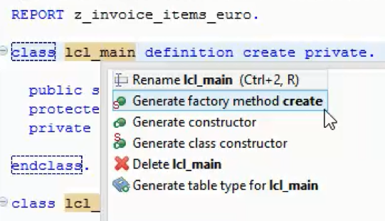

## Prerequisites  
Create an ABAP project in Eclipse (coming soon)

## Next Steps
 Create a global ABAP class and a DDIC structure for data retrieval (coming soon).

## Details
### You will learn  
In this tutorial you will learn how to create and run an ABAP application based on tables of the SAP NetWeaver Demo sample EPM Model (details in the SAP Community [The SAP NetWeaver Enterprise Procurement Model – An Introduction](https://archive.sap.com/documents/docs/DOC-31458). So you can reiterate the tutorial on any SAP NetWeaver 7.5 system.  

### Time to Complete
**5-10 Min**.

---

[ACCORDION-BEGIN [Step 1: ](Create New ABAP Program)]
If you can't see the **$TMP** package in the Project Explorer expand your project node and the node **Favorite Packages**. Right-click on the package **$TMP** to open the context menu. Select **New** and click on **ABAP Program**.

A wizard appears to create a new ABAP Program. Enter  `z_invoice_items_euro` in the name field. Enter a meaningful text in the **description field**. Click **Finish** to create the report. Afterwards an editor will be opened which shows the empty report.

[DONE]
[ACCORDION-END]

[ACCORDION-BEGIN [Step 2: ](Create ABAP local class)]
Type `lcl` and press `Ctrl+Space` to get code completion proposals. Select the code template for the insertion of a local class by double-clicking on `lcl - Local class` or press `Enter` if the right entry is already selected.

Adjust the name of the local class to `lcl_main` using inline editing.

[DONE]
[ACCORDION-END]

[ACCORDION-BEGIN [Step 3: ](Create CREATE method)]
Position the cursor in the class definition statement and press **Ctrl+1** to open the Quick Fix menu. Double-click on **Generate factory method create** to create a static factory method.

[DONE]
[ACCORDION-END]

[ACCORDION-BEGIN [Step 4: ](Implement RUN method)]
Add the definition of an additional instance method **run** in the public section. Position the cursor on the method name and press **Ctrl+1** to open the Quick-Fix menu. Double-click on **Add implementation for run**.

Implement a simple **WRITE** statement in the method **run**.

[DONE]
[ACCORDION-END]

[ACCORDION-BEGIN [Step 5: ](Make ABAP program runnable)]
Add a **START-OF-SELECTION event** to your report and create an instance of the local class `lcl_main`. Call the method **run**.

[DONE]
[ACCORDION-END]

[ACCORDION-BEGIN [Step 6: ](Save and Activate ABAP Program)]
Save and activate your program by clicking on the **Save** and **Activate** buttons in the toolbar.

[DONE]
[ACCORDION-END]

[ACCORDION-BEGIN [Step 7: ](Run ABAP Program)]
Press **F8** to run your program. An embedded SAP GUI will open inside of an Eclipse editor. After checking the output of the report click on the **Close** icon   to close the tab.

[DONE]
[ACCORDION-END]

## Next Steps
Create a global ABAP class and a DDIC structure for data retrieval (coming soon)
