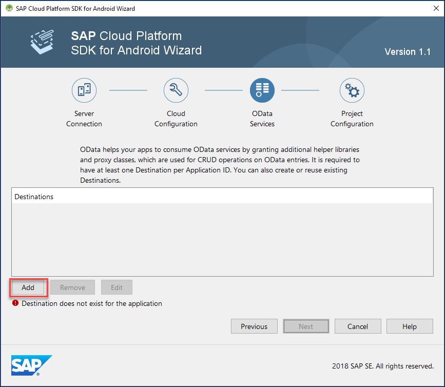
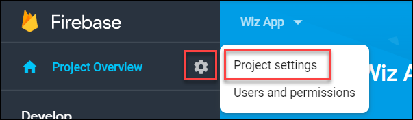
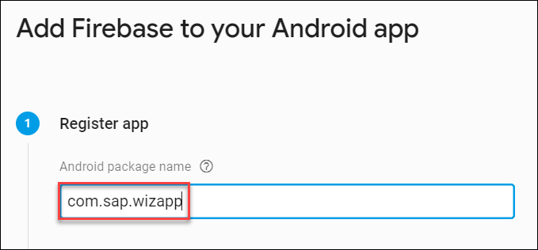
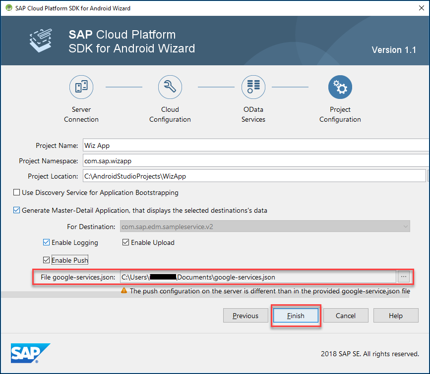
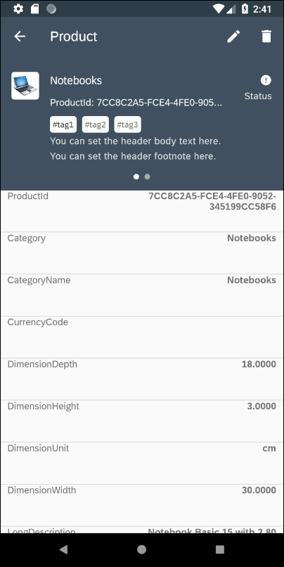

## Prerequisites  
- [Sign up for a free trial account on SAP Cloud Platform](https://www.sap.com/developer/tutorials/hcp-create-trial-account.html)
- [Enable SAP Cloud Platform mobile service for development and operations](https://www.sap.com/developer/tutorials/fiori-ios-hcpms-setup.html)
- **Development environment:** Android Studio
- **SAP Cloud Platform SDK for Android:** Version `1.1.x`

## Details
### You will learn  
- How to create an Android app using the Android Studio integrated SAP Wizard
- How to create a Google Firebase project, enable Cloud Messaging and download a google-services.json file from Google Firebase console to enable push messaging
- The type of screens generated by the wizard

> Before you start, make sure you have:

> - Downloaded <a target="_blank" href="https://www.sap.com/developer/trials-downloads/additional-downloads/sap-cloud-platform-sdk-for-android-15508.html">SAP Cloud Platform SDK for Android</a> **version `1.1.x`**.
> - Followed the <a target="_blank" href="https://help.sap.com/doc/c2d571df73104f72b9f1b73e06c5609a/Latest/en-US/docs/user-guide/getting-started/installing.html">Installing the SAP Cloud Platform SDK for Android</a> instructions.
> - Created a trial account on SAP Cloud Platform. See [Sign up for a free trial account on SAP Cloud Platform](https://www.sap.com/developer/tutorials/hcp-create-trial-account.html) for more information.
> - Enabled SAP Cloud Platform mobile service for development and operations. See [Enable SAP Cloud Platform mobile service for development and operations](https://www.sap.com/developer/tutorials/fiori-ios-hcpms-setup.html) for more information.

---

[ACCORDION-BEGIN [Step 1: ](Create and run the project)]
Open **Android Studio**.

Choose **Start a new SAP Cloud Platform Android project**.

The wizard can save the server connection details for multiple servers. Fill in the required fields as shown below.
>Ensure you have completed the prerequisites for this tutorial before continuing to guarantee that you have an account.

| Field | Value |
|----|----|
| Account Name | `SAP Cloud Platform Mobile Services Trial` |
| Admin API URL | See below for how to get this URL |
| Admin UI URL | See below for how to get this URL |
| Username | Username for your trial account user |
| Password | Password for your trial account user |
| Save Account Information | Check the first time the account info so it does not have to be re-entered on subsequent runs of the wizard |

Go to the SAP Cloud Platform Mobile Services website and under **Important Links**, both URLs will be present

Click **Next** on the **Server Connection** tab.

On the **Cloud Configuration** tab select **Create** and provide the required information.

| Field | Value |
|----|----|
| Application Name | `Wiz App` |
| Application ID | `com.sap.wizapp` |
| Authentication Type | `Basic` |

Click **Next** to configure the OData Services.

The SAP Cloud Platform Mobile Services provides a sample backend destination named `com.sap.edm.sampleservice.v2` that is being used here to provide data for the application. It contains product categories, product, supplier, customer and sales order data. Since you are creating a new application, add `com.sap.edm.sampleservice.v2`.

Click **Next** to continue to the Project Configuration.

On the **Project Configuration** tab provide the following configuration data:

| Field | Value |
|----|----|
| Project Name | `Wiz App` |
| Project Namespace | `com.sap.wizapp` |
| Use Discovery Service for Application bootstrapping | uncheck |
| Generate Master-Detail Application | check |
| Enable Logging | check |
| Enable Upload | check |
| Enable Push | optional |

If you would like to add push notification support to your application, proceed to the next section. Otherwise, click **Finish** and skip the next section, which describes how to acquire a `google-services.json` file needed for push messaging..

[VALIDATE_1]
[ACCORDION-END]

[ACCORDION-BEGIN [Step 2: ](Enable push notifications (optional))]

Check the **Enable Push** checkbox to enable push notification support in the app. You will notice that an error message has appeared explaining that you need to specify a `google-services.json` file. We will obtain this file from the <a target="_blank" href="https://firebase.google.com/docs/cloud-messaging/">Cloud Messaging</a> feature in <a target="_blank" href="https://firebase.google.com/">Google Firebase</a>.

Open the <a target="_blank" href="https://console.firebase.google.com/">Firebase</a> console and click on **`Add project`**.

Access **`Project Settings`** for the newly created project.  

Add Firebase to your app.

The **Android package name** must match the **Project Namespace** used when creating the app in Android Studio. In our example, the **Android package name** is `com.sap.wizapp`.

Download the **`google-services.json`** file.

Now browse for the **`google-services.json`** file in the wizard. This will enable the app to work with Google Firebase notifications.

>The push configuration on the server will be added in the tutorial Send notifications to your application.

Click **Finish**.

[VALIDATE_2]
[ACCORDION-END]

[ACCORDION-BEGIN [Step 3: ](Explore the app)]
Wait for the build to finish.  

Click the **Run** toolbar icon.

Choose the emulator to run the app on.  
>For more information on creating Virtual Devices that run in the Android Emulator, see <a href="https://developer.android.com/studio/run/managing-avds">here</a>.

The welcome screen is shown the first time the app is run.

Sign in with the your credentials.

The entered credentials, are securely stored by the app, and do not need to be re-entered the next time the app is opened.

The passcode (or fingerprint if enabled) screen provides an additional layer of security for your app.  The passcode policy can be modified in the Mobile Service Cockpit under Client Policies feature.

The first screen of the app shows the different entities that are in the sample OData service.

Tap on **`Products`** to reach the below list screen.

Tap on a list item to show an editable detail screen.

>Further information on the generate application can be found at <a target="_blank" href="https://help.sap.com/doc/c2d571df73104f72b9f1b73e06c5609a/Latest/en-US/docs/user-guide/getting-started/creating_an_app.html">Running the Wizard</a> and the `WizardAppReadme.md` file located in the generated app.

Congratulations!  You have created your first Android app using the SAP Cloud Platform SDK for Android!

[VALIDATE_3]
[ACCORDION-END]

---
