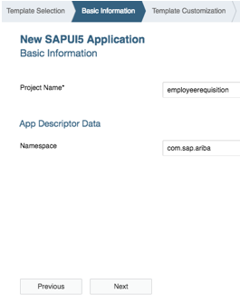
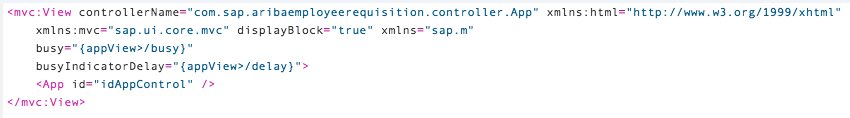

## Prerequisites  
 - **Proficiency:** Intermediate


## Details
### You will learn  
In this tutorial, you will learn how to create an application that contains a master detail view as well as a full-screen view.

### Time to Complete
**15 Min**

---

[ACCORDION-BEGIN [Step 1: ](Open SAP Web IDE)]
1. From the SAP Cloud Platform cockpit, choose the services option in the left-hand navigation menu.  
2. Find SAP Web IDE by using the search or by scrolling down to the **`DevOps`** area.  
3. Choose the SAP Web IDE tile, which will take you to the SAP Web IDE overview page.  
4. Choose **Go to Service**, which will launch SAP Web IDE.


[ACCORDION-END]

[ACCORDION-BEGIN [Step 2: ](Create a new project)]

Choose **File** | **New** | **Project from Template**.


[ACCORDION-END]


[ACCORDION-BEGIN [Step 3: ](Choose the SAPUI5 template)]

From the template selection screen, choose **SAPUI5 Application** and then click **Next**.
You are taken to the **Basic Information** tab.


[ACCORDION-END]

[ACCORDION-BEGIN [Step 4: ](Provide project details)]
Provide the following values:

| Field | Value |
|:-------|:-------|
| Project Name | `employeerequisition` |
| Namespace | `com.sap.ariba` |

Click **Next**. You are taken to the **Template Customization** tab.



[ACCORDION-END]

[ACCORDION-BEGIN [Step 5: ](Choose view types)]

Provide the values for the initial view:

| Field | Value |
|:-------|:-------|
| View Type | `XML` |
| View Name | `App` |


Choose **Finish**. The project is created.


[ACCORDION-END]

[ACCORDION-BEGIN [Step 6: ](Create a new SAPUI5 view)]

With the base structure created, we will now create the addition views needed by the app.  

Right-click the `webapp` folder and choose **New** | **SAPUI5 View**.


[ACCORDION-END]

[ACCORDION-BEGIN [Step 7: ](Provide view values)]

Provide the following values:

| Field | Value |
|:-------|:-------|
| View Type | Leave default |
| Namespace | Leave default |
| View Name | `SplitApp` |

Choose **Next**, and then **Finish**. This creates both a view and a corresponding controller.


[ACCORDION-END]

[ACCORDION-BEGIN [Step 8: ](Create the other views)]

Repeat steps 6 and 7 to create the following views:

  - `Master`
  - `Detail`
  - `FullScreen`

Verify that the project structure now resembles the screenshot to the right.


[ACCORDION-END]

[ACCORDION-BEGIN [Step 9: ](Add a base controller)]
Create a base controller, which can be used to create any functionality that could be shared among other controllers.  

Right-click on the `webapp/controller` folder and choose **New** | **File** from the right-click menu.  

Provide the name `BaseController.js`, and choose **OK**.


[ACCORDION-END]

[ACCORDION-BEGIN [Step 10: ](Add base controller code)]
Open the file `webapp/controller/BaseController.js`, and replace the contents with the following:

```
/*global history */
sap.ui.define([
		"sap/ui/core/mvc/Controller",
		"sap/ui/core/routing/History"
	], function (Controller, History) {
		"use strict";

		return Controller.extend("com.sap.aribaemployeerequisition.controller.BaseController", {
			/**
			 * Convenience method for accessing the router in every controller of the application.
			 * @public
			 * @returns {sap.ui.core.routing.Router} the router for this component
			 */
			getRouter : function () {
				return this.getOwnerComponent().getRouter();
			},

			/**
			 * Convenience method for getting the view model by name in every controller of the application.
			 * @public
			 * @param {string} sName the model name
			 * @returns {sap.ui.model.Model} the model instance
			 */
			getModel : function (sName) {
				return this.getView().getModel(sName);
			},

			/**
			 * Convenience method for setting the view model in every controller of the application.
			 * @public
			 * @param {sap.ui.model.Model} oModel the model instance
			 * @param {string} sName the model name
			 * @returns {sap.ui.mvc.View} the view instance
			 */
			setModel : function (oModel, sName) {
				return this.getView().setModel(oModel, sName);
			},

			/**
			 * Convenience method for getting the resource bundle.
			 * @public
			 * @returns {sap.ui.model.resource.ResourceModel} the resourceModel of the component
			 */
			getResourceBundle : function () {
				return this.getOwnerComponent().getModel("i18n").getResourceBundle();
			},

			/**
			 * Event handler for navigating back.
			 * It there is a history entry or an previous app-to-app navigation we go one step back in the browser history
			 * If not, it will replace the current entry of the browser history with the master route.
			 * @public
			 */
			onNavBack : function() {
				var sPreviousHash = History.getInstance().getPreviousHash(),
					oCrossAppNavigator = sap.ushell.Container.getService("CrossApplicationNavigation");

					if (sPreviousHash !== undefined || !oCrossAppNavigator.isInitialNavigation()) {
					history.go(-1);
				} else {
					this.getRouter().navTo("master", {}, true);
				}
			}

		});

	}
);
```

The functions in the file mostly provide shorthand versions of commonly used access functions.

[ACCORDION-END]

[ACCORDION-BEGIN [Step 11: ](Set app controller to extend base controller)]

Open `webapp/App.controller.js` and change the file to extend from the `BaseController`.

  1. Change the path on line 2 to the path of the `BaseController` file.
  2. Change `"sap/ui/core/mvc/Controller"` to
  `"com/sap/aribaemployeerequisition/controller/BaseController"`
  3. Change the function parameter in line 4 from Controller to `BaseController`
  4. Change the returned value in line 6 to extend from `BaseController`.

The above changes provide the `App` controller access to the functions defined within `BaseController`.  

Your file should now resemble the following:


[ACCORDION-END]

[ACCORDION-BEGIN [Step 12: ](Set other controllers to extend base controller)]

Repeat step 11 to change the path, function parameter and returned value for all of the below controller files:

  -	`FullScreen.controller.js`
  -	`Master.controller.js`
  -	`Detail.controller.js`
  -	`SplitApp.controller.js`

[ACCORDION-END]

[ACCORDION-BEGIN [Step 13: ](Review routes and open manifest)]

Routes, which are defined in `manifest.json`, allow us to navigate between our views. Routes are based on the URL hash and when a matching hash is found a specific target view will be shown on the screen.  

Open the `webapp/manifest.json` file.  The first time you open this file, it will open in the descriptor editor (a visual editor). Switch to the code editor by clicking on the `Code Editor` tab in the bottom left corner of the editor screen.


[ACCORDION-END]

[ACCORDION-BEGIN [Step 14: ](Review manifest structure)]

The routes are part of the last top-level `"sap.ui5"` object defined. We will add new routes under the resources object.  

Using the menu option **Search** | **Find**, search for `resources`.


[ACCORDION-END]

[ACCORDION-BEGIN [Step 15: ](Prepare manifest for edit)]

Add a comma after the last curly brace of the resources object definition.


[ACCORDION-END]

[ACCORDION-BEGIN [Step 16: ](Add routes to manifest)]

Copy the routing object shown below and place it in the `manifest.json` after the comma.

```
"routing": {
			"config": {
				"routerClass": "sap.m.routing.Router",
				"viewType": "XML",
				"viewPath": "com.sap.aribaemployeerequisition.view",
				"controlId": "idAppControl",
				"controlAggregation": "pages",
				"bypassed": {
					"target": [
						"master"
					]
				},
				"async": true
			},
			"routes": [
				{
					"pattern": "",
					"name": "master",
					"target": [
						"object",
						"master"
					]
				},
				{
					"pattern": "item/{objectPath}",
					"name": "object",
					"target": [
						"master",
						"object"
					]
				},
				{
					"name": "fullscreen",
					"pattern": "fullscreen",
					"target": [
						"fullscreen"
					]
				}
			],
			"targets": {
				"master": {
					"viewName": "Master",
					"viewLevel": 1,
					"viewId": "master",
					"controlAggregation": "masterPages",
					"controlId": "idSplitAppControl",
					"parent": "splitview"
				},
				"object": {
					"viewName": "Detail",
					"viewId": "detail",
					"viewLevel": 2,
					"controlId": "idSplitAppControl",
					"controlAggregation": "detailPages",
					"parent": "splitview"
				},

				"fullscreen": {
					"viewName": "FullScreen",
					"viewId": "fullscreen"
				},
				"splitview": {
					"viewName": "SplitApp"
				}
			}
		}
```
The file should now resemble the following:


[ACCORDION-END]

[ACCORDION-BEGIN [Step 17: ](Initialize the router)]

Open the file `/webapp/Component.js` and add the following code to the `init` function:

```
// create the views based on the url/hash
this.getRouter().initialize();
```


[ACCORDION-END]


[ACCORDION-BEGIN [Step 18: ](Edit the app view)]

Open the file `/webapp/view/App.view.xml`, and replace the `App` node with the following:

```
<App id="idAppControl" />
```

This view will be used to display the full-screen view.

The ID is used by the routing to determine what views are placed within the app view.  In the routing, this is defined with the `controlId` property.  


[ACCORDION-END]

[ACCORDION-BEGIN [Step 19: ](Set app view's busy properties)]

In the `app.view.xml` file, add the following properties to the view:

```
busy="{appView>/busy}"
busyIndicatorDelay="{appView>/delay}"
```

The `busy` and `busyIndicatorDetail` property are used to show a busy indicator when the app is processing data requests.




[ACCORDION-END]

[ACCORDION-BEGIN [Step 20: ](Edit SplitApp view)]

Open the file `/webapp/view/SplitApp.view.xml` and replace the `App` node with the following:

```
<SplitApp id="idSplitAppControl" />
```

This view will be used to display the master-detail views within it.


[ACCORDION-END]

[ACCORDION-BEGIN [Step 21: ](Set SplitApp view's busy properties)]

Add the following properties to the view:

```
busy="{appView>/busy}"
busyIndicatorDelay="{appView>/delay}"
```


[ACCORDION-END]

[ACCORDION-BEGIN [Step 22: ](Define the master view)]

Open the file `/webapp/view/Master.view.xml` and replace the contents of the view with the following:

```
<mvc:View xmlns:core="sap.ui.core" xmlns:mvc="sap.ui.core.mvc" xmlns="sap.m" xmlns:semantic="sap.m.semantic"
	controllerName="com.sap.aribaemployeerequisition.controller.Master" xmlns:html="http://www.w3.org/1999/xhtml">
	<semantic:MasterPage id="page" title="{masterView>/title}" navButtonPress="onNavBack" showNavButton="true">
		<semantic:content>
		</semantic:content>
	</semantic:MasterPage>
</mvc:View>
```

[ACCORDION-END]


[ACCORDION-BEGIN [Step 23: ](Define the detail view)]

Open the file `/webapp/view/Detail.view.xml` and replace the contents of the view with the following:

```
<mvc:View xmlns:core="sap.ui.core" xmlns:mvc="sap.ui.core.mvc" xmlns="sap.m" xmlns:semantic="sap.m.semantic"
	controllerName="com.sap.aribaemployeerequisition.controller.Detail" xmlns:html="http://www.w3.org/1999/xhtml">
		<semantic:DetailPage id="page" navButtonPress="onNavBack" showNavButton="{device>/system/phone}"
		title="{i18n>detailTitle}" busy="{detailView>/busy}" busyIndicatorDelay="{detailView>/delay}">
		<semantic:customHeaderContent>
			<Button press="openFullScreenView" id="cartIcon" text="" icon="sap-icon://cart"/>
		</semantic:customHeaderContent>
		<semantic:content>
		</semantic:content>
	</semantic:DetailPage>
</mvc:View>
```

[ACCORDION-END]

[ACCORDION-BEGIN [Step 24: ](Define the full-screen view)]

Open the file `/webapp/view/Detail.view.xml` and replace the contents of the view with the following:

```
<mvc:View xmlns:core="sap.ui.core" xmlns:mvc="sap.ui.core.mvc" xmlns="sap.m" xmlns:semantic="sap.m.semantic"
	controllerName="com.sap.aribaemployeerequisition.controller.FullScreen" xmlns:html="http://www.w3.org/1999/xhtml">
	<semantic:FullscreenPage title="{i18n>fullScreenTitle}" showNavButton="true" navButtonPress="onNavButtonPress" id="FullScreenApp">
	</semantic:FullscreenPage>
</mvc:View>
```

[ACCORDION-END]

[ACCORDION-BEGIN [Step 25: ](Add code to navigate to full-screen view)]

Open the file `/webapp/controller/Detail.controller.xml` and add the function to navigate to the full-screen view.

```
//navigates to the fullscreen view
openFullScreenView: function(){
  this.getRouter().navTo("fullscreen");
},
```

[ACCORDION-END]

[ACCORDION-BEGIN [Step 26: ](Add code to navigate to master-detail views)]

Open the file `/webapp/controller/FullScreen.controller.js` and add the following function:

```
//navigates back to the master/detail views
  onNavButtonPress: function() {
    this.getRouter().navTo("master");
  },
```
Make sure you have saved all your changes.

[ACCORDION-END]

[ACCORDION-BEGIN [Step 27: ](Test your app)]

Right-click your project and choose **Run** | **Run `index.html`**.


Your app should now load.  Verify that the navigation to the full-screen view and back to the master-detail views work as expected.


[ACCORDION-END]
