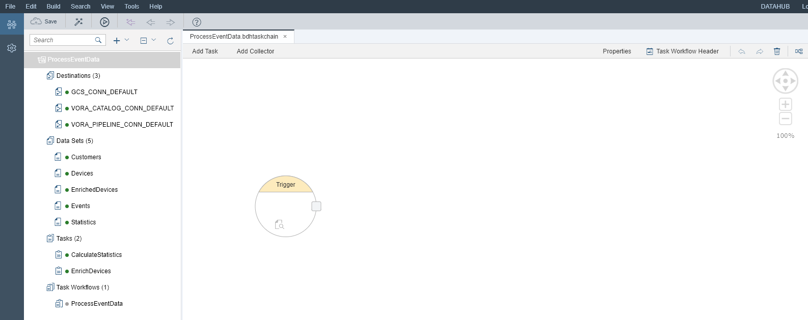

## Details
**This tutorial is obsolete and will be removed shortly (mid-November 2018).**
### You will learn  
During this tutorial, you will build a task workflow. This workflow combines both tasks which you created during the previous tutorials into a process which you can schedule (regularly).

### Time to Complete
**15 Min**

---

[ACCORDION-BEGIN [Step 1: ](Create workflow)]
We assume that you are still in the **SAP Data Hub Modeling tools** (if not, navigate there via the SAP Data Hub Cockpit and open the project which you created  before).

Create a task workflow via the menu **New -> Task Workflow**. Enter `ProcessEventData` as **Name** and press **Create**.

Now add the `EnrichDevices` and `CalculateStatistics` tasks to the workflow via drag and drop. Then connect the two tasks to each other. Afterwards the workflow looks like this:

Use the **Activate** button to activate the task workflow.

[ACCORDION-END]

[ACCORDION-BEGIN [Step 2: ](Execute workflow)]

Now execute the task workflow. You can do this via the context menu **Execute**.

You see the log view. Refresh the log view by clicking **Refresh** until the status of both task is **OK**.

**Remark**: When you look at the `EnrichDevices` or `Customers` data set, you will not see any changes compared to the previous two tutorials.

[ACCORDION-END]

---
