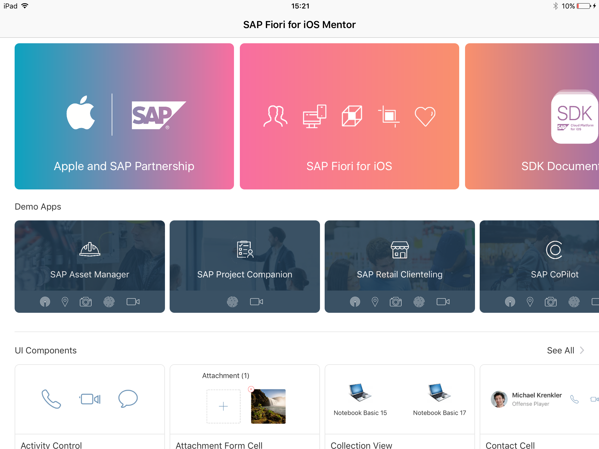

## Prerequisites  
- **Proficiency:** Intermediate
- **Development environment:** Apple iMac, MacBook or MacBook Pro running Xcode 9 or higher
- **SAP Cloud Platform SDK for iOS:** Version 2.0
 <!-- - **Tutorials:** [Implement a new Table View Controller](https://www.sap.com/developer/tutorials/fiori-ios-scpms-deliveryapp-part3.html) -->

<!-- ## Next Steps
 - [Implement the Fiori Timeline cell control](https://www.sap.com/developer/tutorials/fiori-ios-scpms-deliveryapp-part5.html) -->

## Details
### You will learn  
In the previous tutorial, you have enabled navigation, as well as created a query to load all related `DeliveryStatus` entities. However, you haven't bound the results to table cells yet.

Since we want to display the `DeliveryStatus` items in a timeline, the best way to achieve this is to use the SDK's `FUITimeline` table view cell control. A great tool for exploring SAP Fiori for iOS controls and help implementing these into your project is the **SAP Fiori for iOS Mentor app**. This is a companion tool to the SDK, and can be downloaded for iPad from the Apple App Store.

### Time to Complete
**5 Min**

---

[ACCORDION-BEGIN [Step 1: ](Open the SAP Fiori for iOS Mentor app)]

Open the SAP Fiori for iOS Mentor app on your iPad. Upon opening, the app shows an overview page:

[ACCORDION-END]

[ACCORDION-BEGIN [Step 2: ](Locate the Timeline Cell tile)]

Click on the **See All** link next to the **UI Components** section, and scroll down until you see the **Timeline Cell** tile:

[ACCORDION-END]

[ACCORDION-BEGIN [Step 3: ](Examine the Timeline Cell control)]

Click the **Timeline Cell** tile. You now see a page wit a representation of the SAP Fiori Timeline cell, and a couple of preset styles to change the look and feel for the control.

You can also customize the look and feel on a more granular level. Click the **button with three dots** in the lower right corner. This will bring a pop up where you can specify different settings for the control. The control's look and feel is instantly updated, giving you an idea of the final result:

[ACCORDION-END]

[ACCORDION-BEGIN [Step 4: ](Display the generated code)]

When you're happy with the final result, click the **Code button** (the one labeled `</>`). This will bring a pop up with a sample `UITableViewController` class, and all the properties you have set or enabled in the **Control Settings** pop-up are reflected in the generated code:

[ACCORDION-END]

[ACCORDION-BEGIN [Step 5: ](Export the generated code)]

To use the generated code in Xcode, click the **Share** button in the top-right, and use **AirDrop** to transfer to your Mac:

Open the downloaded text file:

The generated code can now be implemented into the appropriate places in the `TrackingInfoViewController.swift` file.

>   **NOTE** Since it may take a bit too long to go through the steps of copying and pasting the code, adding the control binding to the Proxy Classes' properties and format the data properly, you don't need to do this yourself. The code to implement will be provided in the next tutorial.

[ACCORDION-END]

<!-- ## Next Steps
- [Implement the Fiori Timeline cell control](https://www.sap.com/developer/tutorials/fiori-ios-scpms-deliveryapp-part5.html) -->
