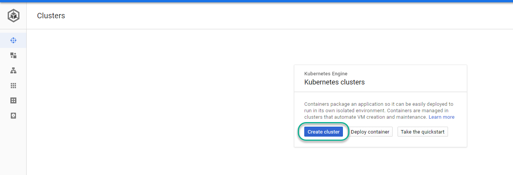

## Details
### You will learn
  - How to create a Kubernetes cluster in the Google Kubernetes Engine
  - How to configure a cluster to deploy SAP HANA, express edition and SQLPAD


---

[ACCORDION-BEGIN [Step 1: ](Create a cluster)]

Click **Create a Cluster**.



Change the amount of nodes to **1** and choose the configuration with 4 `vCPUs` and 15 GB memory


Click **Advanced edit**


Change the image type to **Ubuntu** and the book disk type to **SSD persistent disk**


Click **Save**. Then Click **create**


> What is going on?
> You are creating a Kubernetes cluster with computing capacity for SAP HANA, express edition in a single node. This single node will contain a deployment with two containers: the first container will be SAP HANA, express edition. The second container will be a SQLPAD image. The images for these containers will be pulled from the public `Docker` repository and store. The containers will be connected to each other and have some ports exposed to the internet.

[DONE]
[ACCORDION-END]


[ACCORDION-BEGIN [Step 2: ](Connect to your cluster)]

Once the cluster has been created successfully, click **Connect**.


Click **Run in cloud shell**.


Once the console is open and the command is ready, click **Enter**


[DONE]
[ACCORDION-END]

[ACCORDION-BEGIN [Step 3: ](Create a secret)]

Copy and paste the following command to create a secret:

```text
kubectl create secret docker-registry docker-secret --docker-server=https://index.docker.io/v1/ --docker-username=gnext18 --docker-password=Google@SAPTeched2018 --docker-email=hana.express.rocks@gmail.com
```

> Note: These are temporary credentials to be used at SAP TechEd 2018. Please use your own credentials outside of the AppSpace or if you want to try this again at home. You can register for free [at the Docker Store](https://store.docker.com/).

Press **enter** and use the result of the command to complete the validation below

[VALIDATE_1]
[ACCORDION-END]


---
