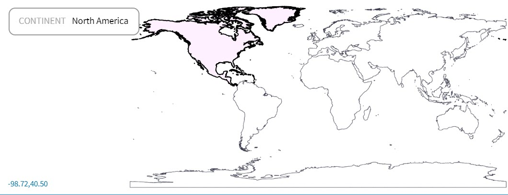
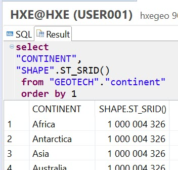
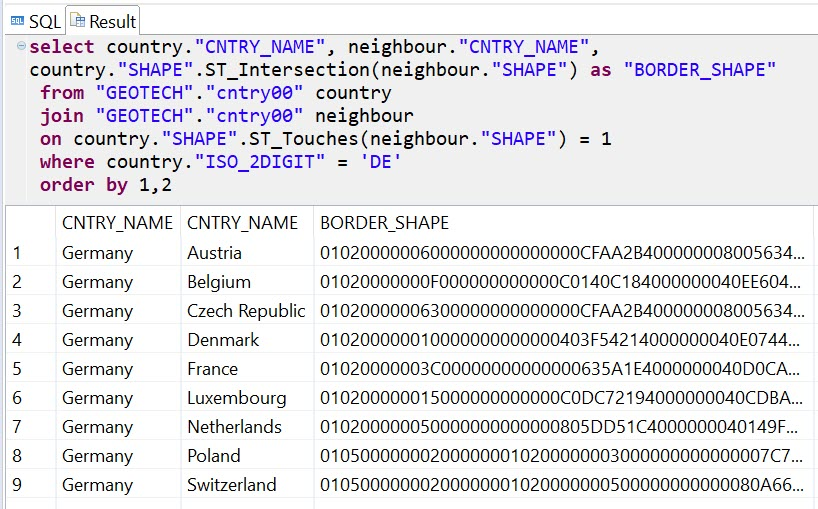

## Prerequisites  
 - **Proficiency:** Beginner

## Details
### You will learn  
  - How to use SAP HANA to analyze data from Shapefiles

### Time to Complete
**5 Min**

---

[ACCORDION-BEGIN [Step 1: ](ESRI shapefiles)]
Good news. You do not need to create all geographic or geodetic data manually! There are open data sets available. They are using one of many geospatial data formats.

One of the most used formats for geospatial data exchange is a [**Shapefile**](https://en.wikipedia.org/wiki/Shapefile) developed by ESRI.

Two of such Shapefiles have been preloaded into the instance of SAP HANA database you are connected to:

 1. `"GEOTECH"."continent"` with shapes of continents
 2. `"GEOTECH"."cntry00"` with shapes of countries

A preview of shapes of continents (using <http://mapshaper.org/> website):



A preview of shapes of countries:


Both of these tables contain a column `"SHAPE"` that stores geometries of all continents or countries, depending on a table. This column has `ST_GEOMETRY` datatype, which allows you to store any spatial data: points, strings, polygons, or their collections.

```sql
select "CNTRY_NAME",
"SHAPE".ST_GeometryType()
 from "GEOTECH"."cntry00"
 order by 1;
```


You can see that some country shapes are single polygons, while others are collections of polygons. In the second case, it is because each island is a polygon.

[ACCORDION-END]

[ACCORDION-BEGIN [Step 2: ](Round Earth vs. Planar projection)]
In the previous tutorial, you learned about SRID `4326` based on Round Earth model used by GPS. Geospatial data in tables that you will use in this tutorial are loaded using special SAP HANA's SRID `1000004326`, which is a planar 2D projection.


You can check geometry's SRID using `.ST_SRID()` method.

```sql
select "CONTINENT",
"SHAPE".ST_SRID()
 from "GEOTECH"."continent"
 order by 1;
```



Some geospatial methods will not work with geometries on the Round Earth model, and can work only with geometries on planes. On the other hand, some measurements on Round Earth will give you more precise values than for geometries on planar projections.

The same method `ST_SRID(srid)`, but with SRID numeric value as an argument, is used to do simple conversion between different Spatial Reference Systems that are using the same coordinates.

```sql
select
"CONTINENT",
"SHAPE".ST_SRID(4326).ST_SRID()
 from "GEOTECH"."continent"
 order by 1;
```


>Please note the way spatial methods are chained to define sequential execution of these methods.

[ACCORDION-END]

[ACCORDION-BEGIN [Step 3: ](Find neighboring countries)]
Based on loaded data, let's find all countries sharing land boarders with Germany.

```sql
select country."CNTRY_NAME", neighbour."CNTRY_NAME",
country."SHAPE".ST_Intersection(neighbour."SHAPE") as "BORDER_SHAPE"
 from "GEOTECH"."cntry00" country
 join "GEOTECH"."cntry00" neighbour  on country."SHAPE".ST_Touches(neighbour."SHAPE") = 1
 where country."ISO_2DIGIT" = 'DE'
 order by 1,2;
```



> ### What just happened?
>
> 1. You joined data from two copies - `country` and `neighbour` - of the same `"GEOTECH"."cntry00"` table storing country geometries.
> 2. You used `ST_Touches()` predicate to select only countries, which geometries have at least one shared point. For predicates the result equal `1` means `True`.
> 3. For every two geometries that have a shared point you calculated an intersection using `ST_Intersection()` set method. This calculated a line string, that is a shared border between two countries.
> 4. Intersections are returned in the WKB format. This output can be used to visualize the shape at <http://geojson.io> site too. Copy the content of a cell the same way you copied GeoJSON content before, then go to <http://geojson.io> site and choose **Meta** > **Load WKB Hex Encoded String**. Paste the content into the input field of a dialog box and click **OK**.

[ACCORDION-END]

[ACCORDION-BEGIN [Step 4: ](Which countries have most neighbors?)]
As you could count from a result of the previous query, Germany has 9 land neighbors. Are there countries that have more?

```sql
select country.CNTRY_NAME as "country", count(neighbour.CNTRY_NAME) as "neighbours"
from "GEOTECH"."cntry00"  country
join "GEOTECH"."cntry00"  neighbour on country."SHAPE".ST_Touches(neighbour."SHAPE") = 1
group by country.CNTRY_NAME
order by "neighbours" desc, "country";
```


> What just happened?
>
> 1. Same as in the previous step you used spatial predicate `ST_Touches()` to find all countries whose geometries have touch points.
> 2. Then you used SQL `group by` to count all neighbors for each country.
> 3. At the end you sorted the result by the number of neighbors.

[ACCORDION-END]

[ACCORDION-BEGIN [Step 5: ](Transcontinental countries)]

**Transcontinental countries** or **intercontinental states** are countries located on more than one continent.

>Please note that the query below is computationally intensive, and will take about one minute to execute.

```sql
select b."CNTRY_NAME", a."CONTINENT",
 b."SHAPE".ST_Intersection(a."SHAPE") as "CNTRY_CONTINENT"
from "GEOTECH"."continent" a
join "GEOTECH"."cntry00" b on b.shape.ST_Overlaps(a.shape) = 1
order by 1, 2;
```


> ### What just happened?
>
> 1. This time you joined two tables - countries and continents - using spatial predicate `.ST_Overlaps()`. This predicate returns `1` (i.e. is `True`), when an intersection of a country shape with a given continent shape is a polygon, but Neither of the original geometries is a subset of the other. Therefore the join returns only transcontinental countries.
> 2. The result of the query contains three columns: a name of a country, a name of a continent, and their spatial intersection.
> 3. In this case the spatial intersection is a polygon, not string as in the previous example with shared borders.

&nbsp;

>There are some countries missing in the query output, like Turkey. Why? Upon closer investigation, you find that a continental border between Asia and Europe was not properly defined in the source file. As a result, not only Turkey, but also Azerbaijan, Georgia and Kazakhstan are missing, although they are all transcontinental countries with parts in both Asia and Europe.

[ACCORDION-END]

---
