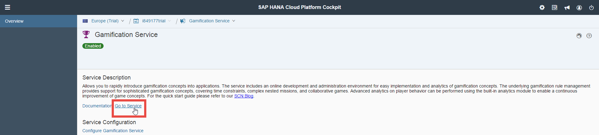
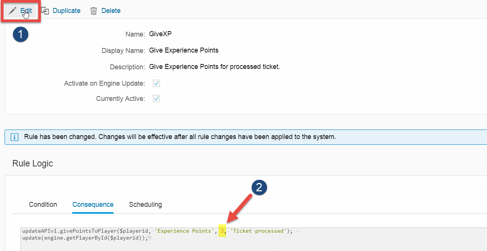
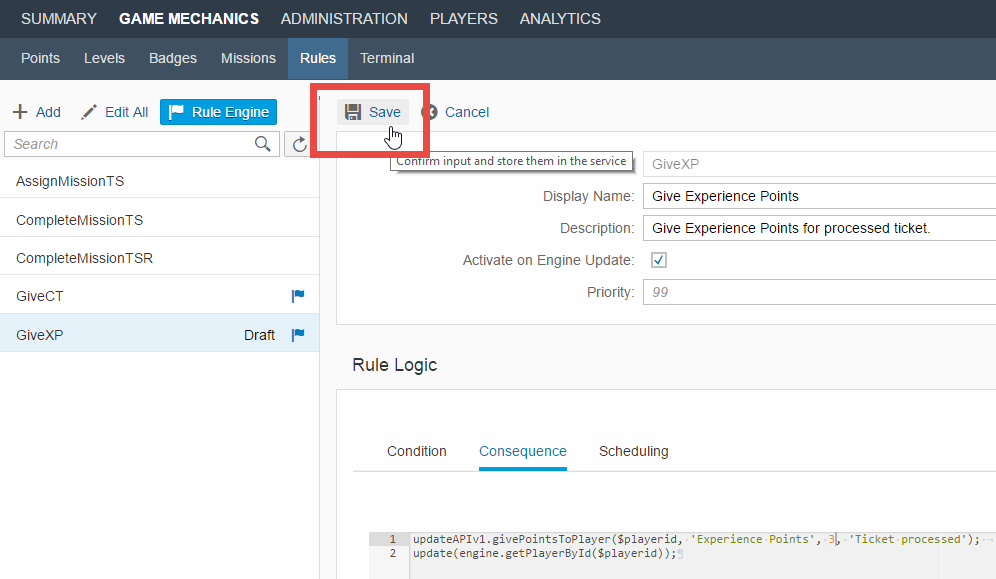
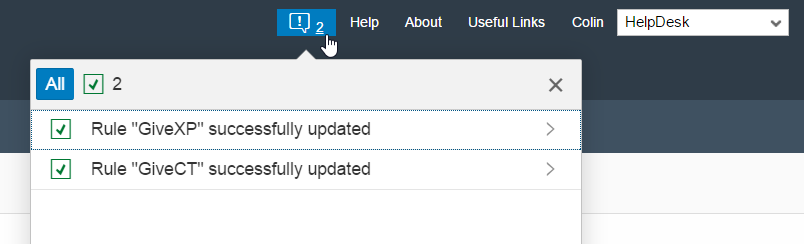
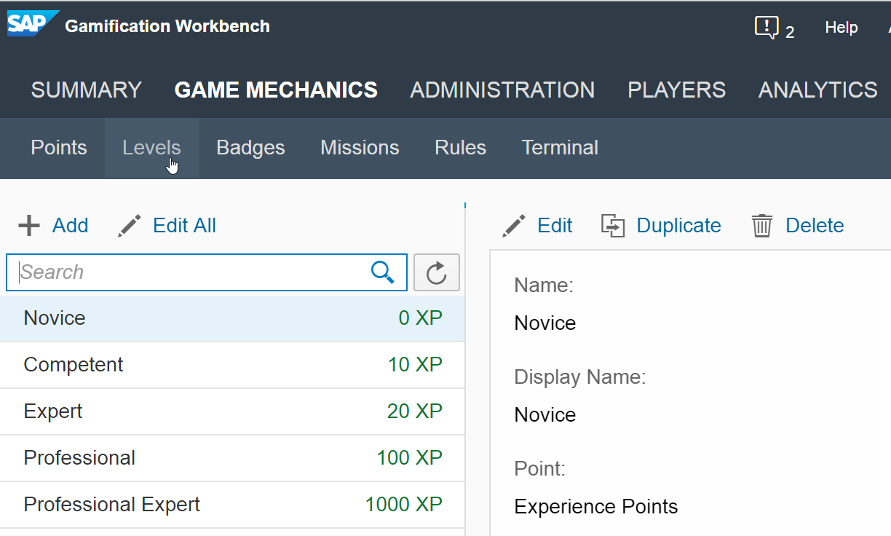
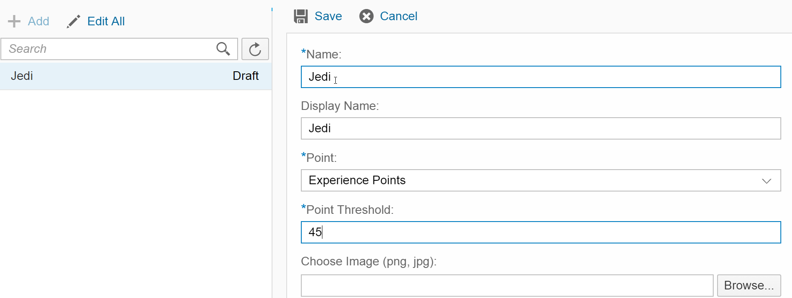
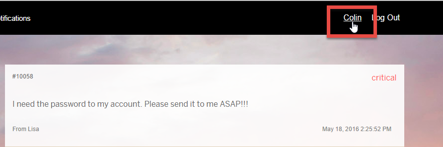

## Prerequisites  
- **Proficiency:** Beginner
- **Tutorials:** [Deploy gamified HelpDesk application to SAP Cloud Platform](https://www.sap.com/developer/tutorials/hcp-deploy-gamified-application.html)

## Next Steps
- Select a tutorial from the [Tutorial Navigator](https://www.sap.com/developer/tutorial-navigator.html) or the [Tutorial Catalog](https://www.sap.com/developer/tutorial-navigator.tutorials.html)

## Details
### You will learn  
In this tutorial, you will tweak the game mechanics of the HelpDesk application manually using the Gamification Workbench on the SAP Cloud Platform. You will increase the number of experience points the user receives for solving sample tickets and increase the total points for solving sample critical tickets. As a result of that change, you will also have to adapt the game levels.

### Time to Complete
**20 Min**.

---

[ACCORDION-BEGIN [Step 1: ](Open Gamification service)]

In your Web browser, open the cockpit of the [SAP Cloud Platform](https://account.hanatrial.ondemand.com/cockpit). Then select **Services** from the left-hand navigation and click the **Gamification Service**.


Click **Go to Service**.



>You can bookmark this page for ease of access in the future.


[ACCORDION-END]

[ACCORDION-BEGIN [Step 2: ](Select HelpDesk application)]

Select the **`HelpDesk`** application from the drop-down menu in the upper-right corner.


[ACCORDION-END]

[ACCORDION-BEGIN [Step 3: ](View existing rules)]

To get an overview of existing rules, navigate to the **Game Mechanics** tab and select **Rules** from the second level navigation bar.


[ACCORDION-END]

[ACCORDION-BEGIN [Step 4: ](Edit rule logic)]

Open the rule **`GiveXP`** by clicking on it. Select the **Consequence** tab under **Rule Logic**.


Select **Edit** and increase the number of **`Experience Points`** that users receive when they respond to a ticket from `1` to `3`.



```java
updateAPIv1.givePointsToPlayer($playerid, 'Experience Points', 3, 'Ticket processed');
update(engine.getPlayerById($playerid));
```

Click **Save**.




[ACCORDION-END]

[ACCORDION-BEGIN [Step 5: ](Edit more logic)]

Open the rule **`GiveCT`** by clicking on it. Select the **Consequence** tab under **Rule Logic**.


Select **Edit** and increase the number of **`Experience Points`** that users receive when they respond to a critical ticket from `2` to `7`.


```java
updateAPIv1.givePointsToPlayer($playerid, 'Critical Tickets', 1, 'Critical ticket processed');
updateAPIv1.givePointsToPlayer($playerid, 'Experience Points', 7, 'Critical ticket processed');
update(engine.getPlayerById($playerid));
```

Click **Save**.


>**`Experience Points`** for responding to critical tickets are given in addition to **`Experience Points`** given for processing any ticket. In other words, users will now receive 10 points when solving a critical ticket (7 critical points plus 3 points for solving any ticket).


[ACCORDION-END]

[ACCORDION-BEGIN [Step 6: ](Verify updates)]

You can ensure that these rules were successfully updated by checking the notification center in the upper right-hand corner.




[ACCORDION-END]

[ACCORDION-BEGIN [Step 7: ](Delete levels)]

Still in **Game Mechanics**, select **Levels** from the second level navigation bar.



Select all the levels in the table and choose **Delete**.


[ACCORDION-END]

[ACCORDION-BEGIN [Step 8: ](Create levels)]

Click **Add**. Enter a **Name**, make sure that **Experience Points** are selected in the **Points** drop-down, and enter a value in the **Point Threshold**. Click **Save**.




[ACCORDION-END]

[ACCORDION-BEGIN [Step 9: ](Add more levels)]

Repeat the previous step three to five times until you have a variety of levels.

>Start with a level with a small threshold, so that newly registered users will have a level already assigned.


[ACCORDION-END]

[ACCORDION-BEGIN [Step 10: ](Launch the gamified app)]

Launch the gamified HelpDesk application by first selecting **Help** in the upper-right corner.


Then click **Open HelpDesk** from the pop-up window.


Select **continue** when the home screen of the sample gamified HelpDesk application appears.


[ACCORDION-END]

[ACCORDION-BEGIN [Step 11: ](Test game features)]

To see your new game mechanics in action, first respond to one of the generated sample tickets.


Then click your name in the upper-right corner to go to your profile.



In your profile, you should see the new levels (green box) as well as the increased number of experience points you received (red box).


[ACCORDION-END]


## Next Steps
- Select a tutorial from the [Tutorial Navigator](https://www.sap.com/developer/tutorial-navigator.html) or the [Tutorial Catalog](https://www.sap.com/developer/tutorial-navigator.tutorials.html)
