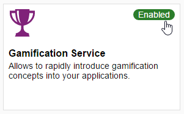

## Prerequisites  
- **Proficiency:** Beginner
- **Tutorials:** [Sign up for an account on SAP Cloud Platform](https://www.sap.com/developer/tutorials/hcp-create-trial-account.html)

## Next Steps
- [Create the gamified HelpDesk application](https://www.sap.com/developer/tutorials/hcp-gamification-sample-application.html)

## Details
### You will learn  
How to enable the gamification service in your SAP Cloud Platform account as well as what roles and destination configurations are necessary to develop gamified applications.

### Time to Complete
**5 Min**.

---

[ACCORDION-BEGIN [Step 1: ](Open SAP Cloud Platform Cockpit)]

In your Web browser, open the cockpit of the [SAP Cloud Platform](https://account.hanatrial.ondemand.com/cockpit). Then select **Services** from the left-hand navigation.

[ACCORDION-END]

[ACCORDION-BEGIN [Step 2: ](Enable gamification service)]

Select **Gamification Service** and click **Enable** to enable the service.

A gamification service subscription is now assigned to your account.

[ACCORDION-END]

[ACCORDION-BEGIN [Step 3: ](Configure gamification service)]

Click **Configure Gamification Service**.

[ACCORDION-END]

[ACCORDION-BEGIN [Step 4: ](Verify roles)]

Select **Roles** from the left-hand navigation.

Verify that the following roles have been assigned to your user:
- **`AppStandard`**
- **`AppAdmin`**
- **`GamificationReviewer`**
- **`GamificationDesigner`**
- **`TenantOperator`**
- **`helpdesk`**

[ACCORDION-END]

[ACCORDION-BEGIN [Step 5: ](Check destinations)]

Back in the Cockpit, select **Destinations** from the left-hand navigation. Verify that the **`gsdest`** and **`gswidgetdest`** destinations required by the gamification service are listed.

> Do NOT click the **Destinations** button in the gamification service itself.

[ACCORDION-END]

[ACCORDION-BEGIN [Step 6: ](Edit destination)]

Click the **Edit** button to open the **`gsdest`** destination for editing.

Verify that **User** is your SAP ID user and replace the default **Password** mask with your SAP ID user password. Click **Save**.

[ACCORDION-END]

## Next Steps

- [Create the gamified HelpDesk application](https://www.sap.com/developer/tutorials/hcp-gamification-sample-application.html)
