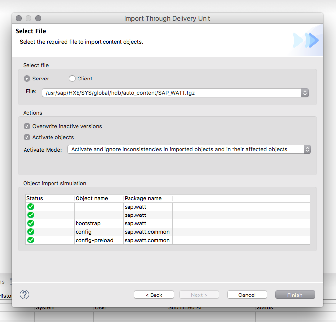
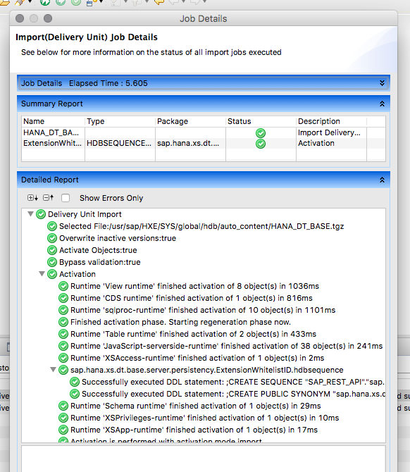

## Prerequisites  
 - **Systems used:** SAP HANA, express edition server only


## Details
> **DEPRECATED:** SAP HANA XS Classic is deprecated as of SPS02. Please use XS Advanced, and learn about how to get started with the new mission [Get Started with XS Advanced Development](https://www.sap.com/developer/missions/xsa-get-started.html).


Out of the box the SAP HANA, express edition (HXE) server only option is ready to go with a lot of basic functionality. However, to use it you need to install the SAP HANA plugin for Eclipse. This of course is not a bad thing, however you may also like the idea of using the browser based tools.

This guide will help walk you through the steps necessary to install the SAP HANA XS tooling allowing you to use a browser to interact with your server going forward.

### Time to Complete
**20 Min**.

---

1. The first step will be to increase the allocated amount of memory for your instance if you are running a virtual machine, around 12 GB will be enough.

	

2. Once you have modified the amount of memory and started the instance and confirmed your HANA server is running, you will connect using the SAP HANA Studio.

	

	**Note** You may need to run the following SQL statement on your system for the Delivery Unit process about to be described here.
	```
	ALTER SYSTEM ALTER CONFIGURATION ('indexserver.ini', 'SYSTEM') SET ('repository','content_vendor') = 'developers.sap.com' WITH RECONFIGURE;
	```

	In SAP HANA, the vendor ID is used primarily to define the identity of the company developing a software component that it plans to ship for use with SAP HANA, for example, "sap.com". To create a delivery unit, it is a prerequisite to maintain a vendor ID in your system.

3. The first step will be to then to choose "File" and then "Import". From the wizard you will select "Delivery Unit".

	
	

4. There are several units you will need to import and there is a specific order for them.

	- `SAPUI5_1`
	- `SAP_WATT`
	- `HANA_DT_BASE`
	- `HANA_XS_BASE`
	- `HANA_IDE_CORE`
	- `HANA_XS_IDE`
	- `HANA_XS_DBUTILS`
	- `HANA_XS_LM`

	

	**Note** The first unit you are importing is the SAPUI5 one which will take quite a bit of memory and time for the import to simulate as well as install so do not panic if it seems to run on and on.

5. After each import you should see that it has "successfully completed" in the log viewer.

	
	
	
	
	
	
	
	

	That is until the very last item which will have **errors** and that will be fine.

	

6. Now that you have finished each import, go ahead and run the `HDB stop` command to shut down your server. This will help clear the processes and memory.

	

	After it has shut down go ahead and start it back up again using `HDB start` - you can use the SAP HANA Studio and double check that it is running and you'll notice that the memory usage is different than before.

	

7. Now through the Studio check under "Content" and you'll see you have additional content now installed into the repository.

	

8. Next stop is under "Security" where you will need to modify your user and add two groups of roles to the user. The first selection is the roles you find by searching for "developer".

	

9. Next set of roles are those found by searching for "admin".

	

10. Now with that saved if you go to a web browser and go to the URL `http://<hostname>:8000` you will see the standard screen.

	

11. Now add the following to the URL `/sap/hana/ide/` if all goes well you should be prompted with a login screen. Upon logging in you should be able to choose from several options.

	

12. You can now see via the browser the same content information.  

	

13. You can now also see the tables and schemas via the catalog editor.  

	

14. Now it is time to change the memory back to 8 GB, or leave it as if you prefer.  

	

15. If you changed the memory back and restarted your server then just verify once again that you can login and still work.  

	

16. Also verify that your system and resources are still in an acceptable state.  

	
