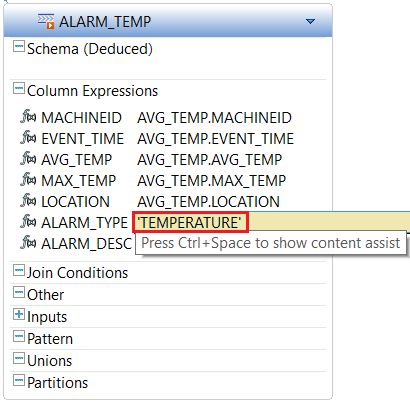
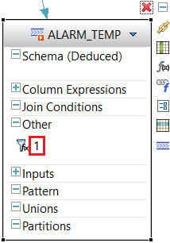

## Prerequisites  
 - **Proficiency:** Intermediate
 - **Tutorials:** [Create a Moving Average on an Event Stream using an Aggregation Window](https://www.sap.com/developer/tutorials/sds-event-stream-moving-average.html)

## Next Steps
- **Tutorials:** [Using the Streaming Playback tool to Test a Streaming Project](https://www.sap.com/developer/tutorials/sds-event-stream-playback.html)

## Details
### You will learn  
 - Use a Derived Window to apply a filter to watch for events that should generate an alert

### Time to Complete
**15 Min**.
---

In the steps below, you will add and configure a derived stream that will watch for events that need to generate an alert - by applying a filter.

However, rather than just using the standard **Filter** element, we will use the **Derived Window** element from the palette since it gives us more flexibility. With this, we can apply the filter and also change the structure of the output event.

At this point in the tutorial series,  if you'd rather not step through the process of creating this window using the visual editor,  you can simply switch to the CCL editor (F6 from the visual editor) and paste the CCL below into your project - and then skip to the last step to compile and test your Project.

```SQL

CREATE OUTPUT WINDOW ALARM_TEMP
PRIMARY KEY DEDUCED
KEEP ALL
AS SELECT
  AVG_TEMP.MACHINEID MACHINEID ,
  AVG_TEMP.EVENT_TIME EVENT_TIME ,
  AVG_TEMP.AVG_TEMP AVG_TEMP ,
  AVG_TEMP.MAX_TEMP MAX_TEMP ,
  AVG_TEMP.LOCATION LOCATION ,
  'TEMPERATURE' ALARM_TYPE ,
  'Machine not maintaining' ALARM_DESC
FROM AVG_TEMP
WHERE AVG_TEMP.AVG_TEMP > AVG_TEMP.MAX_TEMP ;

```

[ACCORDION-BEGIN [Step 1: ](Add a derived window to generate alerts)]

Click **Derived Window** in the **Palette** and drop it onto the canvas.


[ACCORDION-END]

[ACCORDION-BEGIN [Step 2: ](Connect the new window to the event stream)]

Add a connector from **`AVG_TEMP`** to the new window.


[ACCORDION-END]

[ACCORDION-BEGIN [Step 3: ](Change the window name)]

Change the new window name to `ALARM_TEMP` and press **Enter** when done.


[ACCORDION-END]

[ACCORDION-BEGIN [Step 4: ](Add columns to the window)]

Click Add Column Expression **f(x)** icon shown below.


Click the **Copy Columns from Input** menu item to open the column selection dialog.


Select all except for **`MIN_TEMP`** and **`TEMP_UNIT`**, then click **OK**.


Click Add Column Expression **f(x)** icon then **Column Expression** menu item to add a column to this window.

Repeat this to add a 2nd column (i.e. add 2 new columns total).


[ACCORDION-END]

[ACCORDION-BEGIN [Step 5: ](Edit the column names and expressions)]

Rename the first new column to `ALARM_TYPE` and press **Enter** key when done.


Rename the 2nd new column to `ALARM_DESC`.


Double-click on **`simpleResultExpression6`** to edit the expression.


Enter `'TEMPERATURE'` in the expression edit box for the **`ALARM_TYPE`** column. This will set the "type" of all alarms emitted by this window to the string "TEMPERATURE". Press **Enter** key to confirm entry.

> Note that it's important to enclose string values in single quotes in expressions



Enter `'Machine not maintaining temperature'` in the expression box for the **`ALARM_DESC`** column. Press **Enter** key to confirm entry.


[ACCORDION-END]

[ACCORDION-BEGIN [Step 6: ](Add a filter expression)]

Now click **Add Query Clause** to add a query clause.

We want to add a filter such that this window only contains rows for machines that have a current average temperature above the max specified for the machine.


Click the **Filter** menu item to execute it. You can also press **f**.


Double-click on **1** under the **Other** tab to edit the filter expression.



Change the filter expression to: `AVG_TEMP.AVG_TEMP > AVG_TEMP.MAX_TEMP`. Use **Ctrl+Space** for completion assist.


[ACCORDION-END]

[ACCORDION-BEGIN [Step 7: ](Compile and check for errors)]

Click Compile Project icon to check for errors.

> You will get a compiler warning about the lack of a retention policy on the aggregate stream.  You can ignore this warning. The reason for the warning is that windows default to KEEP ALL. If you explicitly state KEEP ALL, then the compiler accepts that you meant it. If you omit an explicit KEEP policy, the compiler warns you in case it's not what you intended. Here, this is an aggregation where we are grouping by Machine ID - and we do indeed want to keep the aggregate value for every machine ID.


[ACCORDION-END]
