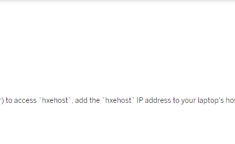

## Prerequisites
 - **Tutorials:** You have completed [Start SAP HANA, express edition Server](hxe-ua-getting-started-vm) plus more text

## Details
### You will learn
You'll learn how to configure your host machine to communicate with the server. OK. More stuff. Even more stuff.
test
!
[Test link](https://localhost:Reloa4004/testLink.html)
[Test link 3](https://localhost/testLink)
[Test link 4](https://127.0.0.1/testLink.html)
[QA GitHub URL](https://raw.githubusercontent.com/SAPDocuments/Tutorials-Contribution/tutorials/smth)
New test of unused files.
---

[ACCORDION-BEGIN [Step 1: ](Update etc/hosts)]

My special `code`.

### My special `code`

#### My special `code`

`LOLO`  `lolo` sap [`SAPDocuments`](mission.cp-starter-ibpm-employeeonboarding)
(e.g. `123`)
!

[Link in other folder](..\abap-connectivity-daemon-mqtt-bridge\add-unimplemented-methods.png)

AAAAAAAAAAAAAAAAA

<rac-support@sap.com>

 `code` 


<https://localhost:4000>


[OPTION BEGIN [Windows]]

If you installed the VM installation package to a Windows machine, follow this step to update the `etc/hosts` file.

1.   On your Windows laptop, navigate to `C:\Windows\System32\drivers\etc`

2.   In `Administrator` mode, open `hosts` in Notepad. See your operating system Help for information on opening applications in Administrator mode

3.   In a new uncommented row, add the IP address and `hxehost`. Save your changes

    Spacing is important. Make sure your hosts file in Notepad looks like this image.

    

    > Note:
    > If the VM is restarted and assigned a new IP, you'll need to update the Hosts file.
    >
    >

[OPTION END]


[OPTION BEGIN [Mac and Linux]]
If you installed the VM installation package to a Mac or Linux machine, follow this step to update the `etc/hosts` file.

1.   On your Mac or Linux machine, start the Terminal application

2.   Enter the following command:

    ```bash [1, 3, 10-19]
    sudo sh -c 'echo <hxehost IP address> hxehost >> /etc/hosts'
    ```

    > Note:
    > If the VM is restarted and assigned a new IP, you will need to update the Hosts file.
    >
    >


[OPTION END]

[DONE]
[ACCORDION-END]

[ACCORDION-BEGIN [Step 2: ](Spacing)]

Start of text is here and `price` as well as three levels of product categories were picked to illustrate the possibility of the service to deal with such information. In a generic use case you may pick a number and combination of properties yourself. Test.

```Java
doSomething();
doSomething2();
```

Start of text is here and `price` as well as three levels of product categories were picked to illustrate the possibility of the service to deal with such information. In a generic use case you may pick a number and combination of properties yourself. Test.

1. Start of text is here and `price` as well as three levels of product categories were picked to illustrate the possibility of the service to deal with such information. In a generic use case you may pick a number and combination of properties yourself. Test.

    ```Java
    doSomething();
    doSomething2();
    ```

2. Start of text is here and `price` as well as three levels of product categories were picked to illustrate the possibility of the service to deal with such information. In a generic use case you may pick a number and combination of properties yourself. Test.

    

    


New stuff


### #EEEEEE


### #AAAAAA


|  Field Name     | Value
|  :------------- | :-------------
|  Name           | **`Northwind`**
|  Type           | **`HTTP`**
|  Description    | **`Northwind OData Service`**
|  URL          | **`http://services.odata.org`**
|  Proxy Type   | **`Internet`**
|  Authentication | **`NoAuthentication`**


### #888888

This is some text before.


This is some text before.

### #444444


In these tutorials, you are using a dataset from [Best Buy](https://www.bestbuy.com/). The original dataset as well as other dataset from Best Buy can be found [here](https://github.com/BestBuyAPIs/open-data-set/). From the original dataset the product information `description`, `manufacturer` and `price` as well as three levels of product categories were picked to illustrate the possibility of the service to deal with such information. In a generic use case you may pick a number and combination of properties yourself. Test.

[DONE]
[ACCORDION-END]


[ACCORDION-BEGIN [Step 1: ](Do something)]

|  Field Name     | Value
|  :------------- | :-------------
|  Name           | **`Northwind`**
|  Type           | **`HTTP`**
|  Description    | **`Northwind OData Service`**
|  URL          | **`http://services.odata.org`**
|  Proxy Type   | **`Internet`**
|  Authentication | **`NoAuthentication`**

[DONE]
[ACCORDION-END]


[ACCORDION-BEGIN [Step 1: ](Do something)]
[SAP](https://www.sap.com)

[DONE]
[ACCORDION-END]

<p style="text-align: center;">Give us 55 seconds to help us improve</p>

<p style="text-align: center;"></p>
