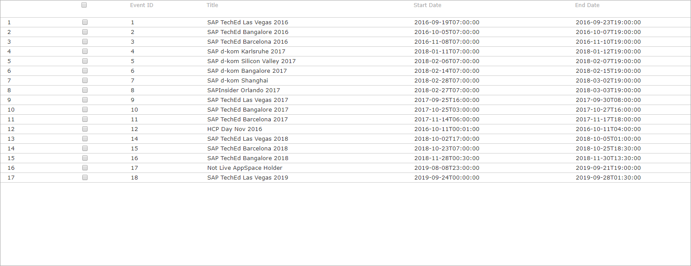
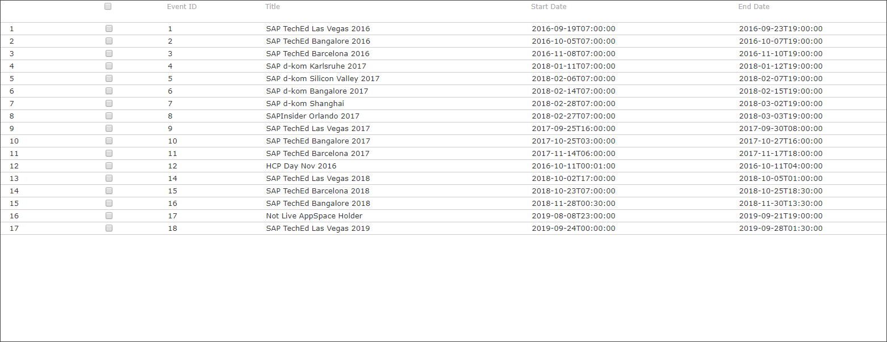

## Prerequisites
 - **Tutorials:** You have completed [Start SAP HANA, express edition Server](hxe-ua-getting-started-vm)

## Details
### You will learn
You'll learn how to configure your host machine to communicate with the server. OK.

[Test link](https://localhost:4004/testLink.html)
[Test link 3](https://localhost/testLink)
[Test link 4](https://localhost/testLink.html)
test
---

[ACCORDION-BEGIN [Step 1: ](Update etc/hosts)]

[SAP](mission.cp-starter-ibpm-employeeonboarding)

!

!

AAAAAAAAAAAAAAAAA

<rac-support@sap.com>


<https://localhost:4000>


[OPTION BEGIN [Windows]]

If you installed the VM installation package to a Windows machine, follow this step to update the `etc/hosts` file.

1.   On your Windows laptop, navigate to `C:\Windows\System32\drivers\etc`

2.   In `Administrator` mode, open `hosts` in Notepad. See your operating system Help for information on opening applications in Administrator mode

3.   In a new uncommented row, add the IP address and `hxehost`. Save your changes

    Spacing is important. Make sure your hosts file in Notepad looks like this image.

    

    > Note:
    > If the VM is restarted and assigned a new IP, you'll need to update the Hosts file.
    >
    >

[OPTION END]


[OPTION BEGIN [Mac and Linux]]
If you installed the VM installation package to a Mac or Linux machine, follow this step to update the `etc/hosts` file.

1.   On your Mac or Linux machine, start the Terminal application

2.   Enter the following command:

    ```bash
    sudo sh -c 'echo <hxehost IP address> hxehost >> /etc/hosts'
    ```

    > Note:
    > If the VM is restarted and assigned a new IP, you will need to update the Hosts file.
    >
    >


[OPTION END]

[DONE]

[ACCORDION-END]

[ACCORDION-BEGIN [Step 2: ](Test borders)]
### #EEEEEE


### #AAAAAA


|  Field Name     | Value
|  :------------- | :-------------
|  Name           | **`Northwind`**
|  Type           | **`HTTP`**
|  Description    | **`Northwind OData Service`**
|  URL          | **`http://services.odata.org`**
|  Proxy Type   | **`Internet`**
|  Authentication | **`NoAuthentication`**



### #888888

This is some text before.


This is some text before.

### #444444



This is some text before.

[DONE]
[ACCORDION-END]
