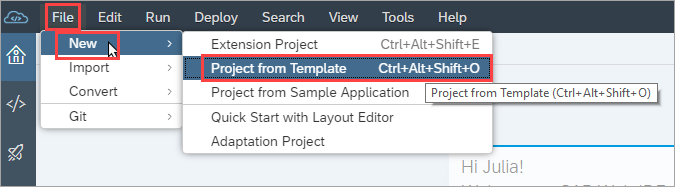

## Prerequisites
 - Make sure you have a Cloud Foundry account. For more information, see [Creating an Account](http://mywebsite.com).
 - Prerequisite 2

## Details
### You will learn
  - How to do something
  - Why this technology is helpful


An introductory sentence.

---

[ACCORDION-BEGIN [Step 1: ](Create a new project)]

1. Open the product and in the **File** menu, select **Menu > Selection > Go**.

    


2. In the window that opens, choose something.

3. Click the **Finish** button.


> This is a note.

For more information, see [Product Overview](http://www.sap.com).

When you do this \(or that\), you should first do this:

- Item
- Item
    1. Item
    2. Item
        * Item
        * Item

Bullets and sub-bullets:

* Item
* Item
    * Item
    * Item
        * Item
        * Item


Here's a table:

First Header | Second Header | Third Header
------------ | ------------- | ------------- |
Content cell 1 | Content cell 2 | Item  |
Content column 1 | Content column 2 | Item |
Content | Content | Content |

Here's what your `.json` file should now look like:

```
{
	"name": "myplugin",
	"description": "This is my plugin.",
	"i18n": "myplugin/i18n/i18n",
	"requires": {
		"services": [

		]
	},
	"provides": {
		"services": {

		},

		"interfaces": {

		}
	},
	"configures": {
		"services": {

		}
	},
	"subscribes": {

	}
}

```


[DONE]
[ACCORDION-END]

[ACCORDION-BEGIN [Step 2: ](Configure the app)]

Keep these \*asterisks\*.

1. Item 1
2. Item 2
3. Item 3
    * Item 3a
    * Item 3b


[VALIDATE_2]
[ACCORDION-END]


[ACCORDION-BEGIN [Step 3: ](XXXXX)]


[DONE]
[ACCORDION-END]

[ACCORDION-BEGIN [Step 4: ](XXXXX)]


[DONE]
[ACCORDION-END]

[ACCORDION-BEGIN [Step 5: ](XXXXX)]


[DONE]
[ACCORDION-END]

[ACCORDION-BEGIN [Step 6: ](XXXXX)]


[DONE]
[ACCORDION-END]


---
