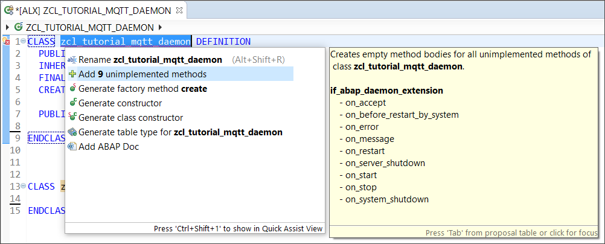
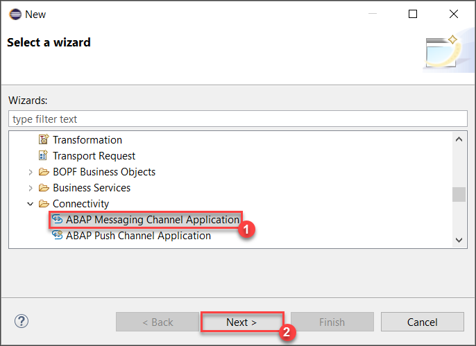
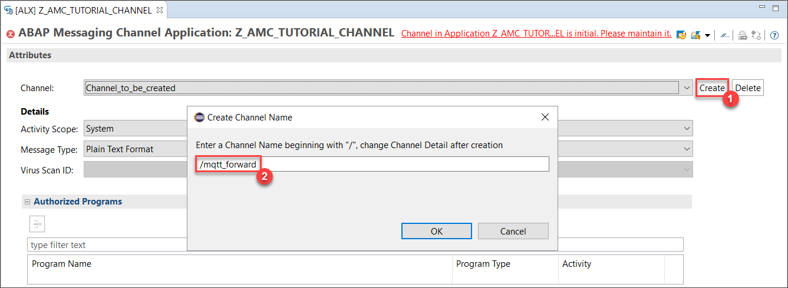
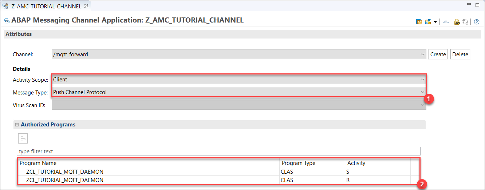
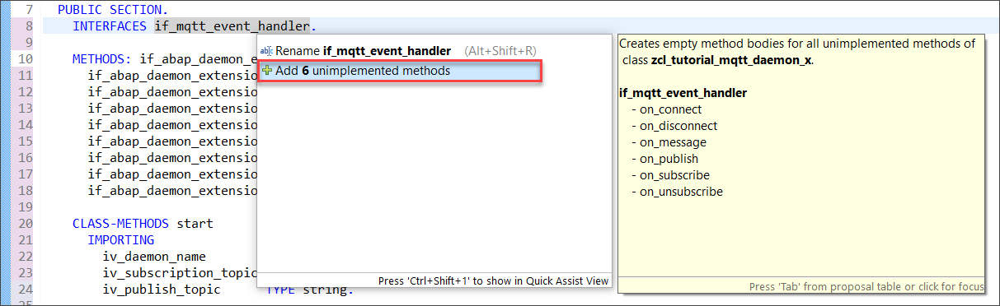
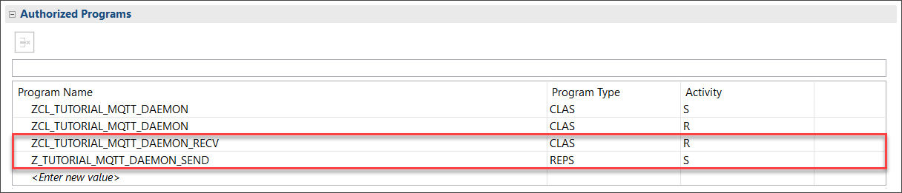
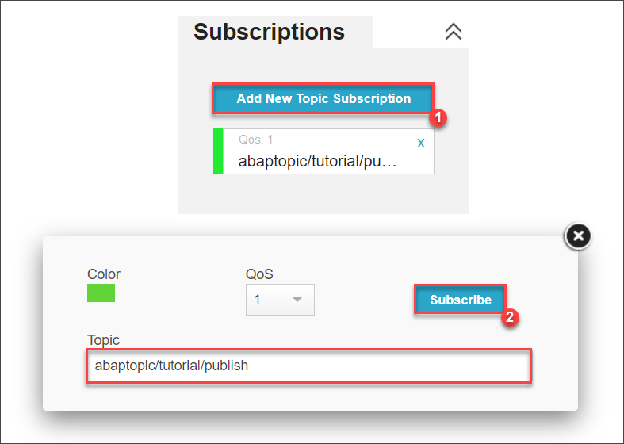
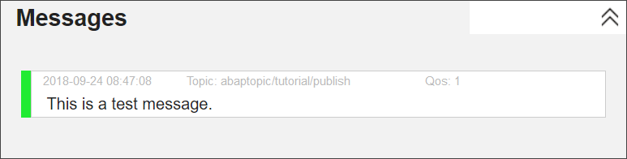
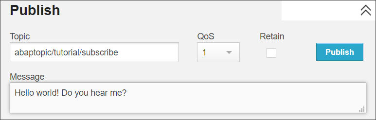
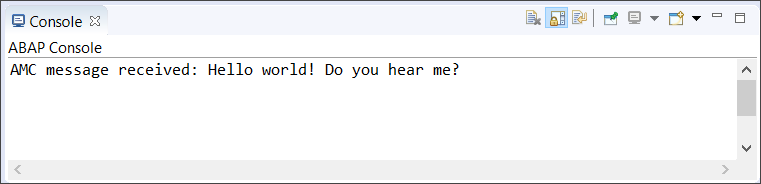

### Prerequisites
  - The ABAP MQTT Client is available on **ABAP Platform 1809** and above.
  - You need to use **ABAP Development Tools**.

## Details
### You will learn
- How to use ABAP Messaging Channels (AMC)
- How to combine MQTT, AMC and ABAP Daemons


### Time to Complete
**25 Min**.

---

In this tutorial, you will create an ABAP Daemon that should act as a bi-directional protocol converter between MQTT and AMC. The daemon should receive MQTT messages, convert them to PCP messages, and forward them via an ABAP Messaging Channel (AMC) to other applications. Forwarding also works in the reverse direction.

[ACCORDION-BEGIN [Step 1: ](Create an ABAP Daemon class)]
Create a new ABAP class **`ZCL_TUTORIAL_MQTT_DAEMON`** extending the base class `CL_ABAP_DAEMON_EXT_BASE`.

As you can see, there is an error in line 1 since the necessary abstract methods have not been implemented yet. Click on the light bulb next to the line number and select **Add 9 unimplemented methods** to resolve this:



Add the following variables to the `PRIVATE SECTION` of your class definition:
```abap
DATA: mv_subscription_topic TYPE string,
      mv_publish_topic      TYPE string,
      mo_client             TYPE REF TO if_mqtt_client.
```
You will need them later.

[DONE]
[ACCORDION-END]

[ACCORDION-BEGIN [Step 2: ](Create an ABAP Messaging Channel)]
Create a new ABAP Messaging Channel (AMC). To do so, click on **File** > **New** > **Other...** or press **`Ctrl+N`**.

In the popup window, select **ABAP** > **Connectivity** > **ABAP Messaging Channel Application** or simply search for it.



Proceed with the wizard and create an ABAP Messaging Channel Application named **`Z_AMC_TUTORIAL_CHANNEL`**.

> You can enter `$TMP` as the local package for this example.

Now, set up your channel. Choose **Create** and enter **`/mqtt_forward`** as the name of the channel.



> Note that an AMC name always has to start with a forward slash "/".

Specify further details regarding the channel. Select **`Client`** as the *Activity Scope* and **`Push Channel Protocol`** as *Message Type*. Additionally, add your daemon class `ZCL_TUTORIAL_MQTT_DAEMON` to the *Authorized Programs* section twice with the Activity S and R to allow your daemon to send and receive messages on this channel:



Finally, **activate your AMC Application** by pressing **`Ctrl+F3`**.

[DONE]
[ACCORDION-END]
[ACCORDION-BEGIN [Step 3: ](Implement ABAP Daemon events)]

>The implementation of the events `ON_ACCEPT`, `ON_START` and `ON_STOP` is based on the tutorial [**Create a Simple ABAP Daemon**](abap-connectivity-daemon-simple). If you need further information regarding these events, check out the tutorial or take a look at the [official documentation](https://help.sap.com/viewer/753088fc00704d0a80e7fbd6803c8adb/1709.001/en-US/311af9b769d84fffa7b7384bae27109c.html).

Replace the empty `ON_ACCEPT` method of your daemon class with the following code. This checks the call stack for whether the program is authorized to start the daemon.
```ABAP
METHOD if_abap_daemon_extension~on_accept.
  TRY.
      DATA lv_program_name TYPE program.
      lv_program_name = cl_oo_classname_service=>get_classpool_name( 'ZCL_TUTORIAL_MQTT_DAEMON' ).

      IF i_context_base->get_start_caller_info( )-program = lv_program_name.
        e_setup_mode = co_setup_mode-accept.
      ELSE.
        e_setup_mode = co_setup_mode-reject.
      ENDIF.
    CATCH cx_abap_daemon_error.
      " to do: error handling, e.g. write error log!
      e_setup_mode = co_setup_mode-reject.
  ENDTRY.
ENDMETHOD.
```

Now, implement the `ON_START` method. It receives two startup parameters containing the names of the MQTT topics for subscription and publication and stores them in the member variables created in step 1.

```ABAP
METHOD if_abap_daemon_extension~on_start.
  TRY.
      " retrieve PCP parameters from start parameters
      DATA(i_message)       = i_context->get_start_parameter( ).
      mv_subscription_topic = i_message->get_field( 'sub_topic' ).
      mv_publish_topic      = i_message->get_field( 'pub_topic' ).

      " specify which MQTT broker to connect to
      cl_mqtt_client_manager=>create_by_url(
          EXPORTING
            i_url            = 'ws://broker.hivemq.com:8000/mqtt'
            i_event_handler  = me
          RECEIVING
            r_client        =  mo_client ).

      " establish the connection
      mo_client->connect( ).

      " subscribe to MQTT topic with a certain quality of service
      DATA(lt_mqtt_topic_filter_qos) =
            VALUE if_mqtt_types=>tt_mqtt_topic_filter_qos(
                         ( topic_filter = mv_subscription_topic
                           qos          = if_mqtt_types=>qos-at_least_once ) ).

      mo_client->subscribe( i_topic_filter_qos = lt_mqtt_topic_filter_qos ).

      " subscribe to the AMC channel for receiving messages
      cl_amc_channel_manager=>create_message_consumer(
          i_application_id = 'Z_AMC_TUTORIAL_CHANNEL'
          i_channel_id     = '/mqtt_forward'
          )->start_message_delivery( i_receiver = me ).

    CATCH  cx_abap_daemon_error cx_ac_message_type_pcp_error cx_mqtt_error cx_amc_error.
      " to do: error handling, e.g. write error log!
  ENDTRY.
ENDMETHOD.
```

Then a connection to the MQTT broker is established and the daemon subscribes to the topic. Additionally, the daemon also subscribes to the ABAP Messaging Channel created in step 2.


> The `ON_START` method will contain two errors since your daemon has not implemented the MQTT and AMC Message handler yet. This will be fixed in steps 5 and 6.

Now, implement the `ON_STOP` method by inserting the lines below. This method is called when the ABAP Daemon is terminated. The following code simply unsubscribes from the MQTT topic.

```ABAP
METHOD if_abap_daemon_extension~on_stop.
  TRY.
      " unsubscribe from the MQTT topic
      DATA(lt_mqtt_topic_filter) = VALUE if_mqtt_types=>tt_mqtt_topic_filter( ( topic_filter =  mv_subscription_topic ) ).
      mo_client->unsubscribe( i_topic_filter = lt_mqtt_topic_filter ).
    CATCH cx_mqtt_error cx_ac_message_type_pcp_error cx_abap_daemon_error.
      " to do: error handling, e.g. write error log!
  ENDTRY.
ENDMETHOD.
```

[DONE]
[ACCORDION-END]

[ACCORDION-BEGIN [Step 4: ](Implement static methods)]
In this step, you will create two static methods `START` and `STOP`. They are used to instantiate and terminate your ABAP Daemon and will be called by another ABAP Program.

At first, define the methods by inserting the following code into the `PUBLIC SECTION` in the class definition of your ABAP Daemon class:

```ABAP
CLASS-METHODS start
  IMPORTING
    iv_daemon_name        TYPE string
    iv_subscription_topic TYPE string
    iv_publish_topic      TYPE string
  RAISING
    cx_abap_daemon_error
    cx_ac_message_type_pcp_error.

CLASS-METHODS stop
  IMPORTING
    iv_daemon_name TYPE string
  RAISING
    cx_abap_daemon_error.
```

Now, copy the static `START` method below into your class implementation. This instantiates the daemon and passes all necessary parameters via PCP.

```ABAP
METHOD start.
  " set ABAP Daemon start parameters
  DATA(lo_pcp) = cl_ac_message_type_pcp=>create( ).
  lo_pcp->set_field( i_name = 'name' i_value = iv_daemon_name ).
  lo_pcp->set_field( i_name = 'sub_topic' i_value = iv_subscription_topic ).
  lo_pcp->set_field( i_name = 'pub_topic' i_value = iv_publish_topic ).

  " start the daemon application using the ABAP Daemon Manager
  cl_abap_daemon_client_manager=>start(
      i_class_name = 'ZCL_TUTORIAL_MQTT_DAEMON'
      i_name       = CONV #( iv_daemon_name )
      i_priority   = cl_abap_daemon_client_manager=>co_session_priority_low
      i_parameter  = lo_pcp ).
ENDMETHOD.
```

The `STOP` method below can be used to terminate the daemon. It uses the *ABAP Daemon Client Manager* to retrieve a list of all running ABAP Daemon instances of your class and stops them.

Add these lines to the class implementation:

```ABAP
METHOD stop.
  " retrieve the list of ABAP Daemon instances
  DATA(lt_ad_info) = cl_abap_daemon_client_manager=>get_daemon_info( i_class_name = 'ZCL_TUTORIAL_MQTT_DAEMON').

  " for each running daemon instance of this class
  LOOP AT lt_ad_info ASSIGNING FIELD-SYMBOL(<ls_info>).

    " stop the daemon if the names match
    IF iv_daemon_name = <ls_info>-name.
      cl_abap_daemon_client_manager=>stop( i_instance_id = <ls_info>-instance_id ).
    ENDIF.

  ENDLOOP.
ENDMETHOD.
```

[DONE]
[ACCORDION-END]
[ACCORDION-BEGIN [Step 5: ](Handle incoming MQTT messages)]

Your ABAP Daemon will process each incoming MQTT message by simply forwarding it to the ABAP Messaging Channel.

In order to receive MQTT messages, your daemon needs to implement the interface `IF_MQTT_EVENT_HANDLER`. Therefore, insert the line below into the `PUBLIC SECTION` of your ABAP class definition:

```ABAP
INTERFACES if_mqtt_event_handler.
```

To easily implement the necessary methods for this interface, **place the cursor in the line you just inserted, press ``Ctrl+1``** and select **Add 6 unimplemented methods**:



Now, add the following code to the interface method `ON_MESSAGE`, which is called each time an MQTT message is received:

```ABAP
METHOD if_mqtt_event_handler~on_message.
  TRY.
      " retrieve message text and put received message into PCP format
      DATA(lv_message) = i_message->get_text( ).
      DATA(lo_pcp)     = cl_ac_message_type_pcp=>create( ).
      lo_pcp->set_text( lv_message ).

      " forward message via AMC
      CAST if_amc_message_producer_pcp(
             cl_amc_channel_manager=>create_message_producer(
               i_application_id = 'Z_AMC_TUTORIAL_CHANNEL'
               i_channel_id     =  '/mqtt_forward'
               i_suppress_echo  = abap_true )
        )->send( i_message = lo_pcp ).
    CATCH cx_mqtt_error cx_ac_message_type_pcp_error cx_amc_error.
      " to do: error handling, e.g. write error log!
  ENDTRY.
ENDMETHOD.
```

[DONE]
[ACCORDION-END]
[ACCORDION-BEGIN [Step 6: ](Handle AMC messages)]
As your ABAP Daemon shall also receive AMC messages, you will need to add another interface to your class definition:
```ABAP
INTERFACES if_amc_message_receiver_pcp.
```

There should be a warning since the interface method `RECEIVE` has not been implemented yet. In this method, you retrieve the PCP message content from the importing variable `I_MESSAGE`. Insert the code below into the class implementation of your ABAP Daemon:

```ABAP
METHOD if_amc_message_receiver_pcp~receive.
  TRY.
      " get message sent to the daemon via AMC
      DATA(lv_message) = i_message->get_text( ).

      " forward the message on the specified MQTT channel
      DATA(lo_mqtt_message) = cl_mqtt_message=>create( ).
      lo_mqtt_message->set_qos( if_mqtt_types=>qos-at_least_once ).
      lo_mqtt_message->set_text( lv_message ).

      mo_client->publish( i_topic_name = mv_publish_topic
                          i_message    = lo_mqtt_message ).

    CATCH cx_ac_message_type_pcp_error cx_mqtt_error.
      " to do: error handling, e.g. write error log!
  ENDTRY.
ENDMETHOD.
```

[DONE]
[ACCORDION-END]

[ACCORDION-BEGIN [Step 7: ](Run the ABAP Daemon)]
**Activate your ABAP Daemon class by pressing `Ctrl+F3`.**

To run the ABAP Daemon, create a new ABAP Program **`Z_TUTORIAL_MQTT_DAEMON_START`** that contains the following line:

```ABAP
zcl_tutorial_mqtt_daemon=>start( iv_daemon_name = 'mqtt_daemon' iv_subscription_topic = 'abaptopic/tutorial/subscribe' iv_publish_topic = 'abaptopic/tutorial/publish' ).
```

**Activate your program** `Z_TUTORIAL_MQTT_DAEMON_START` **by pressing `Ctrl+F3`**. Afterwards, **run it as ABAP Application (Console) by pressing `F9`**.

> Your daemon should now be running in the background. You can check this in the transaction `SMDAEMON`.

[DONE]
[ACCORDION-END]

[ACCORDION-BEGIN [Step 8: ](Prepare interaction with the ABAP Daemon)]
In this step, you will create two programs to test the functionality of your ABAP Daemon.

Create an ABAP Program **`Z_TUTORIAL_MQTT_DAEMON_SEND`**, which should send a message to the ABAP Messaging Channel to trigger the forwarding mechanism from AMC to MQTT. Copy the implementation below into this new program:

```ABAP
" create a PCP message
DATA(lo_pcp)     = cl_ac_message_type_pcp=>create( ).
lo_pcp->set_text( 'This is a test message.' ).

" send message via AMC
CAST if_amc_message_producer_pcp(
       cl_amc_channel_manager=>create_message_producer(
         i_application_id = 'Z_AMC_TUTORIAL_CHANNEL'
         i_channel_id     =  '/mqtt_forward'
         i_suppress_echo  = abap_true )
  )->send( i_message = lo_pcp ).
```

For the reverse direction, you will need a class that simply waits for any incoming messages via the AMC and logs them to the console. **Create a new ABAP class `ZCL_TUTORIAL_MQTT_DAEMON_RECV`** with the following content:

```ABAP
CLASS zcl_tutorial_mqtt_daemon_recv DEFINITION
  PUBLIC
  FINAL
  CREATE PUBLIC.

  PUBLIC SECTION.
    INTERFACES: if_oo_adt_classrun, if_amc_message_receiver_pcp.
  PROTECTED SECTION.
  PRIVATE SECTION.
    DATA: mo_out     TYPE REF TO if_oo_adt_classrun_out,
          mv_message TYPE string.
ENDCLASS.

CLASS zcl_tutorial_mqtt_daemon_recv IMPLEMENTATION.
  METHOD if_oo_adt_classrun~main.

    " create new instance of this class for receiving AMC messages
    DATA(lo_receiver) = NEW zcl_tutorial_mqtt_daemon_recv( ).
    lo_receiver->mo_out = out.
    lo_receiver->mv_message = ''.

    " subscribe to the channel
    TRY.
        cl_amc_channel_manager=>create_message_consumer(
              i_application_id = 'Z_AMC_TUTORIAL_CHANNEL'
              i_channel_id     = '/mqtt_forward'
          )->start_message_delivery( i_receiver = lo_receiver ).
      CATCH cx_amc_error.
        " to do: error handling, e.g. write error log!
    ENDTRY.

    " wait until an AMC message has been received
    WAIT FOR MESSAGING CHANNELS UNTIL lo_receiver->mv_message IS NOT INITIAL UP TO 60 SECONDS.

      " log any received message to the console
    IF lo_receiver->mv_message IS NOT INITIAL.
      out->write( |AMC message received: { lo_receiver->mv_message }| ).
    ELSE.
      out->write( 'No message received.' ).
    ENDIF.

  ENDMETHOD.

  METHOD if_amc_message_receiver_pcp~receive.
    TRY.
        " retrieve the received AMC message text
        mv_message = i_message->get_text( ).
      CATCH cx_ac_message_type_pcp_error.
        " to do: error handling, e.g. write error log!
    ENDTRY.
  ENDMETHOD.

ENDCLASS.
```

As these two programs will need to access your ABAP Messaging Channel, make sure to **add them to the *Authorized Programs* section** of the AMC Application. **Activate the AMC Application** afterwards.



[DONE]
[ACCORDION-END]

[ACCORDION-BEGIN [Step 9: ](Interact with the ABAP Daemon)]

Use the [HiveMQ Websocket Client](http://www.hivemq.com/demos/websocket-client/) to subscribe to the MQTT topic `abaptopic/tutorial/publish` as you can see in the image below:



> The HiveMQ Websocket Client is only used for example purposes. For productive usage, you can switch to any other application and broker. Make sure to adjust your source code accordingly.

**Activate the program** `Z_TUTORIAL_MQTT_DAEMON_SEND` **by pressing `Ctrl+F3`**. Afterwards, **run it as ABAP Application (Console) by pressing `F9`**.

You should see the text you just published on your ABAP Messaging Channel appear in the HiveMQ Websocket Client interface. This proves that your daemon has forwarded the message via MQTT.



For testing the other forwarding direction, **activate the class** `ZCL_TUTORIAL_MQTT_DAEMON_RECV`  **by pressing `Ctrl+F3`**. Now **run it as ABAP Application (Console) by pressing `F9`**.

> The class will now be able to receive AMC messages for 60 seconds. You can extend this time range by modifying the `WAIT ... UP TO 60 SECONDS` statement in the source code or you simply execute your class again.

While the class is running, you can publish MQTT messages under the topic `abaptopic/tutorial/subscribe` by using the [HiveMQ Websocket Client](http://www.hivemq.com/demos/websocket-client/):



This triggers the forwarding process and your ABAP class will output the received AMC message in the console:



[VALIDATE_1]
[ACCORDION-END]
