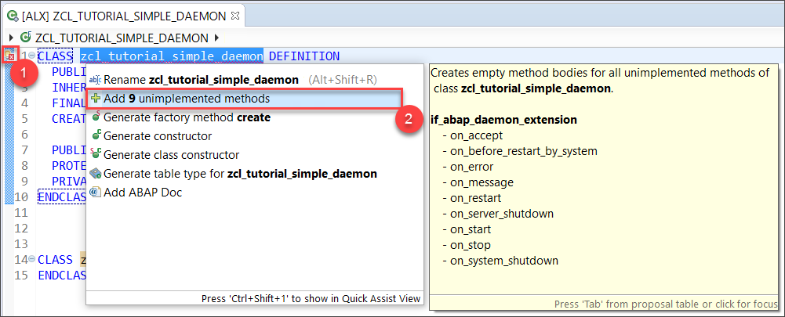
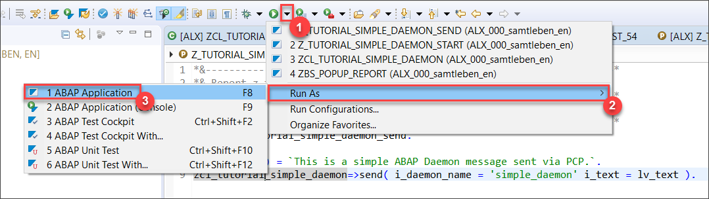
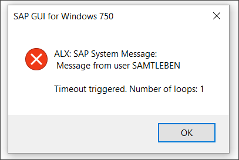
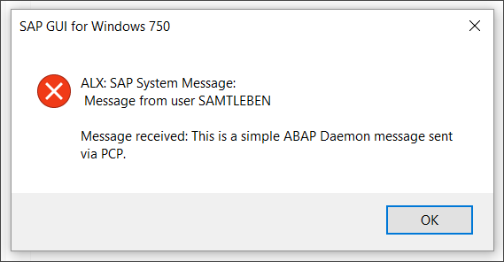

## Prerequisites
- Your system needs to be based on **SAP NetWeaver 7.52** or higher.
- You need to use **ABAP Development Tools**.

## Details
### You will learn
- How to create and run an ABAP Daemon
- How to send PCP messages to an ABAP Daemon


### Introduction to ABAP Daemons
ABAP Daemons are provided by the ABAP Daemon Framework (ADF). They are used to handle events in a reliable way by running in sessions with unlimited lifetime. ABAP programs can communicate with the daemons by sending messages to them using ABAP Messaging Channels and message type Push Channel Protocol.

You can make yourself more familiar with the ABAP Daemon Framework by reading the [official documentation](https://help.sap.com/viewer/753088fc00704d0a80e7fbd6803c8adb/1709.001/en-US/311af9b769d84fffa7b7384bae27109c.html).

> **Push Channel Protocol (PCP)** is a communications format similar to a simple HTTP message. It consists of header fields (name-value pairs) for metadata and a message body. For further information, have a look at the [Specification of the Push Channel Protocol](https://blogs.sap.com/2015/07/27/specification-of-the-push-channel-protocol-pcp/).

### Time to Complete
**20 Min**.

[ACCORDION-BEGIN [Step 1: ](Create a new ABAP Daemon class)]
ABAP Daemons are instances of an ABAP Daemon class that extend the base class `CL_ABAP_DAEMON_EXT_BASE`.

First, create a new ABAP class `ZCL_TUTORIAL_SIMPLE_DAEMON` and set `CL_ABAP_DAEMON_EXT_BASE` as its superclass.

As you can see there is an error in line 1 since the necessary abstract methods have not been implemented yet. Click on the light bulb next to the line number and select **Add 9 unimplemented methods** to resolve this:



[DONE]
[ACCORDION-END]

[ACCORDION-BEGIN [Step 2: ](Implement ON_ACCEPT method)]
Before a new instance of the ABAP Daemon class can be created, its `ON_ACCEPT` method is called to determine if the daemon should start.

Replace your `ON_ACCEPT` method with the following code. It accepts all start requests from your own class and rejects all requests from any other program. This is achieved by checking the calling program that initiated the start.

```abap
METHOD if_abap_daemon_extension~on_accept.
  TRY.
      DATA lv_program_name TYPE program.
      lv_program_name = cl_oo_classname_service=>get_classpool_name( 'ZCL_TUTORIAL_SIMPLE_DAEMON' ).

      IF i_context_base->get_start_caller_info( )-program = lv_program_name.
        e_setup_mode = co_setup_mode-accept.
      ELSE.
        e_setup_mode = co_setup_mode-reject.
      ENDIF.
    CATCH cx_abap_daemon_error.
      " to do: error handling, e.g. write error log!
      e_setup_mode = co_setup_mode-reject.
  ENDTRY.
ENDMETHOD.
```

[DONE]
[ACCORDION-END]


[ACCORDION-BEGIN [Step 3: ](Implement ON_START method)]
To start the ABAP Daemon, the `ON_START` method is executed.

You can include a PCP message containing arbitrary startup parameters which can be accessed in the `ON_START` method.

In this simple scenario, you will pass a parameter `timeout` via PCP. The daemon will then set up a timer to display a popup message each time the timeout was reached. A counter will be used to stop the timer after five messages.

At first, you need to create some private member variables to store the necessary data. Add these lines to the `PRIVATE SECTION` of your class:
```ABAP
DATA: mv_timeout TYPE i,
      mo_timer   TYPE REF TO if_abap_timer_manager,
      mv_counter TYPE i.
```

In the `ON_START` method you can now retrieve the timeout value from PCP and initiate the timer afterwards. To do so, copy the following implementation:
```abap
METHOD if_abap_daemon_extension~on_start.
  TRY.
      " retrieve timeout from PCP start parameters
      mv_timeout = i_context->get_start_parameter( )->get_field( 'timeout' ).

      " start timer for displaying messages
      mo_timer = cl_abap_timer_manager=>get_timer_manager( ).
      mo_timer->start_timer( i_timeout = mv_timeout i_timer_handler = me ).

    CATCH cx_abap_daemon_error cx_ac_message_type_pcp_error cx_abap_timer_error.
      " to do: error handling, e.g. write error log!
  ENDTRY.
ENDMETHOD.
```
> **CAUTION!** Please add your own exception handling for productive applications as this has not been included in this simple tutorial.

[DONE]
[ACCORDION-END]

[ACCORDION-BEGIN [Step 4: ](Implement ON_TIMEOUT method)]
While your ABAP Daemon is running in the background, the `ON_TIMEOUT` method will be triggered when the timeout elapses. Therefore, you need to implement a handler interface. Add this code to the `PUBLIC SECTION` of your class:
```ABAP
INTERFACES if_abap_timer_handler.
```

Now insert the following `ON_TIMEOUT` method into your class implementation. It will display a popup message using function module `TH_POPUP` and restart the timer five times:

```ABAP
METHOD if_abap_timer_handler~on_timeout.
  " increment the loop counter
  ADD 1 TO mv_counter.

  " display popup message
  CALL FUNCTION 'TH_POPUP'
    EXPORTING
      client  = sy-mandt
      user    = sy-uname
      message = CONV th_popup( |Timeout triggered. Number of loops: { mv_counter }| ).

  " restart the timer if any loops are remaining
  IF mv_counter < 5.
    TRY.
        mo_timer->start_timer( i_timeout = mv_timeout i_timer_handler = me ).
      CATCH cx_abap_timer_error.
        " to do: error handling, e.g. write error log!
    ENDTRY.
  ENDIF.
ENDMETHOD.
```

[DONE]
[ACCORDION-END]

[ACCORDION-BEGIN [Step 5: ](Implement ON_MESSAGE method)]
You can also send PCP messages to your daemon while it is continuously running in the background. The `ON_MESSAGE` method will be called every time the daemon receives a PCP message.

In this tutorial, you will send a plain text to the daemon, which then will be shown in a popup message. As a real life example, you could imagine the ABAP Daemon receiving live data from a sensor and sending a notification under certain conditions.

Replace your `ON_MESSAGE` method with this code:
```abap
METHOD if_abap_daemon_extension~on_message.
  TRY.
      " get text from PCP message
      DATA(lv_text) = i_message->get_text( ).

      " display popup
      CALL FUNCTION 'TH_POPUP'
        EXPORTING
          client  = sy-mandt
          user    = sy-uname
          message = CONV th_popup( |Message received: { lv_text }| ).
    CATCH cx_ac_message_type_pcp_error.
      " to do: error handling, e.g. write error log!
  ENDTRY.
ENDMETHOD.
```

[DONE]
[ACCORDION-END]

[ACCORDION-BEGIN [Step 6: ](Implement the static method START)]
> Since the security concept of ABAP Daemons is based on "source code authorization" (see documentation), i.e. only the program (e.g. a class) which starts the daemon has the right to send messages to the daemon or to stop it. For simplicity reasons we use the daemon class to implement the start, stop and send functionalities for the daemon to access them from different programs.

This simple ABAP Daemon will be started by a static method. Thus, you need to create a new method `START` in your daemon class with two import parameters:

- `IV_DAEMON_NAME`: The name of the daemon
- `IV_TIMEOUT`: The timeout between two successive timer events (milliseconds)

To do so, paste the following code into the `PUBLIC SECTION` of the class definition:
```ABAP
CLASS-METHODS start
  IMPORTING
    iv_daemon_name TYPE string
    iv_timeout     TYPE i
  RAISING
    cx_abap_daemon_error
    cx_ac_message_type_pcp_error.
```
Instantiate the ABAP Daemon using the ABAP Daemon Manager. Its static method `CL_ABAP_DAEMON_CLIENT_MANAGER=>START` requires the name and priority of the daemon as parameters. Additionally, you can pass the startup parameters as a PCP message.

Copy these lines into your class implementation:

```ABAP
METHOD start.
  " set ABAP Daemon start parameters
  DATA(lo_pcp) = cl_ac_message_type_pcp=>create( ).
  lo_pcp->set_field( i_name = 'timeout' i_value = CONV #( iv_timeout ) ).

  " start the daemon application using the ABAP Daemon Manager
  cl_abap_daemon_client_manager=>start(
      i_class_name = 'ZCL_TUTORIAL_SIMPLE_DAEMON'
      i_name       = CONV #( iv_daemon_name )
      i_priority   = cl_abap_daemon_client_manager=>co_session_priority_low
      i_parameter  = lo_pcp ).
ENDMETHOD.
```

[DONE]
[ACCORDION-END]

[ACCORDION-BEGIN [Step 7: ](Implement the static method SEND)]
Implement a static method `SEND` which will be used to send text to the daemon and therefore trigger its `ON_MESSAGE` method. The method will need the following importing parameters:

- `IV_DAEMON_NAME`: The name of the daemon that will receive the message.
- `IV_TEXT`: The text message that will be send to the daemon.

> You can have multiple instances of your daemon running independently at the same time as they can be distinguished by their name.

Paste the code below into the `PUBLIC SECTION` of the class definition.
```ABAP
CLASS-METHODS send
  IMPORTING
    iv_daemon_name TYPE string
    iv_text        TYPE string
  RAISING
    cx_abap_daemon_error
    cx_ac_message_type_pcp_error.
```

In order to send PCP messages to your daemon, you first have to retrieve a list of all running ABAP Daemon instances of your class `ZCL_TUTORIAL_SIMPLE_DAEMON`. Afterwards, you can compare the name of each instance to `IV_DAEMON_NAME` and send the PCP message accordingly.

Insert the following code into the class implementation:
```ABAP
METHOD send.
  " retrieve the list of ABAP Daemon instances
  DATA(lt_ad_info) = cl_abap_daemon_client_manager=>get_daemon_info( i_class_name = 'ZCL_TUTORIAL_SIMPLE_DAEMON').

  " create PCP message with text
  DATA(lo_pcp) = cl_ac_message_type_pcp=>create( ).
  lo_pcp->set_text( iv_text ).

  " for each running daemon instance of this class
  LOOP AT lt_ad_info ASSIGNING FIELD-SYMBOL(<ls_info>).

    " send a message if the names match
    IF iv_daemon_name = <ls_info>-name.
      cl_abap_daemon_client_manager=>attach( <ls_info>-instance_id )->send( lo_pcp ).
    ENDIF.

  ENDLOOP.
ENDMETHOD.
```

[DONE]
[ACCORDION-END]

[ACCORDION-BEGIN [Step 8: ](Run the ABAP Daemon)]
**Congratulations, you have now created your first ABAP Daemon class!
Activate it by pressing `Ctrl+F3`.**

You can run your daemon by simply calling the static `START` method created previously. Therefore, create a new ABAP Program `Z_TUTORIAL_SIMPLE_DAEMON_START` with only one line of code:

```abap
zcl_tutorial_simple_daemon=>start( iv_daemon_name = 'simple_daemon' iv_timeout = 10000 ).
```

Activate the program and run it as **ABAP Application**:



You should see a popup notification every 10 seconds:



[DONE]
[ACCORDION-END]

[ACCORDION-BEGIN [Step 9: ](Send messages to the ABAP Daemon)]
In addition to the timeout, you can trigger a popup message manually by calling the static `SEND` method. Create another ABAP Program `Z_TUTORIAL_SIMPLE_DAEMON_SEND` with the following content:

```abap
DATA(lv_text) = `This is a simple ABAP Daemon message sent via PCP.`.
zcl_tutorial_simple_daemon=>send( iv_daemon_name = 'simple_daemon' iv_text = lv_text ).
```

Feel free to change the message text in line 1. After activating and executing the program you should see a popup message similar to this:



> **If you do not receive any message:** Make sure your daemon has been started previously in step 8. The daemon will keep running even after the popup messages stop.

[DONE]
[ACCORDION-END]

[ACCORDION-BEGIN [Step 10: ](Stop the ABAP Daemon)]
You can monitor all running ABAP Daemons using transaction `SMDAEMON` in SAPGUI. There you can see their state, check for errors, and also restart and terminate them.

To stop your daemon, select it from the list and go to **ABAP Daemon** > **Terminate Daemon**.

Alternatively, you can also create a static `STOP` method. Therefore, add this to the `PUBLIC SECTION` of your class definition:

```ABAP
CLASS-METHODS stop
  IMPORTING
    iv_daemon_name TYPE string
  RAISING
    cx_abap_daemon_error.
```

Copy the following lines into the class implementation:

```ABAP
METHOD stop.
  " retrieve the list of ABAP Daemon instances
  DATA(lt_ad_info) = cl_abap_daemon_client_manager=>get_daemon_info( i_class_name = 'ZCL_TUTORIAL_SIMPLE_DAEMON').

  " for each running daemon instance of this class
  LOOP AT lt_ad_info ASSIGNING FIELD-SYMBOL(<ls_info>).

    " stop the daemon if the names match
    IF iv_daemon_name = <ls_info>-name.
        cl_abap_daemon_client_manager=>stop( i_instance_id = <ls_info>-instance_id ).
    ENDIF.

  ENDLOOP.
ENDMETHOD.
```

Now you can stop your daemon by executing

```ABAP
zcl_tutorial_simple_daemon=>stop( iv_daemon_name = 'simple_daemon' ).
```
from any ABAP Program.

> For further information on ABAP Daemons, see the [ABAP Daemons documentation](https://help.sap.com/viewer/753088fc00704d0a80e7fbd6803c8adb/1709.001/en-US/311af9b769d84fffa7b7384bae27109c.html).

[DONE]
[ACCORDION-END]

[ACCORDION-BEGIN [Step 11: ](Test your application)]

Start your daemon using the following line of code. Note that the daemon name is now significantly longer and the timeout is negative.

```ABAP
zcl_tutorial_simple_daemon=>start( iv_daemon_name = 'does_the_daemon_start_up_if_you_use_this_as_your_daemon_name' iv_timeout = -10000 ).
```

[VALIDATE_1]
[ACCORDION-END]
