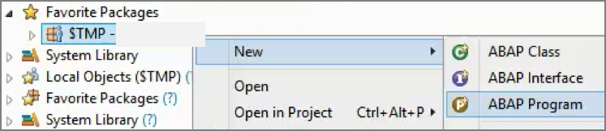
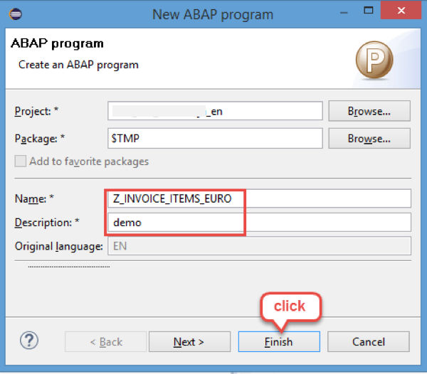
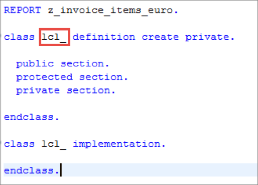
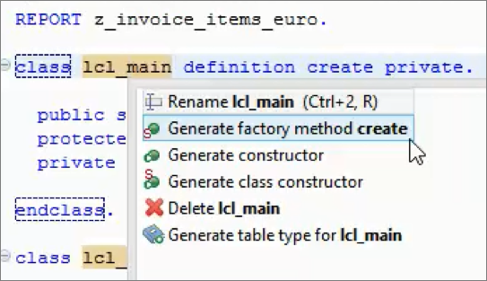
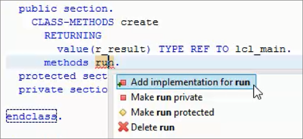
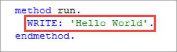
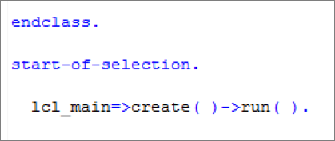
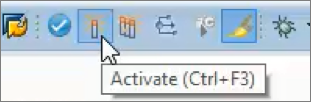
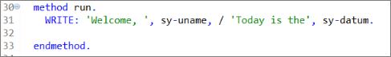
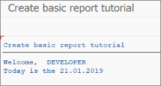

## Prerequisites  
- You have a valid instance of an on-premise AS ABAP server, version 7.51 or higher (some ABAP Development Tools may not be available in earlier versions)
- **Tutorial**: [Create an ABAP Project in ABAP Development Tools (ADT)](https://developers.sap.com/tutorials/abap-create-project.html)

## Details
### You will learn  
- How to create and run an ABAP application

This mission is based on tables of the SAP NetWeaver Demo sample EPM Model, so that you can complete the tutorial on any SAP NetWeaver `7.5x` system.

For more information, see [The SAP NetWeaver Enterprise Procurement Model – An Introduction](https://help.sap.com/viewer/a602ff71a47c441bb3000504ec938fea/7.52.2/en-US/57e9f59831e94311852a2af18ab733b5.html)

---

[ACCORDION-BEGIN [Step 1: ](Create new ABAP program)]
In the toolbar, choose **New** > **ABAP Program...**:



A wizard appears to create a new ABAP Program. Enter **`z_invoice_items_euro`** in the name field. Enter a meaningful text in the **description field**. Choose **Finish** to create the report.
Afterwards an editor will be opened which shows the empty report.



[DONE]
[ACCORDION-END]

[ACCORDION-BEGIN [Step 2: ](Create ABAP local class)]

1. Type `lcl` and choose `Ctrl+Space` to get code completion proposals. Select the code template for the insertion of a local class by choosing `lcl - Local class` or choose `Enter` if the right entry is already selected.

    

2. Adjust the name of the local class to `lcl_main` using inline editing.

    

[DONE]
[ACCORDION-END]

[ACCORDION-BEGIN [Step 3: ](Create CREATE method)]
Position the cursor in the class definition statement and choose **Ctrl+1** to open the Quick Fix menu. Choose **Generate factory method create** to create a static factory method.



[DONE]
[ACCORDION-END]

[ACCORDION-BEGIN [Step 4: ](Implement RUN method)]
1. Add the definition of an additional instance method **run** by entering **`methods run.`** in the public section.

2. Then position the cursor on the method name and choose **Ctrl+1** to open the Quick-Fix menu. Choose **Add implementation for run**.

    

3. Implement a simple **WRITE** statement in the method **run**.

    

[DONE]
[ACCORDION-END]

[ACCORDION-BEGIN [Step 5: ](Make ABAP program runnable)]
1. Add a **START-OF-SELECTION event** to your report

2. Create an instance of the local class `lcl_main`.

3. Call the **run** method.
That is, enter the following code:

    ```ABAP
    START-OF-SELECTION.
        lcl_main=>create( )->run( ).
    ```

    

Class methods are called using `=>` ; instance methods are called using `->`.

[DONE]
[ACCORDION-END]

[ACCORDION-BEGIN [Step 6: ](Save and activate ABAP program)]
Save and activate your program by choosing **Save** and **Activate** in the toolbar.



[DONE]
[ACCORDION-END]

[ACCORDION-BEGIN [Step 7: ](Run the ABAP program)]
Choose **F8** to run your program. An embedded SAP GUI will open inside an Eclipse editor. After checking the output of the report choose **Close**.


[DONE]
[ACCORDION-END]

[ACCORDION-BEGIN [Step 8: ](Output system variables)]
You will now enhance the program to output your user name and today's date. Change the `WRITE` statement to:

   `WRITE: 'Welcome, ', sy-uname, / 'Today is the', sy-datum.`



`sy- ` is the table containing all the system fields. For the complete list, see the [ABAP keyword documentation: ABAP System Fields](https://help.sap.com/doc/abapdocu_752_index_htm/7.52/en-US/index.htm?file=ABENSYSTEM_FIELDS.htm).

`/` is simply the new line character. (See also [ABAP keyword documentation: WRITE](https://help.sap.com/doc/abapdocu_752_index_htm/7.52/en-US/index.htm?file=abapwrite-.htm).)

[DONE]
[ACCORDION-END]

[ACCORDION-BEGIN [Step  9: ](Run the ABAP program)]
Again, choose **F8** to run your program. Your output should now look something like this:



[DONE]
[ACCORDION-END]

[ACCORDION-BEGIN [Step 10: ](Check your code)]
Your code should look like this:

```ABAP
*&---------------------------------------------------------------------*
*& Report zjp_basic_app
*&---------------------------------------------------------------------*
*&
*&---------------------------------------------------------------------*
REPORT z_invoice_items_euro.

class lcl_main definition create private.

  public section.
    methods run.
    CLASS-METHODS create
      RETURNING
        value(r_result) TYPE REF TO lcl_main.

  protected section.
  private section.

endclass.

class lcl_main implementation.

  method create.
    create object r_result.
  endmethod.

  method run.
    WRITE: 'Welcome, ', sy-uname, / 'Today is the', sy-datum.

  endmethod.

endclass.

START-OF-SELECTION.
    lcl_main=>create( )->run( ).

```

[DONE]
[ACCORDION-END]

[ACCORDION-BEGIN [Step 11: ](Test yourself)]


[VALIDATE_1]
[ACCORDION-END]
