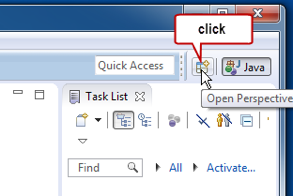
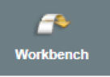
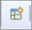
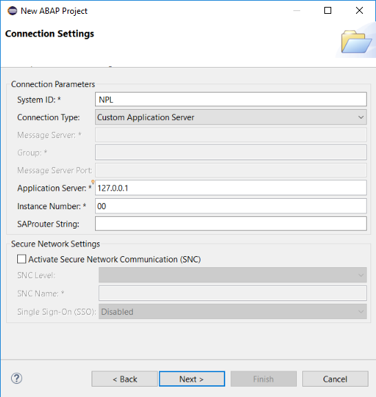
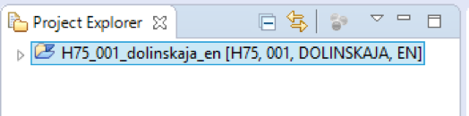

## Prerequisites  
 - Download and install the latest Eclipse IDE from [Eclipse ](http://www.eclipse.org/) site

## Next Steps
[Display database content and run SQL queries](http://www.sap.com/developer/tutorials/abap-display-data-queries.html)

## Details
### You will learn  
In this tutorial you will learn how to configure your ABAP development environment and create your first ABAP project.

### Time to Complete
**10 Min**.

---

[ACCORDION-BEGIN [Step 1: ](Download, Install and launch the Eclipse IDE)]
ABAP development is done in the Eclipse IDE with custom ABAP tooling. If you haven't installed Eclipse yet, [download Eclipse IDE for Java Developers](http://www.eclipse.org/), install and launch the application now.

[DONE]
[ACCORDION-END]

[ACCORDION-BEGIN [Step 2: ](Install the ABAP Development Tools for SAP NetWeaver (ADT))]

 - In the Eclipse menu bar, select: **Help > Install New Software...**
 - In the dialog box add the URL `https://tools.hana.ondemand.com/neon` (e.g. for Eclipse Neon 4.6)
 - Press **Enter** to display the available features
 - Select **ABAP Development Tools for SAP NetWeaver** and click **Next**
 - On the next wizard page, you get an overview of the features to be installed. Click **Next**
 - Confirm the license agreements and click **Finish** to start the installation

[DONE]
[ACCORDION-END]

[ACCORDION-BEGIN [Step 3: ](Switch perspective)]

Switch to the ABAP perspective by clicking the **Open Perspective** button or using the menu: **Window > Open Perspective > Other**.

[DONE]
[ACCORDION-END]

[ACCORDION-BEGIN [Step 4: ](Close the Welcome page)]

The Welcome Page might appear. It gives some general information about Eclipse. Click on the **Workbench** button to leave the Welcome Page.

[DONE]
[ACCORDION-END]

[ACCORDION-BEGIN [Step 5: ](Select the ABAP perspective)]

Click **Open Perspective** button.

Then switch to ABAP Perspective by choosing **ABAP** in the list and clicking the **OK** button.

[DONE]
[ACCORDION-END]

[ACCORDION-BEGIN [Step 6: ](Familiarize yourself with the tooling layout)]

In the ABAP Perspective, the ABAP tools are ideally positioned in the IDE to facilitate your development tasks. Nevertheless you are free to rearrange all views and editors to your personal needs.

[DONE]
[ACCORDION-END]

[ACCORDION-BEGIN [Step 7: ](New ABAP Project)]

Open the **File** menu, select **New** and then click on **ABAP Project**. Choose the ABAP backend system from the list of SAP System connections and press the **Next** button.

[DONE]
[ACCORDION-END]

[ACCORDION-BEGIN [Step 8: ](Select Connection Settings)]

Click Next on the Connection Settings dialog.

[DONE]
[ACCORDION-END]

[ACCORDION-BEGIN [Step 9: ](Enter your log on data)]

On the next screen enter your logon data and click the **Finish** button.

[DONE]
[ACCORDION-END]

[ACCORDION-BEGIN [Step 10: ](Project created)]

The ABAP Project has been created. It represents a system connection to your chosen SAP system.

[DONE]
[ACCORDION-END]

## Next Steps
 [Display database content and run SQL queries](http://www.sap.com/developer/tutorials/abap-display-data-queries.html)
