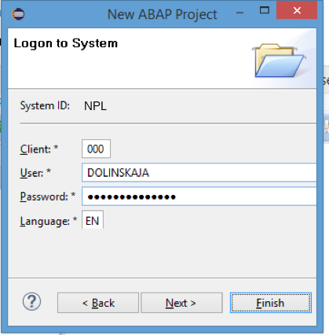
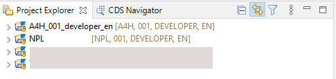

## Prerequisites  
 - You have a valid instance of an on-premise AS ABAP server, version 7.51 or higher (some ABAP Development Tools may not be available in earlier versions). You can download a free ABAP application server, developer edition, from [SAP Developers Community - Trials and Downloads](https://developers.sap.com/trials-downloads.html?search=AS%20ABAP), e.g. AS ABAP 7.52 SP04
 - You have downloaded and installed the latest Eclipse IDE from [Eclipse IDE for Java Developers ](http://www.eclipse.org/) site, and opened the application.

## Details
### You will learn  
- How to configure your ABAP development environment with ABAP Development Tools (ADT)
- How to create your first ABAP project

---

[ACCORDION-BEGIN [Step 1: ](Install the ABAP Development Tools for SAP NetWeaver (ADT))]

Follow the instructions on the [ABAP Development Tools](https://tools.hana.ondemand.com/#abap) site.

[DONE]
[ACCORDION-END]

[ACCORDION-BEGIN [Step 2: ](Select the ABAP perspective)]
1. If the Welcome Page appears, close it.
2. Switch to the ABAP perspective choosing **Open Perspective** from the toolbar or using the menu: **Window > Open Perspective > Other**.

Then switch to the ABAP Perspective by choosing **ABAP** in the list and choosing **OK**.

[DONE]
[ACCORDION-END]

[ACCORDION-BEGIN [Step 3: ](Familiarize yourself with the tooling layout)]

In the ABAP Perspective, the ABAP tools are ideally positioned in the IDE to facilitate your development tasks. Nevertheless you are free to rearrange all views and editors to your personal needs.

[DONE]
[ACCORDION-END]

[ACCORDION-BEGIN [Step 4: ](Create a new ABAP project)]

You need to create one ABAP project for each system connection. To do this:

1. In the **File** menu, choose **New > Other ABAP Project**. Choose the ABAP backend system from the list of SAP System connections, then choose **Next**. For example, if you are using the AS ABAP 7.5x developer edition, this will be **`NPL`** or **`A4H`**.

    !

2. In Connection Settings, accept the defaults and choose **Next**.

    

3. Enter your logon data and choose **Finish**.

    

The ABAP Project has been created. It represents a system connection to your chosen SAP system.

!

[DONE]
[ACCORDION-END]

[ACCORDION-BEGIN [Step 5: ](Test yourself)]

[VALIDATE_1]
[ACCORDION-END]
