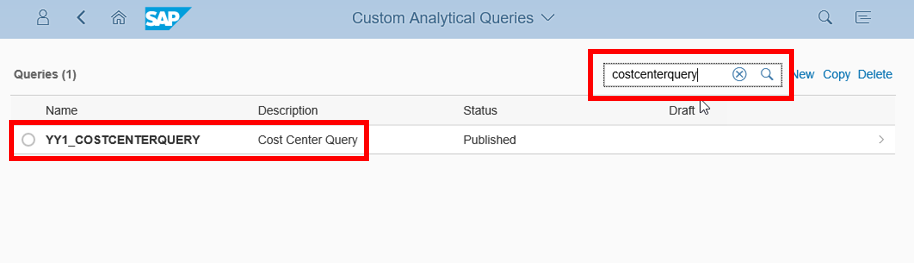
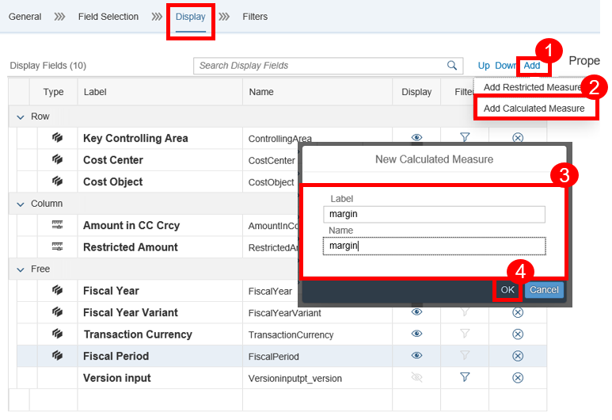
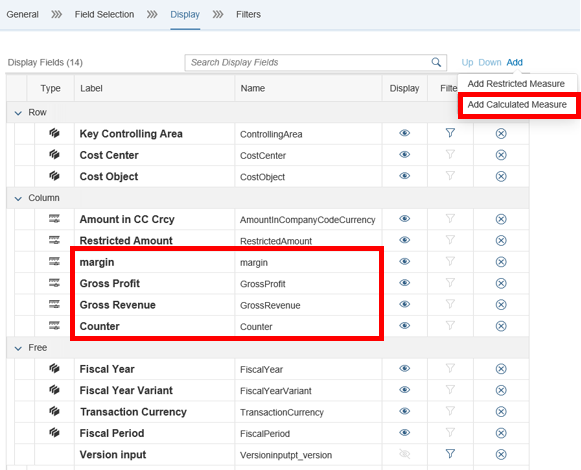
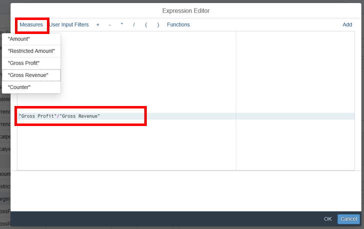
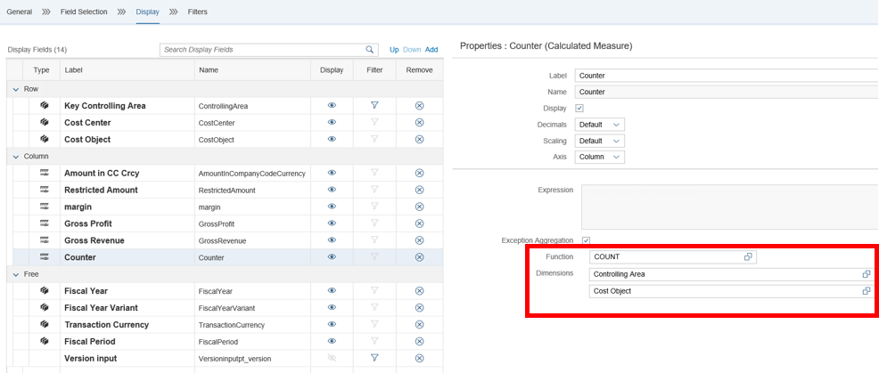
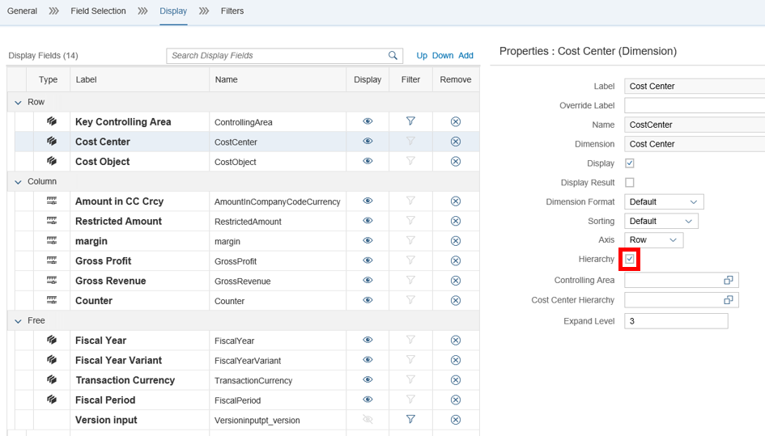
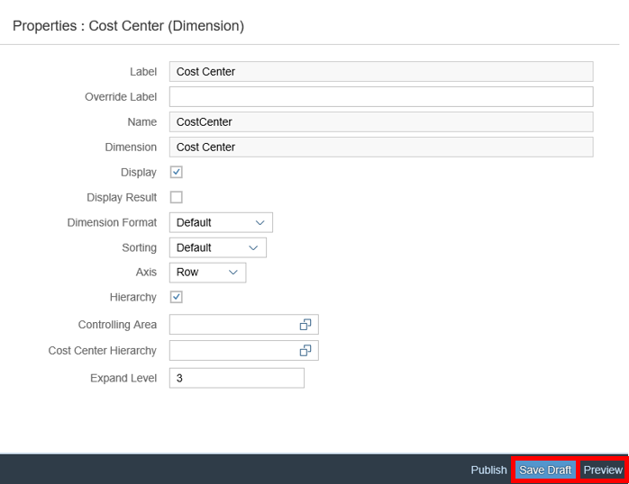
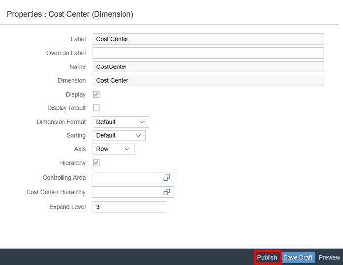

## Prerequisites  
The Business user requires the Role `SAP_BCR_CA_ANA_AQD_PC` to access the Query Designer.
Furthermore `ABAP Custom Analytical Queries` as a tutorial reveals another Prerequisite.

## Details
The Application Custom Analytical Queries characterizes the usage of reporting and analysis.
Raw data from business documents are getting converted into a meaningful grid.
By using Custom Analytical Queries you do not need to understand the technical details.

### You will learn  
This tutorial teaches you the creation of a Custom Analytical Query and the addition of a Calculated Measures. You will also be able to edit your calculated Measures and define an Exception Aggregation.

---
[ACCORDION-BEGIN [Step 1: ](Open Custom Analytical Queries Application)]
Start the **Custom Analytical Queries** Application by selecting the corresponding tile in the SAP Fiori Launchpad.

[DONE]
[ACCORDION-END]

[ACCORDION-BEGIN [Step 2: ](Select your Analytical Query)]
To edit your analytical query you have to search for it and **select** it.
Furthermore you have to click on the **Edit** button to continue.

[DONE] 
[ACCORDION-END]

[ACCORDION-BEGIN [Step 3: ](Add Calculated Measures)]
Now you have to switch to the **Display** Tab to add a calculated measure.

[DONE]
[ACCORDION-END]

[ACCORDION-BEGIN [Step 4: ](Add Further Calculated Measures)]
Press the **Add** button to add further calculated measures like:

-    **Gross Profit**
-    **Gross Revenue**
-     and **Counter**.

[DONE]
[ACCORDION-END]

[ACCORDION-BEGIN [Step 5: ](Edit Calculated Measures)]
Select the measure **`margin`** and click on **Edit** to open the expression editor in a `popup` window.

[DONE]
[ACCORDION-END]

[ACCORDION-BEGIN [Step 6: ](Choose Measures)]
You can choose different measures, supported functions and you have content assistance by pressing **`Ctrl`** + **space**.

Select **`"Gross Profit" / "Gross Revenue"`** as an Expression.

[DONE]
[ACCORDION-END]

[ACCORDION-BEGIN [Step 7: ](Result of Measures)]

Result:
The new expression for the calculated measure is shown in the text field.

[DONE]
[ACCORDION-END]

[ACCORDION-BEGIN [Step 8: ](Define Exception Aggregation)]
For a calculated measure, you can define exception aggregation. Check **Exception Aggregation** and press the value help to add a function. The **`popup`** shows you the supported functions. One or more dimensions can be added to the exception aggregation via the **+** button.

Select following:

-      `COUNT` as `Function`
-      `Controlling Area` as `Dimension`
-       and `Cost Object` as `a further Dimension`.

[DONE]
[ACCORDION-END]

[ACCORDION-BEGIN [Step 9: ](Display Hierarchy)]
If a field supports hierarchies, then the hierarchy checkbox is shown in the properties.
**`Checkmark` the hierarchy checkbox** to enable displaying hierarchy for `CostCenter`.
Furthermore select values for `Controlling Area` and `Cost Center Hierarchy`.

[DONE]
[ACCORDION-END]

[ACCORDION-BEGIN [Step 10: ](Save the Draft and Show the Preview)]
**Click on Save Draft** to save the query and **click** afterwards on **Preview** to test the query.

[DONE]
[ACCORDION-END]

[ACCORDION-BEGIN [Step 11: ](Publish the Query)]
**Click on publish** to publish the query. Published queries are available to be consumed by Key Performance Indicators and Reports.  

After publishing the status will be updated to published on the top right corner.

[DONE]
[ACCORDION-END]

[ACCORDION-BEGIN [Step 12: ](Test yourself)]

[VALIDATE_1]
[ACCORDION-END]
