## Prerequisites  
The Business user requires the Role `SAP_BCR_CA_ANA_AQD_PC` to access the Query Designer.

## Details
**Custom Analytical Queries** is a tool used for reporting and analysis.
Raw data from business documents are getting converted into a meaningful grid.
By using Custom Analytical Queries you do not need to understand the technical details.

### You will learn  
In this tutorial you will learn how to setup Custom Analytical Queries for use. This section deals with creating, deleting and modifying queries. The creation of Restricted Measures will take part in this example.

---

[ACCORDION-BEGIN [Step 1: ](Open Custom Analytical Queries Application)]
Start the **Custom Analytical Queries** Application by selecting the corresponding tile in the SAP Fiori Launchpad.

[DONE]
[ACCORDION-END]

[ACCORDION-BEGIN [Step 2: ](Create Query)]
Choose **New  (1)** to create a new query. Enter the **query name (2)**: `CostCenterCostQuery`.

Choose the **data view (3) + (4)** `I_GLACCOUNTLINEITEMCUBE`. **Press OK (5)** to create the query.

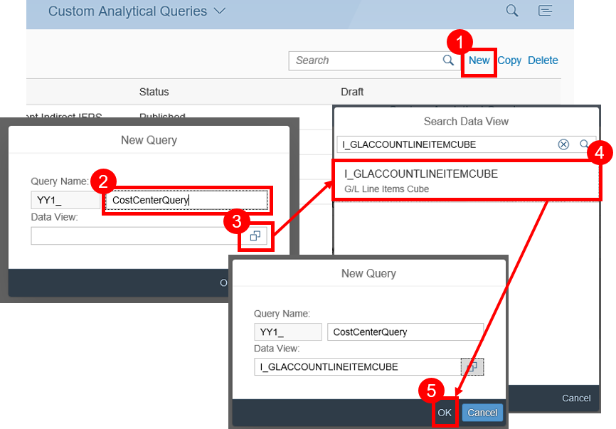

[DONE]
[ACCORDION-END]

[ACCORDION-BEGIN [Step 3: ](Specify Label)]
On the **General** tab, you can specify the label.

[DONE]
[ACCORDION-END]

[ACCORDION-BEGIN [Step 4: ](Select Fields)]
Switch now to the **Field Selection** tab.

**Select** all following **fields** of the Data View, so that they can be copied to the query:
-  `Amount in CC Crcy`
-  `Controlling Area`
-  `Cost Center`
-  `Fiscal Year`
-  `Fiscal Year Variant`
-  `Cost Object`
-  `Transaction Currency`
-  `Fiscal Period`

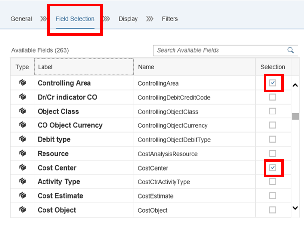

[DONE]
[ACCORDION-END]

[ACCORDION-BEGIN [Step 5: ](Select Display Tab)]
Switch now to the **Display** tab. The **Display** icon indicates, whether a column is shown in
the report. The **Filter** icon indicates, whether a fixed value filter is defined for this field.

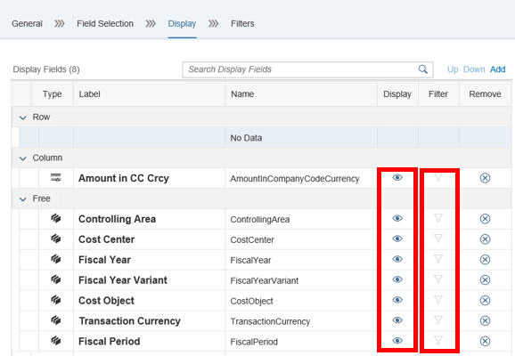

[DONE]
[ACCORDION-END]

[ACCORDION-BEGIN [Step 6: ](Change Attributes)]
By Selecting the field **`Controlling Area` (1)** you are able to change the attributes of this field:

 - define the label as **`Key Controlling Area` (2)**
 - change the **display status (3)**
 - you can choose to hide/show the aggregated **results (4)**
   when the query is executed in thedesign studio
 - and **so on (5)**.

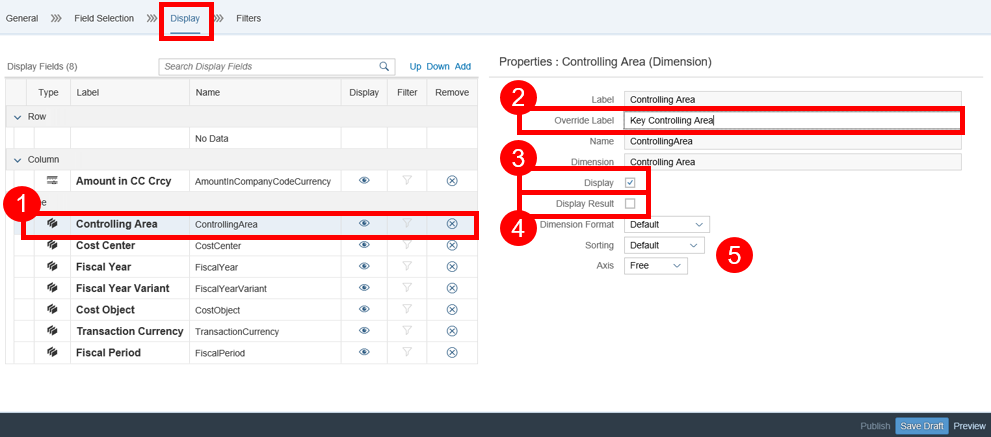

[DONE]
[ACCORDION-END]

[ACCORDION-BEGIN [Step 7: ](Move Fields)]
Field types are symbolized by different icons as:
 - **measure (1)**
 - **dimension (2)**.

**Click Move Up/Down (3)** to reorder the fields within an across Row/Column/Free
section. **Choose Row/Column/Free (4)** to quickly move across the sections.

Afterwards you can **Save (5)** your draft.

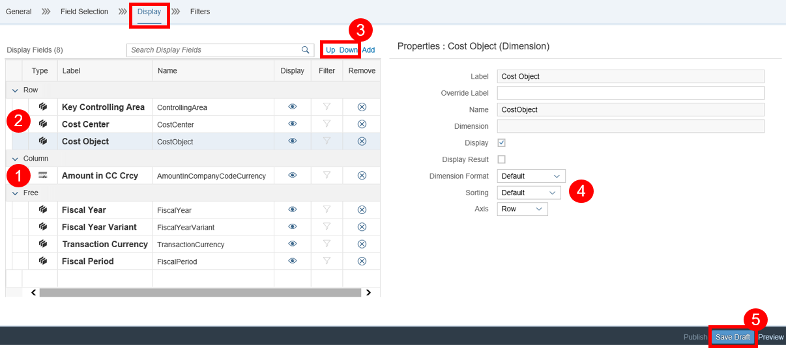

[DONE]
[ACCORDION-END]

[ACCORDION-BEGIN [Step 8: ](Select Filters Tab)]
Switch to the **Filters** tab. This section displays the fixed value filters and the user input values for the selected dimension. **Change** Filters from **No Filters** to **User Input Values**.
A dialog will be shown in the design studio to read value from user.

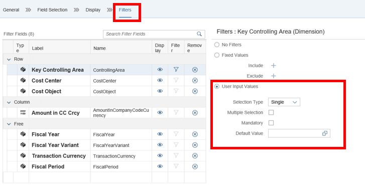

[DONE]
[ACCORDION-END]

[ACCORDION-BEGIN [Step 9: ](Define Fixed Value Filter)]
Or **define a fixed value filter**. The result set upon executing the report will be filtered by the conditions specified here. **Add multiple include conditions**. A range of values can also be specified.

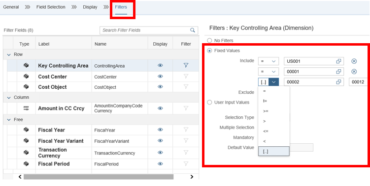

[DONE]
[ACCORDION-END]

[ACCORDION-BEGIN [Step 10: ](Add Restricted Measures)]

Switch back to the **Display (1)** tab again and press **Add** to add a new restricted measure.
A `popup` appears to **enter the label and the name (2)** of the restricted measure.

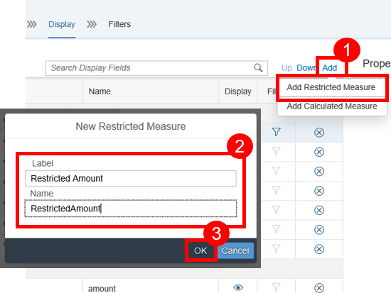

[DONE]
[ACCORDION-END]

[ACCORDION-BEGIN [Step 11: ](Choose Measure)]
Now choose the measure `Restricted Amount` to **add the restrictions**.

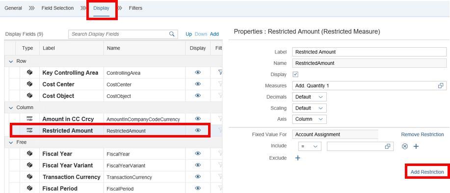

[DONE]
[ACCORDION-END]

[ACCORDION-BEGIN [Step 12: ](Choose Dimension)]
On the following `popup`, you can **choose a dimension** for the restrictions. Choose **Fiscal Year**.

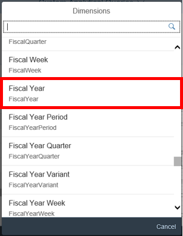

[DONE]
[ACCORDION-END]

[ACCORDION-BEGIN [Step 13: ](Display Conditions)]
You can have multiple include and exclude conditions with value help support.

[DONE]
[ACCORDION-END]

[ACCORDION-BEGIN [Step 14: ](Define User Input Filter)]
Define a new User Input Filter for restricted **measures (1)**. **Choose** on the **`popup`** the tab **User Input Filters** and **enter the attributes (2)** on the following **`popup`**. **Click** on the **new Button (3)** to create a new input filter **(4) + (5)**. The dimension is derived from the version.

Result:
A new field for **user input filter is created**.

[DONE]
[ACCORDION-END]

[ACCORDION-BEGIN [Step 15: ](Save and Publish Draft)]
The **:** signifies the usage of a user input filter.
While executing the query, the value for **`pt_version`** is read from user and entered into the
query. The user input filter can be used at any other location in the query for **Version** fields.

Now **Save** and **Publish** your draft.

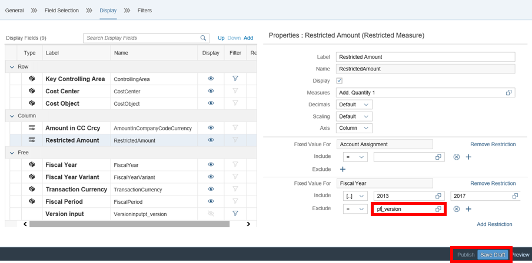

[DONE]
[ACCORDION-END]

[ACCORDION-BEGIN [Step 16: ](Test yourself)]

[VALIDATE_1]
[ACCORDION-END]
