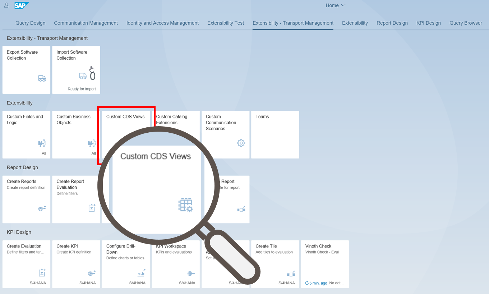
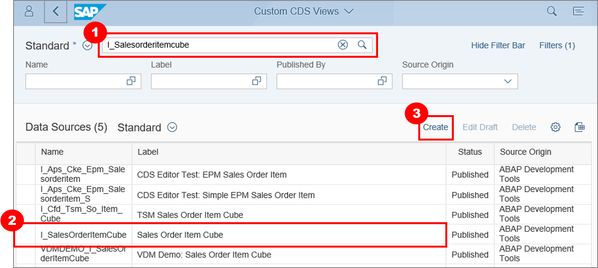
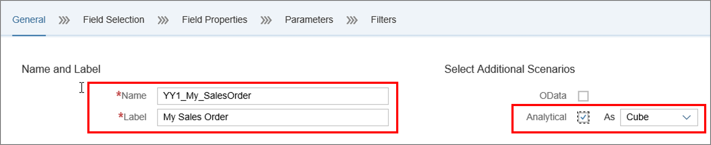
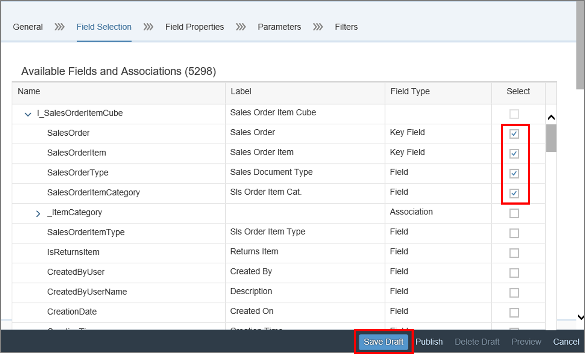
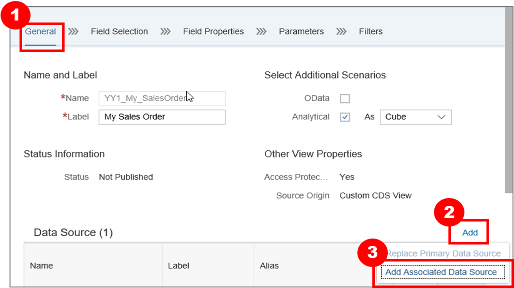
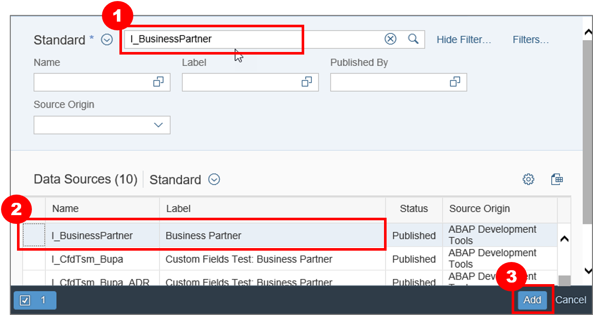
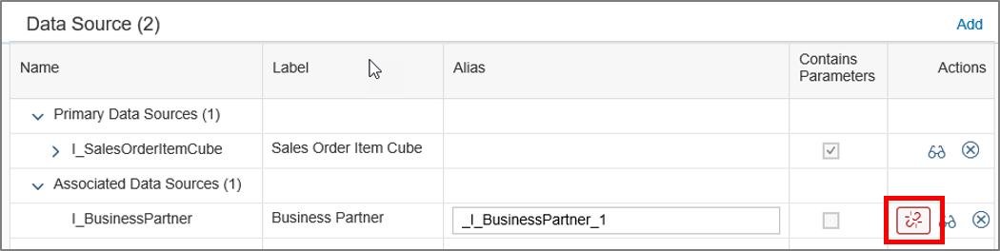
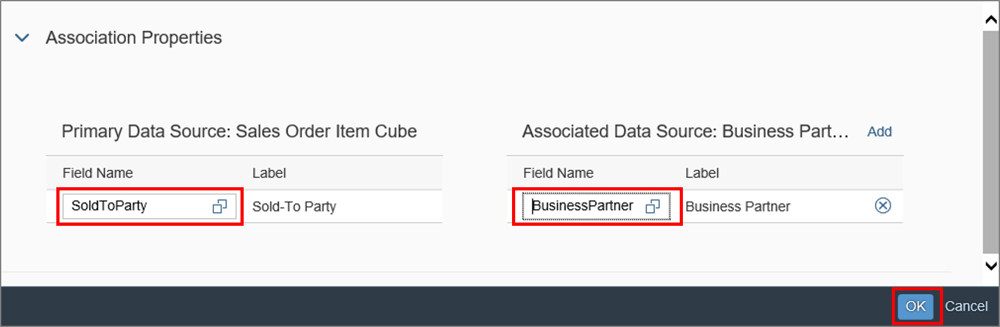
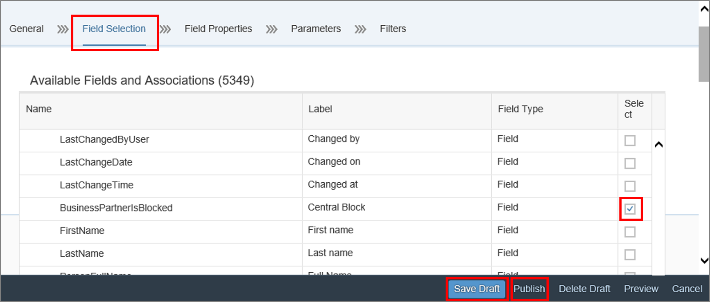
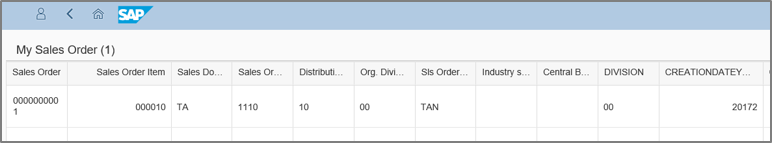

## Prerequisites  
The Prerequisites of this tutorial is the assignment of the Business Catalog **`SAP_CORE_BC_EXT`** to your user.

## Next Steps
 (coming soon).
## Details
If you need access to data in your system in a way the system does not offer so far, you can create your own data access by making use of a Custom Core Data Services view (Custom CDS view). Usually, the data of an application is distributed across several database tables. Using CDS views allows you to model the data access without changing underlying database tables. In general, CDS views are intended to be consumed by a UI, analytics or other systems. CDS View can be built on CDS Views as well. To simplify the data access there are pre-delivered CDS Views, Custom CDS Views can only be built on.
### You will learn  
You will be able to see a preview of your generated Custom CDS View and your data at the end of this tutorial. First of all a Custom CDS View will be generated to have the access to your data. You will select fields and association properties in your Custom CDS View to see them later on in your preview.

### Time to Complete
**15 Min**.

---

[ACCORDION-BEGIN [Step 1: ](Open Custom CDS Views Application)]
Navigate to the **Extensibility** category and press the **Custom CDS Views** tile to start the application.

[ACCORDION-END]

[ACCORDION-BEGIN [Step 2: ](Create Custom CDS View)]
Search for `I_SalesOrderItemCube` **(1)**, **select (2)** it and  click on **Create(3)** to create a new CDS View.

[ACCORDION-END]

[ACCORDION-BEGIN [Step 3: ](Add View Name)]
Give CDS the View **Name:** `YY1_My_SalesOrder`, **Label:** `My Sales Order`.
`Checkmark` **Analytical** and select **Cube** as additional Scenarios.

[ACCORDION-END]

[ACCORDION-BEGIN [Step 4: ](Select Fields)]
Now navigate to **Field Selection** and select following fields:

- `SalesOrder`
- `SalesOrderItem`
- `SalesOrderType`
- `SalesOrganization`
- `DistributionChannel`
- `Division`
- `CreationDateYearQuarter`
- `CreationDateYearMonth`
- `SalesOrderDateYear`
- `SoldToPartyName`
- `ShipToParty`
- `ShipToPartyName`
- `OrderQuantityUnit`
- `OrderQuantity`
- `TotalNetAmount`
- `TransactionCurrency`
- `DisplayCurrency`
- `NetAmountDisplayCurrency`

Afterwards execute **Save Draft**.

[ACCORDION-END]

[ACCORDION-BEGIN [Step 5: ](Add Associated Data Source)]
In **General** tab add a secondary data source by clicking on **Add**.
Afterwards click on **Add Associated Data Source**.

[ACCORDION-END]

[ACCORDION-BEGIN [Step 6: ](Select CDS View)]
Search for the data source `I_BusinessPartner` and select the view. Then click on **Add** to append the associated data source.

[ACCORDION-END]

[ACCORDION-BEGIN [Step 7: ](Maintain Join Conditions)]
Maintain the **join conditions** with clicking on the corresponding symbol.

[ACCORDION-END]

[ACCORDION-BEGIN [Step 8: ](Select Association Properties)]
Select the field **`SoldToParty`** in the primary data source and the field **`BusinessPartner`** in the associated data source and click on `ok`.

[ACCORDION-END]

[ACCORDION-BEGIN [Step 9: ](Select Additional Fields)]
In **Field Selection** select additional fields from the associated data source.
These fields are:
- `Industry`
- `BusinessPartnerIsBlocked`

And then click on **Save Draft** and **Publish**.

[ACCORDION-END]

[ACCORDION-BEGIN [Step 10: ](Show Preview)]
Click on **Preview** and fill Parameters
- `P_ExchangeRateType` with `M` and
- `P_DisplayCurrency` with `EUR`.
Afterwards check the view.

Result:
Result list of the CDS View.

Hint: To be able to see data in this preview you need sales order data in your system.

[ACCORDION-END]

## Next Steps
