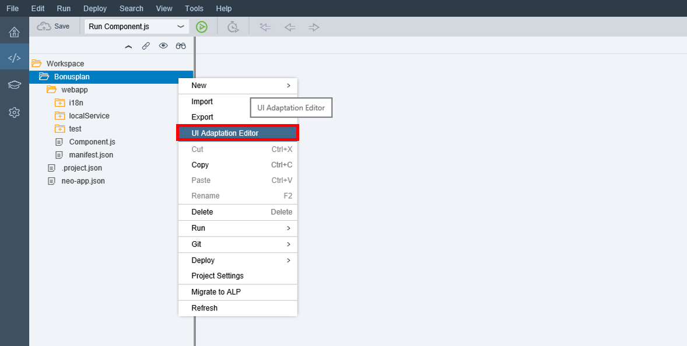
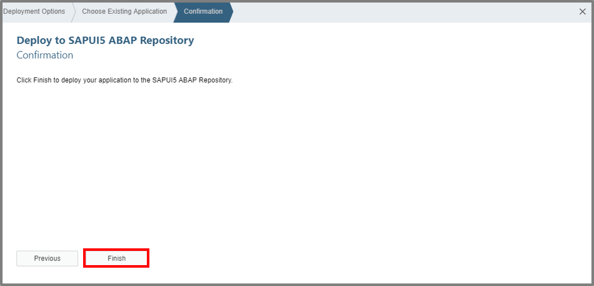

## Prerequisites  
Access to a SAP Web IDE account is expected as a prerequisite. **`ABAP Custom New UI - Generate Tile`** as tutorial represents a further Prerequisite for the tile adaptation on SAP Web IDE.

## Next Steps
 (coming soon).
## Details
The usage of the UI Adaptation Editor will take part in this tutorial. You will be able to adapt the UI and deploy it to the SAPUI5 ABAP Repository again. After this deployment you will be able to check the UI adaptation.

### You will learn  
The adaptation of the UI and deployment to the SAPUI5 ABAP Repository will be shown here with the UI Adaptation Editor.

### Time to Complete
**15 Min**.

---

[ACCORDION-BEGIN [Step 1: ](Open UI Adaptation Editor)]
Open the **UI Adaptation Editor** for your Project `Bonusplan`.

[ACCORDION-END]

[ACCORDION-BEGIN [Step 2: ](Adapt UI)]
Click on **Adapt UI** to make changes on your UI.
Now make following changes in this table:
Low Bonus Percentage: `Low Bonus %`
High Bonus Percentage: `High Bonus %`
Put also the Validate Start and Validate End Date to the end of your table.

Afterwards save your changes.

[ACCORDION-END]

[ACCORDION-BEGIN [Step 3: ](Deploy UI to Repository )]
Now deploy your changes to `SAPUI5 ABAP Repository`.

Afterwards click on the **Next** button.

[ACCORDION-END]

[ACCORDION-BEGIN [Step 4: ](Update Existing Application)]
Choose update existing application and move on with next.

[ACCORDION-END]

[ACCORDION-BEGIN [Step 5: ](Choose Application Name)]
Choose an application name for your deployment and move on with next.

[ACCORDION-END]

[ACCORDION-BEGIN [Step 6: ](Select Finish)]
Select the **Finish** button.

And now just click on the **Finish** button.

[ACCORDION-END]

[ACCORDION-BEGIN [Step 7: ](Confirm Deployment)]
Now confirm your deployment.

[ACCORDION-END]

[ACCORDION-BEGIN [Step 8: ](Check UI Adaptation)]
Now check your UI Adaptation in your Fiori Launchpad.

[ACCORDION-END]

## Next Steps
(coming soon)
