# Connect SAP Business Application Studio and SAP S/4HANA Cloud Tenant
<!-- description --> Connect SAP Business Application Studio and an SAP S/4HANA Cloud tenant using SAML assertion authentication to develop custom UIs.

## Prerequisites
 - You have an **SAP S/4HANA Cloud tenant** and a business user with **Communication Management** authorizations (this requires a business role with unrestricted write access containing business catalog `SAP_CORE_BC_COM` ).
 - You have an **SAP Business Technology Platform trial account** with an SAP Business Application Studio subscription
## You will learn
- How to create an HTTP destination on SAP Business Technology Platform with SAML assertion authentication to an SAP S/4HANA Cloud tenant
- How to create a communication system for an SAP Business Application Studio subaccount in an S/4HANA ABAP tenant

## Intro
To follow this tutorial, you can either use a subaccount in your trial account on SAP BTP or you can use a subaccount in a customer account. However, for the customer account subaccount, you have to do the following:

  - Set up mutual trust between the SAP BTP subaccount and the Identity Provider, see

    - [ABAP Environment Documentation: Setup of a Custom Identity Service](https://help.sap.com/viewer/65de2977205c403bbc107264b8eccf4b/Cloud/en-US/550251abaf49432bbaa65147b65a1f39.html)

    - [Tutorial: Set Up Trust Between Identity Authentication and SAP Cloud Platform](abap-custom-ui-trust-settings) which is showing the process in SAP BTP Neo Environment instead of here needed Cloud Foundry environment. Nevertheless it's that similar, that in can help, you only have to omit setting the subaccount as service provider

    - [SAP BTP Documentation: Trust and Federation with Identity Providers](https://help.sap.com/viewer/65de2977205c403bbc107264b8eccf4b/Cloud/en-US/cb1bc8f1bd5c482e891063960d7acd78.html)  

  - Assign the developer users permission for SAP Business Application Studio, see [ABAP Environment Documentation: Assigning Permissions for SAP Business Application Studio](https://help.sap.com/viewer/65de2977205c403bbc107264b8eccf4b/Cloud/en-US/a08c1cb7def34798891b0a1ac6ddbd96.html)

Alternatively, see [Integrating SAP Business Application Studio](https://help.sap.com/viewer/0f69f8fb28ac4bf48d2b57b9637e81fa/latest/en-US/22bc724fd51a4aa4a4d1c5854db7e026.html) documentation for this tutorial's content with a customer account.

The communication system for an SAP Business Application Studio subaccount in an S/4HANA ABAP tenant is needed to develop a custom UI with SAP Business Application Studio for a custom business object running in an S/4HANA ABAP tenant and for deploying that UI.

>Tutorial last updated with SAP S/4HANA Cloud Release 2105

---

### Create destination to SAP S/4HANA Cloud tenant

SAP Business Application Studio requires connection information to request custom business object data from your SAP S/4HANA Cloud tenant and to deploy a UI into this tenant. That information is stored in the SAP Business Application Studio subaccount as a so-called destination. To create that destination, do the following:

1.  In your web browser, open the SAP BTP Trial cockpit <https://account.hanatrial.ondemand.com> and **Enter Your Trial Account**, which is a so-called global account.

    <!-- border -->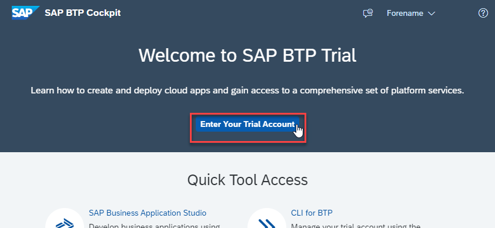

2.  On your global account page, select default subaccount `trial`.

    <!-- border -->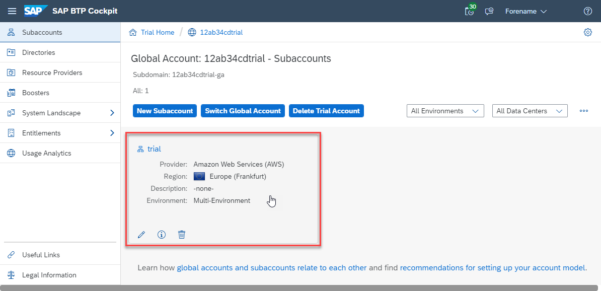

3.  In the navigation pane expand the **Connectivity** section.

4.  Select **Destinations**.

5.  Select **New Destination**.

<!-- border -->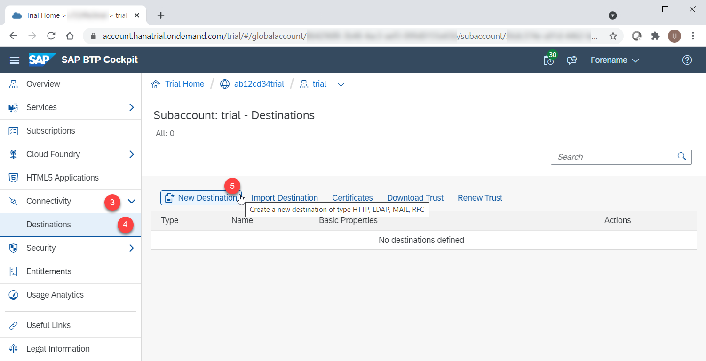

### Configure destination

Configure the new destination with the following standard field values.

|  Field Name     | Value
|  :------------- | :-------------
|  Name           | **`<YOUR_SYSTEMS_ID>_SAML_ASSERTION`**
|  Type           | **`HTTP`**
|  Description    | **`SAML Assertion Destination to SAP S/4HANA Cloud tenant <YOUR_SYSTEMS_ID>`**
|  URL          | In the SAP S/4HANA Cloud tenant, navigate to the **Communication Systems** app and copy the **Host Name** from **Own System** = `Yes`
<!-- border -->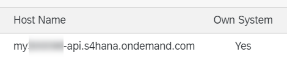
 and paste it with prefix `https://` for example `https://my12345-api.s4hana.ondemand.com.`
|  Proxy Type   | **`Internet`**
|  Authentication | **`SAMLAssertion`**
|  Audience   | Enter the URL of your system and remove `-api`, for example `https://my12345.s4hana.ondemand.com`.
|  `AuthnContextClassRef` | **`urn:oasis:names:tc:SAML:2.0:ac:classes:PreviousSession`**

Select **New Property** and maintain the following **Additional Properties** and values.

|  Field Name     | Value          | Remark
|  :------------- | :------------- | :-------------
|  HTML5.DynamicDestination           | **`true`**   |&nbsp;
|  HTML5.Timeout           | **`60000`**   | value stated in milliseconds. 60000 equals 1 minute. Required as deployment needs longer than the standard of 30 seconds.
|  `WebIDEEnabled`    | **`true`**   |&nbsp;
|  `WebIDEUsage`          | **`odata_abap,dev_abap`**   |&nbsp;
|  `nameIDFormat`     | **`urn:oasis:names:tc:SAML:1.1:nameid-format:emailAddress`**  | Required in case your subaccount sends mail address as SAML Name ID for authentication (**Subject Name Identifier** in Identity Authentication tenant), although SAP S/4HANA Cloud tenant expects user login by default. **That is the case with a trial Account.** This also requires the mail address to be maintained for SAP S/4HANA Cloud tenant business users.

Make sure that the **Use default JDK truststore** checkbox is ticked.

<!-- border -->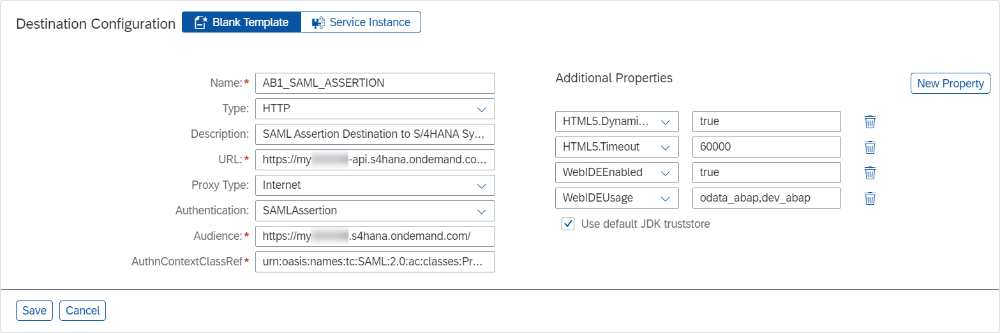

Click **Save**.

### Download SAP BTP certificate

On the SAP S/4HANA Cloud tenant side, you need to allow SAP Business Application Studio to make inbound calls.
To set SAP Business Application Studio as a trusted caller in the SAP S/4HANA Cloud tenant, you first have to download the public key of the SAP Business Application Studio subaccount.

To do this, in the Destinations section, select **Download Trust**.

<!-- border -->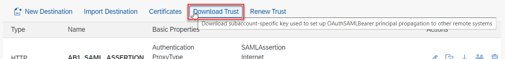

An untyped file with name `pk-\<your subaccounts ID\>` (for example `pk_9zy8xw7v-6u54-3tsr-21qp-1pqr234st56uv;`) is downloaded. Save this file for later.

### Create communication system in SAP S/4HANA Cloud tenant

With the downloaded public key from the SAP Business Application Studio subaccount, you can now maintain it as a trusted caller in SAP S/4HANA Cloud tenant.

- Log on to your SAP S/4HANA Cloud tenant with the business user that is authorized for communication management.

- From the dashboard home screen, choose **Communication Management > Communication Systems**

    <!-- border -->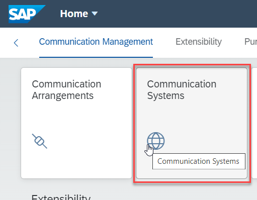

- Select **New**.

    <!-- border -->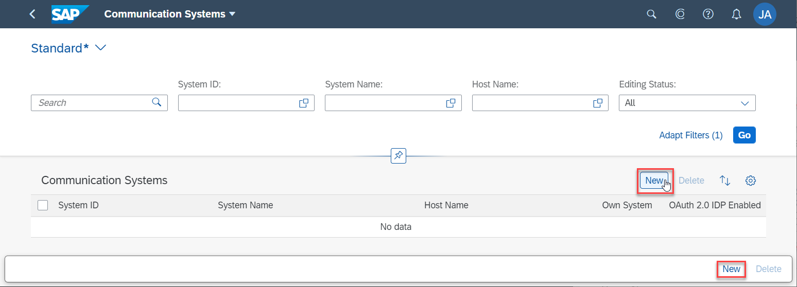

- Enter a System ID and System Name, for example `BAS_<YOUR SUBACCOUNTS_SUBDOMAIN>` like `BAS_12AB34CDTRIAL` and choose **Create**.

    <!-- border -->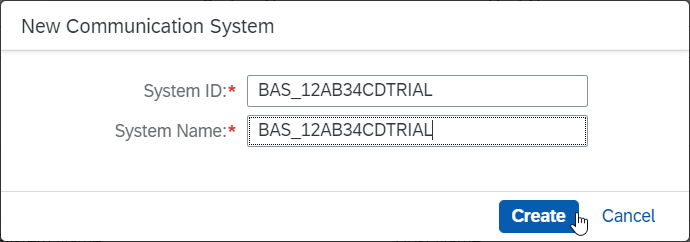

### Configure communication system

This is how you have to configure the communication system that represents the SAP Business Application subaccount as a trusted caller.

- Navigate to **General > Technical Data**

    <!-- border -->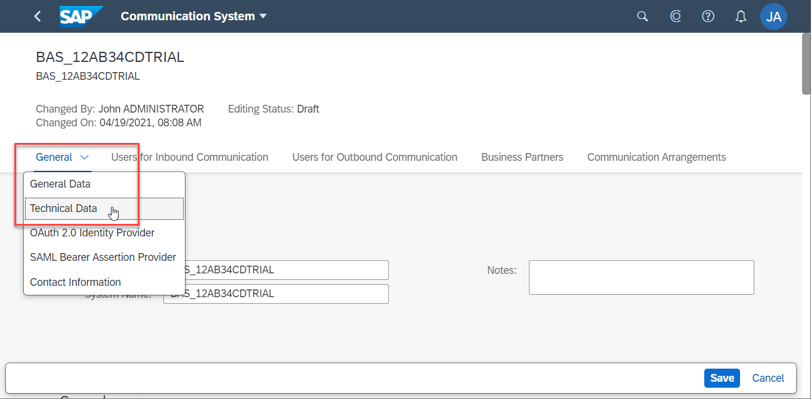

- Tick the **Inbound Only** checkbox.

    <!-- border -->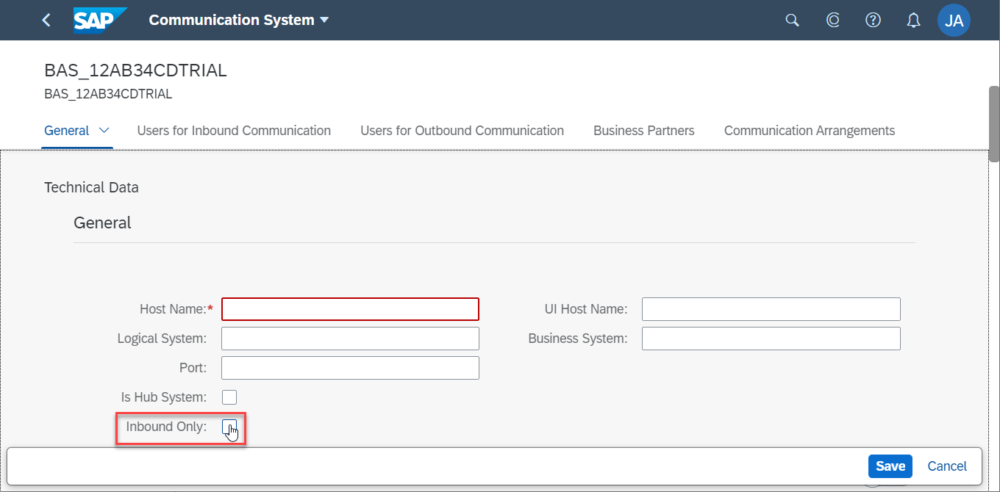

- Navigate to **General > SAML Bearer Assertion Provider** and slide the button to **ON**.

    <!-- border -->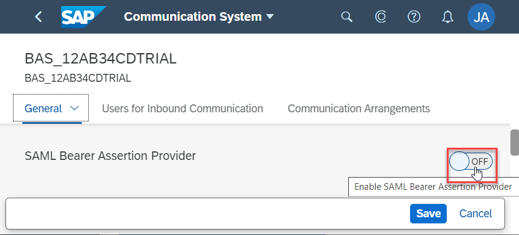

- Choose **Upload Signing Certificate**, browse for the SAP BTP certificate and upload it.

    <!-- border -->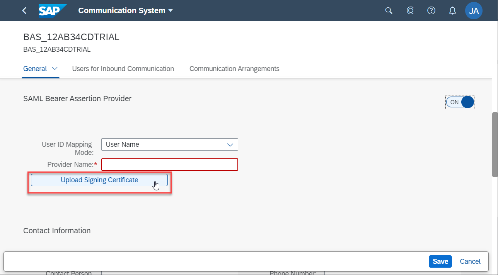

- Set the **Provider Name** by inserting the CN attribute of the Signing Certificate Subject.

    <!-- border -->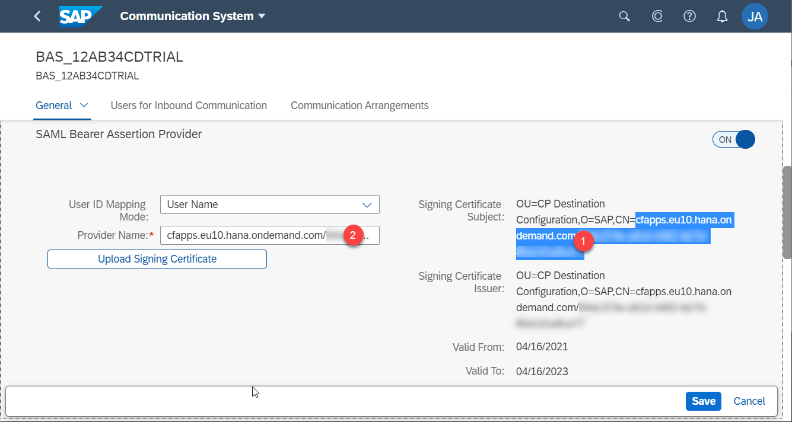

- Choose **Save**.

The connection is now set up and you can use of the custom business object OData services of the SAP S/4HANA Cloud tenant in SAP Business Application Studio.  

### Test yourself

---
