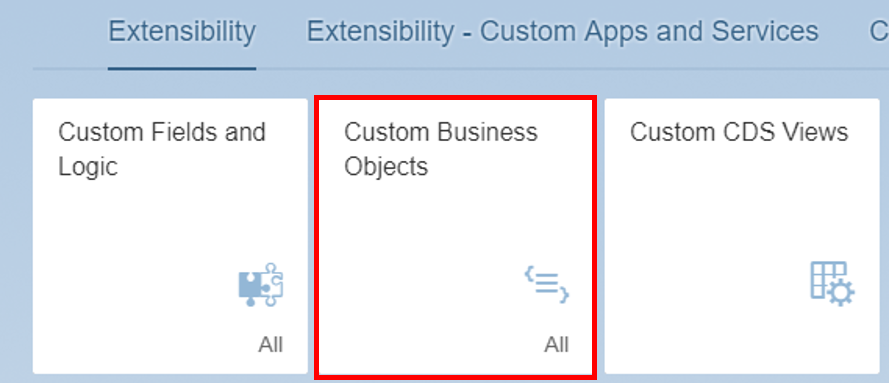
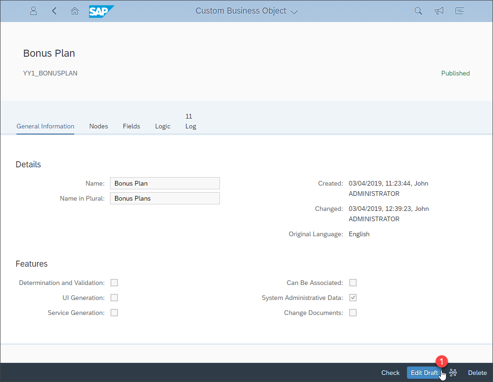
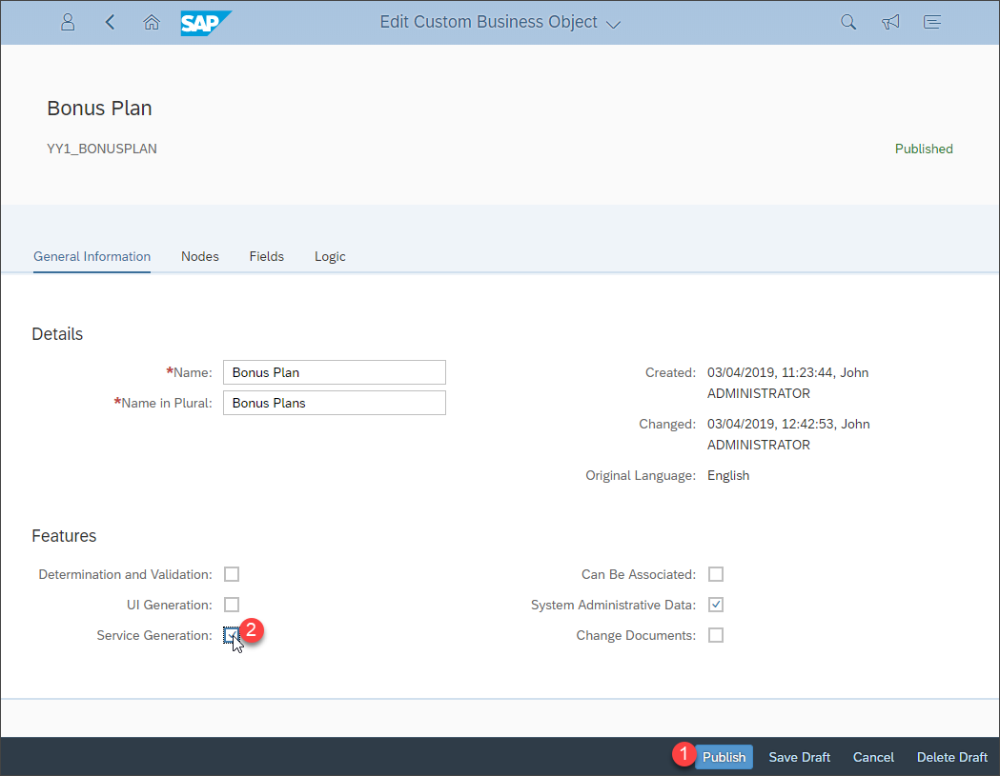
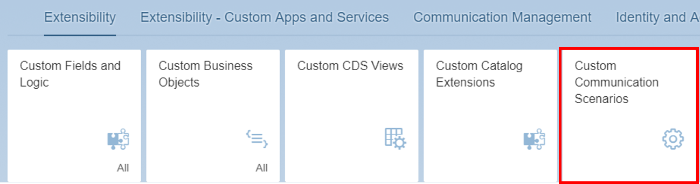
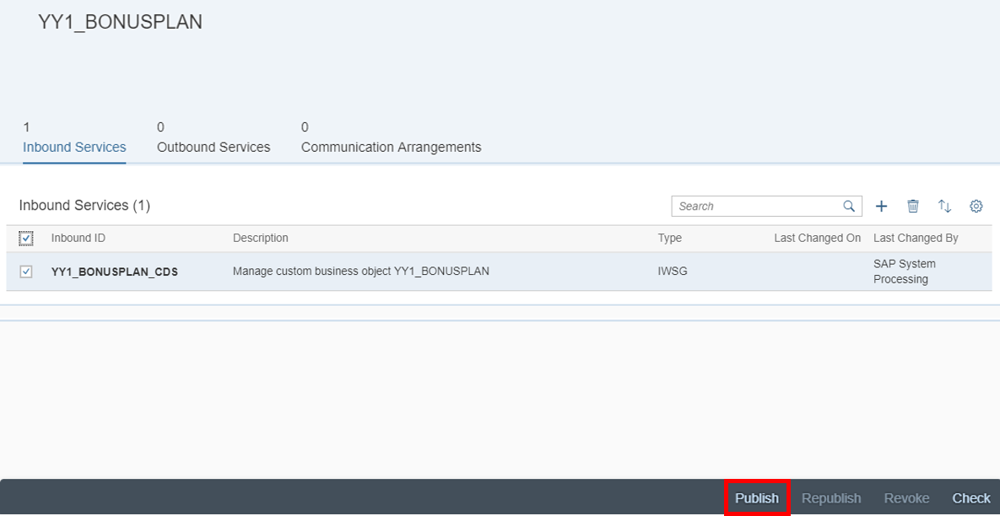
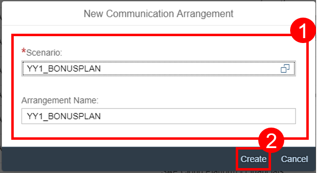
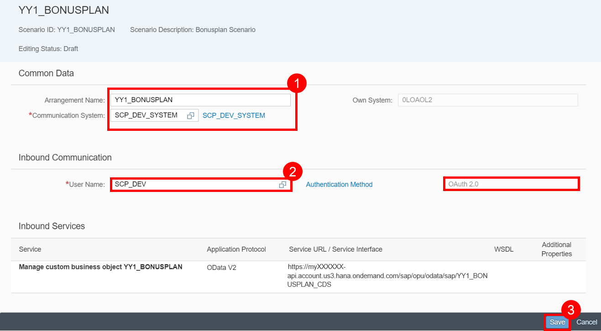

## Prerequisites  
- **Tutorial:**
[Create a Custom Business Object](abap-extensibility-cbo-create)
 - **Authorizations:** Your user needs (a) business role(s) with business catalogs **Extensibility** (ID: `SAP_CORE_BC_EXT`) and **Communication Management** (ID: `SAP_CORE_BC_COM`)

## Details
### You will learn  
- How to create the OData service for a custom business object
- How to expose the custom business object's service to the internet

This tutorial shows how to generate the OData service for an existing custom business object. Furthermore this service is exposed to the internet via the creation of a custom communication scenario. The creation of a communication arrangement for the `Bonusplan` scenario is the second part of the exposure.

### Additional Information
- **SAP S/4HANA Cloud Release** (tutorial's last update): 1902

---

[ACCORDION-BEGIN [Step 1: ](Open custom business objects application)]
Navigate to **Custom Business Objects** tile to start the application.

[DONE]
[ACCORDION-END]

[ACCORDION-BEGIN [Step 2: ](Generate OData service)]
Open details of your custom business object **`Bonusplan`** and **Edit Draft**.

Select the **Service Generation** checkbox and click **Publish**. With this step an OData service is created.

> Be aware that **UI Generation** needs to stay de-selected as otherwise due to a limitation you wouldn't get the label texts automatically in the custom UI.

[DONE]
[ACCORDION-END]

[ACCORDION-BEGIN [Step 3: ](Open custom communication scenarios application)]
Open **Custom Communication Scenarios** application.

[DONE]
[ACCORDION-END]

[ACCORDION-BEGIN [Step 4: ](Create communication scenario)]
A communication scenario is the basis definition for a communication between systems. It defines a solution to be made available for external systems. Click **New**, give your scenario a name, description and click **New** again.

Enter **`Bonusplan Scenario`** as description and click **New**.

[DONE]
[ACCORDION-END]

[ACCORDION-BEGIN [Step 5: ](Add inbound service to scenario)]
Add service **`YY1_BONUSPLAN_CDS`** by clicking **+** and **Publish** it.

[DONE]
[ACCORDION-END]

[ACCORDION-BEGIN [Step 6: ](Open communication arrangements application)]
Open **Communication Arrangements** application.

[DONE]
[ACCORDION-END]

[ACCORDION-BEGIN [Step 7: ](Create communication arrangement)]
Create a communication arrangement. This time you create it for your `Bonusplan` scenario.

[DONE]
[ACCORDION-END]

[ACCORDION-BEGIN [Step 8: ](Set communication system in arrangement)]
Select **`SCP_DEV_SYSTEM`** as your communication system. Select **`SCP_DEV`** as communication user with **`OAuth 2.0`** as authentication method.

Click **Save**.

By exposing the service via custom communication scenario and communication arrangement, you will be able to select it from the list of services in a SAP Web IDE project.

[DONE]
[ACCORDION-END]

[ACCORDION-BEGIN [Step 9: ](Test yourself)]

[VALIDATE_1]
[ACCORDION-END]
