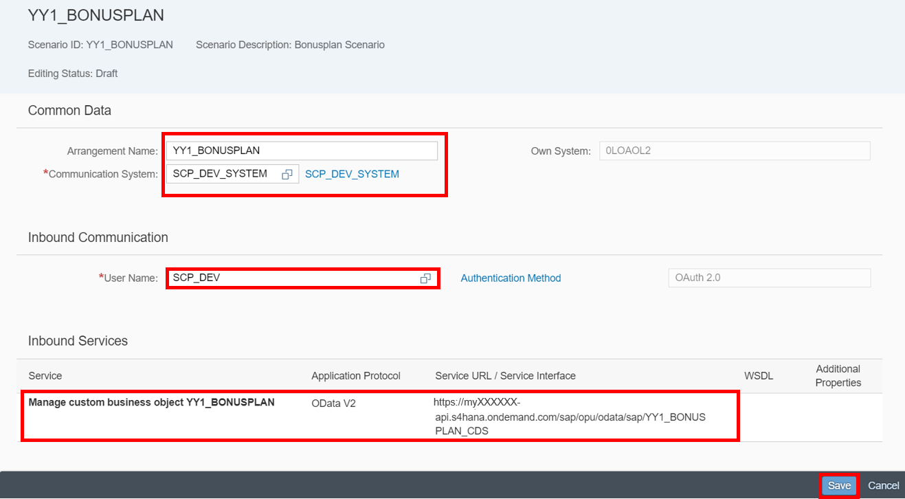

## Prerequisites  
The assignment of the Business Catalog **`SAP_CORE_BC_COM`**, **`SAP_CORE_BC_EXT`** to your user and **`ABAP Custom New UI - Communication Arrangement for SAP_COM_0013 Scenario`** as tutorial represents the Prerequisites for the usage of the Service Generation as well as Custom Communication Scenario and Communication Arrangement creation.

## Next Steps
 (coming soon).
## Details
This tutorial describes how the Service Generation can be activated for an existing Custom Business Object. Furthermore the addition of a CDS View to the Custom Communication Scenario is explained. The creation of a Communication Arrangement for the `Bonusplan` Scenario takes also place in this tutorial.
### You will learn  
You will learn in this tutorial how to activate the Service Generation. Furthermore the addition of an OData Service to a Custom Communication Scenario will be explained and also the creation of a Communication Arrangement for the `Bonusplan` Scenario.

### Time to Complete
**15 Min**.

---

[ACCORDION-BEGIN [Step 1: ](Open Custom Business Objects Application)]
Navigate to **Custom Business Objects** tile to start the application.

[ACCORDION-END]

[ACCORDION-BEGIN [Step 2: ](Select Service Generation)]
Choose your custom business object and select **Service Generation** checkbox.
Afterwards save your draft and publish your changes.

With this step a new business object with an OData service is created.
If you have not created a Custom Business Object yet, then following tutorial will help you with this steps:

[ACCORDION-END]

[ACCORDION-BEGIN [Step 3: ](Open Custom Communication Scenarios Application)]
Open the **Custom Communication Scenarios** application.

[ACCORDION-END]

[ACCORDION-BEGIN [Step 4: ](Open Communication System Application)]
Create a new Communication Scenario by clicking on the **New** button.

Give your scenario a name, a description and click on **New**.

[ACCORDION-END]

[ACCORDION-BEGIN [Step 5: ](Add Inbound Service)]
Add your CDS View by clicking on the **Plus** symbol and **publish** it.

[ACCORDION-END]

[ACCORDION-BEGIN [Step 6: ](Open Communication Arrangements Application)]
Open the **Communication Arrangements** application.

[ACCORDION-END]

[ACCORDION-BEGIN [Step 7: ](Create Communication Arrangement)]
Now create a Communication Arrangement again. This time you create it for your
`Bonusplan` Scenario.

[ACCORDION-END]
[ACCORDION-BEGIN [Step 8: ](Select Communication System)]
Select **`SCP_DEV_SYSTEM`** as your communication system.
Also select `SCP_DEV` with `OAuth2.0` as communication system.
Afterwards save your changes.

[ACCORDION-END]

## Next Steps
(coming soon)
