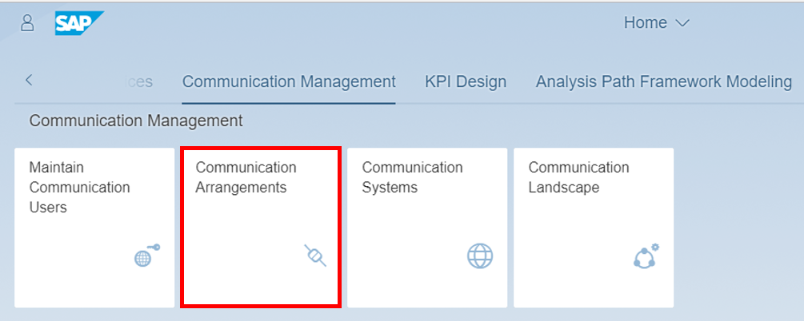
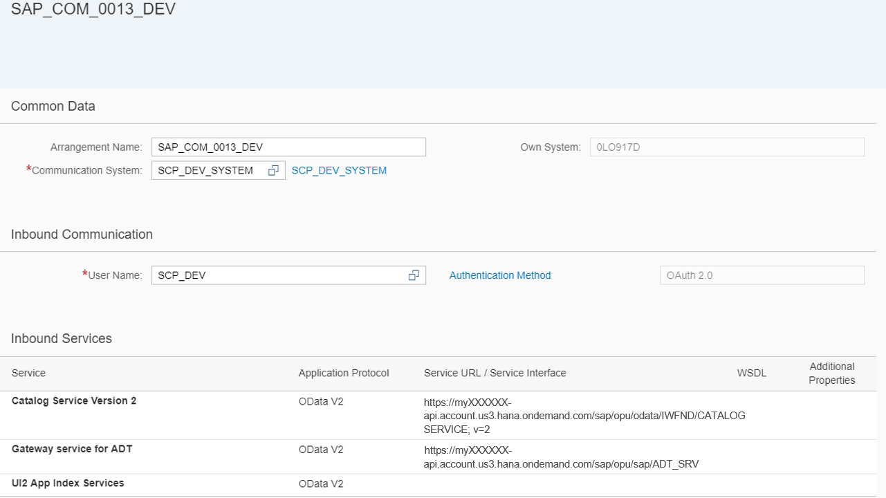
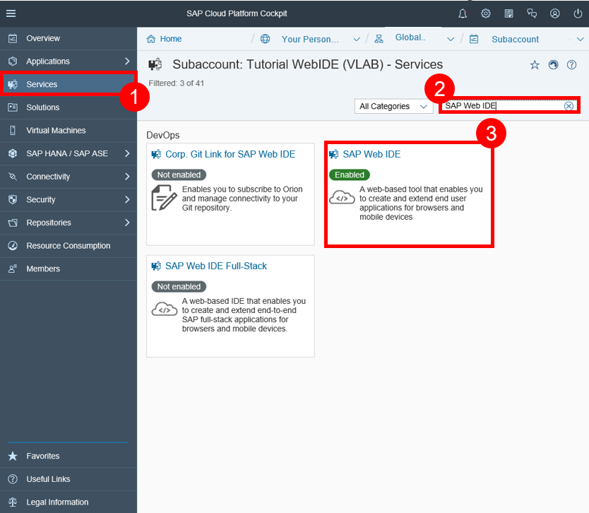
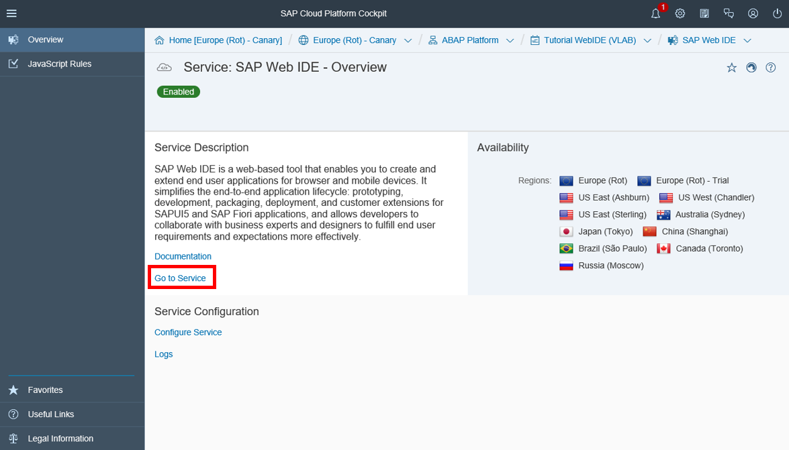

## Prerequisites
- **Tutorials:** [`Create OAuth communication system and user`](https://developers.sap.com/tutorials/abap-custom-ui-communication-systems.html)
- **Authorizations:** The assignment of the business catalog **`SAP_CORE_BC_COM`** represents the prerequisites for the usage of communication arrangement.


## Details
### You will learn
- How to create a communication arrangement for SAP Web IDE scenario `SAP_COM_0013`
- How to create a HTTP destination
- How to create a UI project

You will learn how to enable SAP Cloud Platform development with SAP Web IDE against a specific S/4HANA cloud system via OAuth authentication. You will see that communication arrangement for SAP Web IDE scenario `SAP_COM_0013` in S/4HANA cloud will expose essential services, that SAP Web IDE needs. SAP Cloud Platform subaccount will get a destination which holds data for the connection and OAuth communication with the S/4HANA cloud system. At the end you will see in SAP Web IDE a list of services that you can theoretically build extensions on.

### Time to Complete
**15 Min**.

---

[ACCORDION-BEGIN [Step 1: ](Open communication arrangements application)]
Navigate to **Communication Arrangements** tile to start the application.



[ACCORDION-END]

[ACCORDION-BEGIN [Step 2: ](Create new communication arrangement)]
Click **New** to create a new communication arrangement.


[ACCORDION-END]

[ACCORDION-BEGIN [Step 3: ](Select scenario)]
Select **`SAP_COM_0013`** as scenario, rename your arrangement name and click **Create**.


[ACCORDION-END]

[ACCORDION-BEGIN [Step 4: ](Add communication system)]
Add your communication system to your communication arrangement. Select **`SCP_DEV`** with **`OAuth2.0`** as communication system. Be sure that your service status of your launch SAP Web IDE is activated and click **Save**.


[ACCORDION-END]

[ACCORDION-BEGIN [Step 5: ](Check data)]
Now following should be listed:



[ACCORDION-END]

[ACCORDION-BEGIN [Step 6: ](Create HTTP destination)]
Enter the SAP Cloud Platform account as an administrator. Switch to **Destinations** and click **New Destination**.


[ACCORDION-END]

[ACCORDION-BEGIN [Step 7: ](Set destination data)]
Enter following **data** to your destination:


| ---------------------------- | ------------------------------------------------- |
|          **Name**            |            Name of your destination               |
|          **Type**            |                    `HTTP`                         |
|      **Description**         |            Description of your destination        |
|           **URL**            |  URL of your S/4HANA cloud System (with `-api`)   |
|       **Proxy Type**         |                  `Internet`                       |
|     **Authentication**       |            `OAuth2SAMLBearerAssertion`            |
|        **Audience**          | URL of your S/4HANA cloud System (without `-api`) |
|       **Client Key**         |          Equals your communication user           |
|    **Token Service User**    |          Equals your communication user           |
| **Token Service Password**   |        Password of your communication user        |


Token service URL will be explained in the next step.

[ACCORDION-END]

[ACCORDION-BEGIN [Step 8: ](Define token service URL)]
**Token service URL** - This consists of 2 parts:

   `<URL_of_your_S4HANA_Cloud_System> with –api`
     `+`
   `/sap/bc/sec/oauth2/token`

Example:

```swift
https://myXXXXXX-api.account.us3.hana.ondemand.com/sap/bc/sec/oauth2/token

```
[ACCORDION-END]

[ACCORDION-BEGIN [Step 9: ](Enter additional properties)]
Add additional properties:

| ----------------------------- | -------------------------------------------------------- |
| **`authnContextClassRef`**    |      `urn:oasis:names:tc:SAML:2.0:ac:classes:X509`       |
|       **`TrustAll`**          |                      `true`                              |
|     **`WEBIDEEnabled`**       |                      `true`                              |  
|      **`WebIDEUsage`**        |         `odata_abap,ui5_execute_abap,dev_abap`           |


**Save** your changes.

[ACCORDION-END]

[ACCORDION-BEGIN [Step 10: ](Search SAP Web IDE)]
Go to **Services**, search for **SAP Web IDE** and select it on your SAP Cloud Platform account.



Click **Go to Service** to open **SAP Web IDE**.



[ACCORDION-END]

[ACCORDION-BEGIN [Step 11: ](Select new project)]
Select **New Project from Template** to generate one.


If you don't see this welcome page then follow the alternative way:
File -> New -> Project from Template

[ACCORDION-END]

[ACCORDION-BEGIN [Step 12: ](Create UI project)]
Choose **List Report Application** and click **Next** to create a new UI.


[ACCORDION-END]

[ACCORDION-BEGIN [Step 13: ](Enter basic information)]
Enter **`Bonusplan`** as project name and title.


Click **Next**.

[ACCORDION-END]

[ACCORDION-BEGIN [Step 14: ](Select service)]
Click **Service Catalog** and select **`SAP_DEV_SYSTEM`** as service.


Now you can see a list of all services. You learn the importance of a scope. By adding the scope to your destination you are allowed to see the list of all services. But if you try to select any service, you'll get an error message. To create your UI project, you have to add a further definition to your scope.
[ACCORDION-END]
