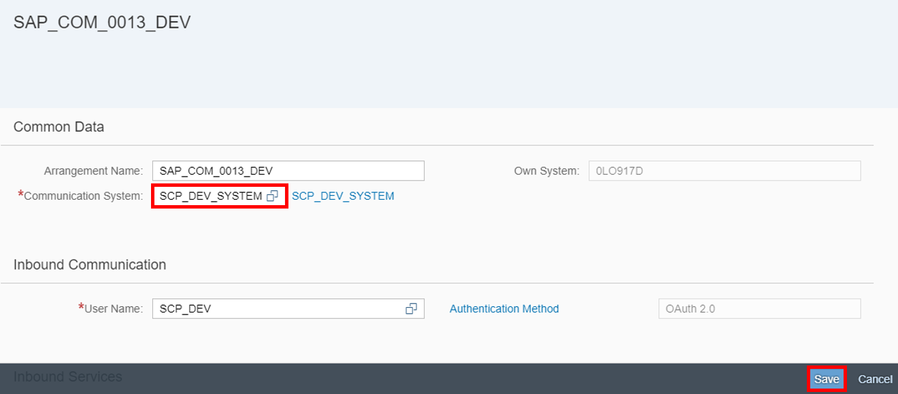

## Prerequisites  
The assignment of the Business Catalog **`SAP_CORE_BC_COM`** to your user and **`Create OAuth Communication System & User`** as tutorial represents the Prerequisites for the usage of Communication Arrangement.

## Next Steps
 (coming soon).

### You will learn  
You will learn how to enable SAP Cloud Platform Development with the Web IDE against a specific S/4HANA System via OAuth authentication. First a Communication Arrangement for Web IDE Scenario `SAP_COM_0013` in S/4HANA will expose essential services, that Web IDE needs. Then SAP Cloud Platform Subaccount will get a destination which holds data for the connection and OAuth communication with the S/4HANA system. At the end you will see in Web IDE a list of Services that you can theoretically build extensions on.

### Time to Complete
**15 Min**.

---

[ACCORDION-BEGIN [Step 1: ](Open Communication Arrangements Application)]
Navigate to **Communication Arrangements** tile to start the application.


[ACCORDION-END]

[ACCORDION-BEGIN [Step 2: ](Create New Communication Arrangement)]
Click on the **New** button to create a new communication arrangement.


[ACCORDION-END]

[ACCORDION-BEGIN [Step 3: ](Select Scenario)]
Select `SAP_COM_0013` as Scenario and rename your Arrangement Name.


[ACCORDION-END]

[ACCORDION-BEGIN [Step 4: ](Add Communication System)]
Add your Communication System to your Communication Arrangement and save it.
Also select `SCP_DEV` with `OAuth2.0` as communication system.
Be sure that your service status of you Launch SAP Web IDE is activated and save your changes.



[ACCORDION-END]

[ACCORDION-BEGIN [Step 5: ](Check Data)]
Now following should be listed:


[ACCORDION-END]

[ACCORDION-BEGIN [Step 6: ](Create HTTP Destination)]
Enter the SAP Cloud Platform account as an administrator.
Switch to **Destinations** and click on **New Destination**.


[ACCORDION-END]

[ACCORDION-BEGIN [Step 7: ](Set Destination Data)]
Now enter following data to your destination:


| ---------------------------- | ------------------------------------------------- |
|          **Name:**           |            Name of your destination               |
|          **Type:**           |                      HTTP                         |
|      **Description:**        |            Description of your destination        |
|           **URL:**           |  URL of your S/4HANA Cloud System (with `-api`)   |
|       **Proxy Type:**        |                    Internet                       |
|     **Authentication:**      |            `OAuth2SAMLBearerAssertion`            |
|        **Audience:**         | URL of your S/4HANA Cloud System (without `-api`) |
|       **Client Key:**        |          Equals your communication user           |
|    **Token Service User:**   |          Equals your communication user           |
| **Token Service Password:**  |        Password of your communication user        |


Token Service URL will be explained in the next step.

[ACCORDION-END]

[ACCORDION-BEGIN [Step 8: ](Define Token Service URL)]
**Token Service URL** - This consists of 2 parts:

   `<URL_of_your_S4HANA_Cloud_System> with –api`
     `+`
   `/sap/bc/sec/oauth2/token?`

Example:

```swift
https://myXXXXXX-api.account.us3.hana.ondemand.com/sap/bc/sec/oauth2/token

```
[ACCORDION-END]

[ACCORDION-BEGIN [Step 9: ](Enter Additional Properties)]
Add Additional Properties:

| ----------------------------- | -------------------------------------------------------- |
|        **`scope:`**           | `ADT_001 /UI5/APP_INDEX_0001 /IWFND/SG_MED_CATALOG_0002` |
| **`authnContextClassRef:`**   |      `urn:oasis:names:tc:SAML:2.0:ac:classes:X509`       |
|       **`TrustAll:`**         |                      `true`                              |
|     **`WEBIDEEnabled:`**      |                      `true`                              |  
|      **`WebIDEUsage:`**       |         `odata_abap,ui5_execute_abap,dev_abap`           |


Your **scope** consists of 3 parts:
 - `ADT_001`: scope of the Gateway service for ADT  
 - /`UI5`/`APP_INDEX_0001`: scope of the UI2 App Index
 - /`IWFND`/`SG_MED_CATALOG_0002`: scope of the Catalog service version 2.0

Now save your changes.

[ACCORDION-END]

[ACCORDION-BEGIN [Step 10: ](Open Web IDE)]
Go to Services, search for **SAP Web IDE** and select it on your SAP Cloud Platform Account.


Now save your changes.

[ACCORDION-END]

[ACCORDION-BEGIN [Step 11: ](View Service Catalog)]
Now click on **Go to Service** to open SAP Web IDE.
Create a new project from template, select a List Report Application and
your Service Catalog. Choose your destination and see the list of services afterwards.  


Now save your changes.

[ACCORDION-END]

[ACCORDION-BEGIN [Step 12: ](Open SAP Web IDE)]
Select **New project from Template** to generate one on SAP Web IDE.


[ACCORDION-END]

[ACCORDION-BEGIN [Step 13: ](Create UI Project)]
Choose the **List Report Application** template to create a new UI.


The alternative way would be following:
File -> New -> Project from Template

[ACCORDION-END]

[ACCORDION-BEGIN [Step 14: ](Enter Basic Information)]
Now enter **`Bonusplan`** as project name and UI for **`Bonusplan`** as title.


Afterwards click on the **Next** button.

[ACCORDION-END]

[ACCORDION-BEGIN [Step 15: ](Enter Basic Information)]
Now click on **Service Catalog** and select **`SAP_DEV_SYSTEM`** as service.
Now you can see a list of all services. Inserting the scope to your destination allows you to see this list.


[ACCORDION-END]

## Next Steps
(coming soon)
