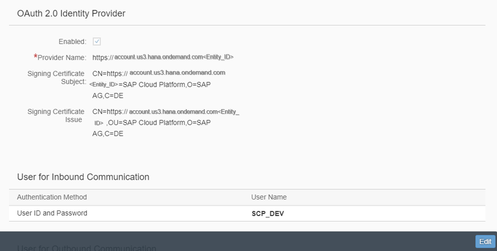

## Prerequisites  
The assignment of the Business Catalog **`SAP_CORE_BC_COM`** to your user and **`ABAP Custom New UI - SAP Cloud Platform Settings`** as tutorial represents the Prerequisites for the usage of Communication System.

## Next Steps
 (coming soon).
## Details
With this an application you are able to create Communication Systems. To create the communication system, you have to specify the SAP Web IDE link from SAP Cloud Platform as host name. Within the Communication System application you can generate also a System User, which can be found under Inbound Communication User. The Upload of your certificate can be realized furthermore.

### You will learn  
You will learn in this tutorial how to create a Communication System and User. It also shows how to specify the SAP Web IDE link from SAP Cloud Platform and upload the certificate.

### Time to Complete
**15 Min**.

---

[ACCORDION-BEGIN [Step 1: ](Open Communication System Application)]
Navigate to **Communication Systems** tile to start the application.

[ACCORDION-END]

[ACCORDION-BEGIN [Step 2: ](Create new Communication System)]
Create a new communication system. Therefore just click on the **New** button.

[ACCORDION-END]

[ACCORDION-BEGIN [Step 3: ](Add System ID and System Name)]
By adding a system ID, system name and clicking on the **Create** button, you are able to build a new communication system.

[ACCORDION-END]

[ACCORDION-BEGIN [Step 4: ](Add Host Name)]
Now you can add your host name. You can find this information on SAP Cloud Platform. It corresponds to the link address copied from `ABAP Custom New UI - SAP Cloud Platform Settings` in step 9.

[ACCORDION-END]

[ACCORDION-BEGIN [Step 5: ](Create New Inbound Communication User)]
Click on the plus sign to create a new user for inbound communication.

[ACCORDION-END]

[ACCORDION-BEGIN [Step 6: ](Create New User)]
Now click on **New User** to create one.

[ACCORDION-END]

[ACCORDION-BEGIN [Step 7: ](Add User Data and Password)]
Write a user name and description for your user.
Also give your user a password and click on the create button.

[ACCORDION-END]
[ACCORDION-BEGIN [Step 8: ](Generate New User)]
The new user will be generated by clicking on the **OK** button.

[ACCORDION-END]

[ACCORDION-BEGIN [Step 9: ](Upload Signing Certificate)]
By clicking on enabled you can upload the certificate you have generated before and you
are able to add the provider name. The provider name can be found at SAP Cloud Platform.
This matches with the local provider name.

Afterwards you can save your changes.

[ACCORDION-END]

[ACCORDION-BEGIN [Step 10: ](Check Data)]
After your changes following will be displayed:

Now you can check the identity provider data.

[ACCORDION-END]

## Next Steps
(coming soon)
