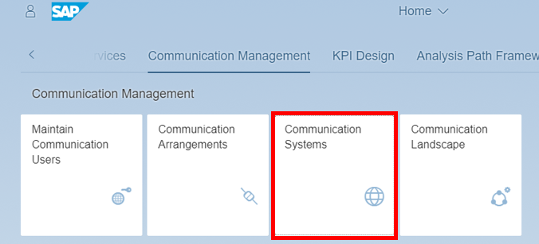
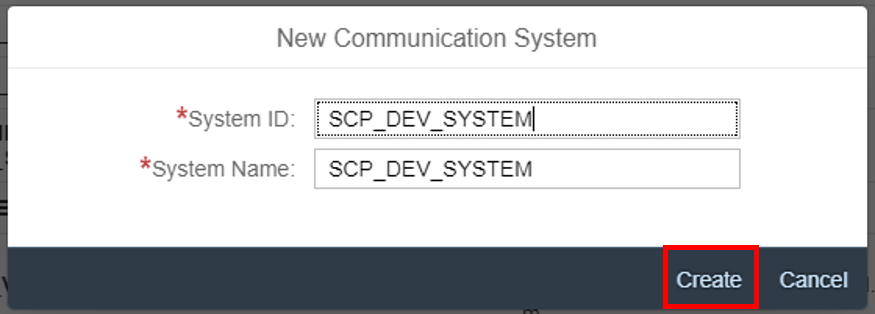
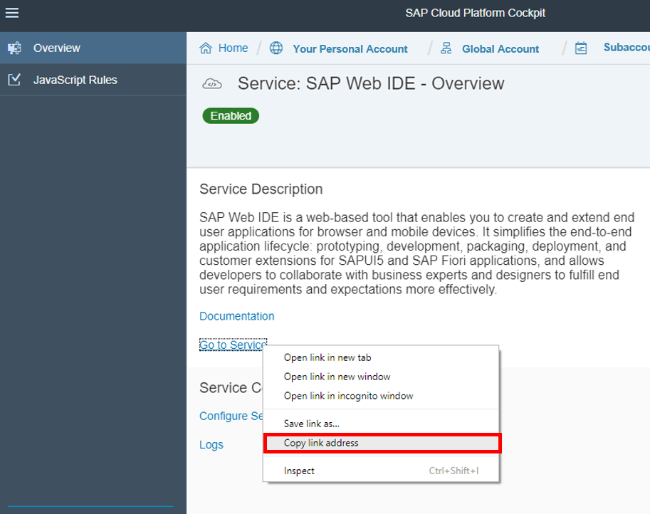
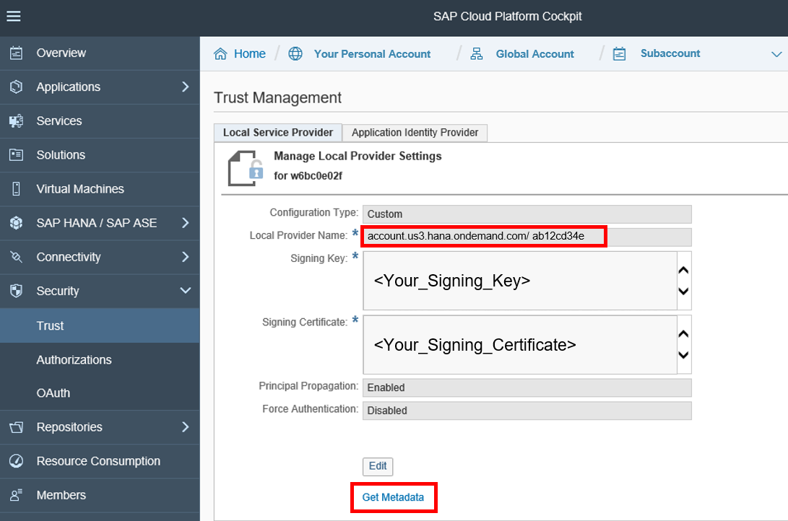
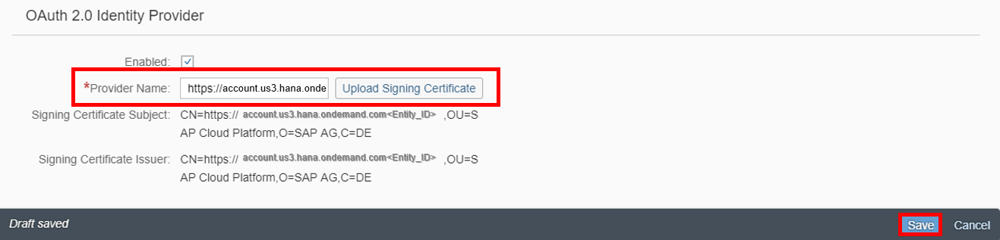

## Prerequisites  
- **Tutorials:** [`Set up trust between identity authentication and SAP Cloud Platform subaccount`](https://developers.sap.com/tutorials/abap-custom-ui-trust-settings.html)
- **Authorizations:** You must assign business catalog **`SAP_CORE_BC_COM`** to your user.

## Details
### You will learn
- How to create a OAuth communication system and user
- How to specify the SAP Web IDE link from SAP Cloud Platform
- How to upload the certificate

This tutorial focuses on creating an OAuth communication systems. To create such an OAuth communication system, you must insert the link address from SAP Cloud Platform, add your host name, edit and upload a certificate so that the S/4HANA system trusts your SAP Cloud Platform subaccount.

### Time to Complete
**15 Min**.

---

[ACCORDION-BEGIN [Step 1: ](Open communication system application)]
Navigate to **Communication Systems** tile to start the application.


[DONE]
[ACCORDION-END]

[ACCORDION-BEGIN [Step 2: ](Create communication system)]
Create a new communication system by clicking **New**.


[DONE]
[ACCORDION-END]

[ACCORDION-BEGIN [Step 3: ](Add system ID and system name)]
By adding a system ID, system name and clicking **Create**, you are able to register a new communication system.


[DONE]
[ACCORDION-END]

[ACCORDION-BEGIN [Step 4: ](Get SAP Web IDE URL)]
Switch to your SAP Cloud Platform cockpit, go to **Services** and select **SAP Web IDE**. Copy the link address of **Go to Service** paste it to some text editor and remove `https://` from that SAP Web IDE's URL. This will be needed in the creation process of the communication system.


[DONE]
[ACCORDION-END]

[ACCORDION-BEGIN [Step 5: ](Set SAP Web IDE URL as host name)]
Switch back to the communication system maintenance in SAP S/4HANA Cloud system. Set SAP Web IDE's URL without `http://` that you got before as Host Name of the communication system.

[DONE]
[ACCORDION-END]

[ACCORDION-BEGIN [Step 6: ](Add inbound communication user to system)]
Click **`+`** to add a user for inbound communication. Inbound communication means that the here defined system is used from a communication partner to call from external into the S/4HANA system. Doing this, the user that will be added next has to be used to get authorized.


[DONE]
[ACCORDION-END]

[ACCORDION-BEGIN [Step 7: ](Create communication user)]
Click **New User** to create one.


[DONE]
[ACCORDION-END]

[ACCORDION-BEGIN [Step 8: ](Add user data and password)]
Enter a **user name** and **description** for your user. Give your user a password and click **Create**.


[DONE]
[ACCORDION-END]

[ACCORDION-BEGIN [Step 9: ](Confirm user to add)]
The new user will be generated by clicking **OK**.


[DONE]
[ACCORDION-END]

[ACCORDION-BEGIN [Step 10: ](Get SAP Cloud Platform subaccount's signing certificate)]
Switch to your SAP Cloud Platform subaccount. Open trust settings, copy all data from the Signing Certificate field ( in windows: click inside and press `CTRL+a`) and paste it to some text editor.


[DONE]
[ACCORDION-END]

[ACCORDION-BEGIN [Step 11: ](Create certificate file)]
1. In the text editor file that you pasted SAP Cloud Platform subaccount's signing certificate into before, add a line with value `"-----BEGIN CERTIFICATE-----"` in front of the signing certificate and a line with value `"-----END CERTIFICATE-----"` after.

    ```swift
        -----BEGIN CERTIFICATE-----
             <SIGNING_CERTIFICATE>
        -----END CERTIFICATE-----
    ```
2. Save your changes as `.cer` file.

[DONE]
[ACCORDION-END]

[ACCORDION-BEGIN [Step 12: ](Upload signing certificate to communication system)]
Go back to your SAP S/4HANA Cloud system and open your created communication system draft. Edit your draft and enable it for `OAuth 2.0` by checking the enabled box. Then upload the certificate by clicking upload signing certificate. Take the provider name from the `CN` attribute of the Signing certificate subject, that appears after upload and enter it as the provider name. Click **Save**.



With this step, you've uploaded your certificate to your communication system. Now your S/4HANA system trusts your SAP Cloud Platform subaccount. The picture should also show the execution sequence.
[DONE]
[ACCORDION-END]

[ACCORDION-BEGIN [Step 13: ](Test yourself)]
[VALIDATE_1]
[ACCORDION-END]
