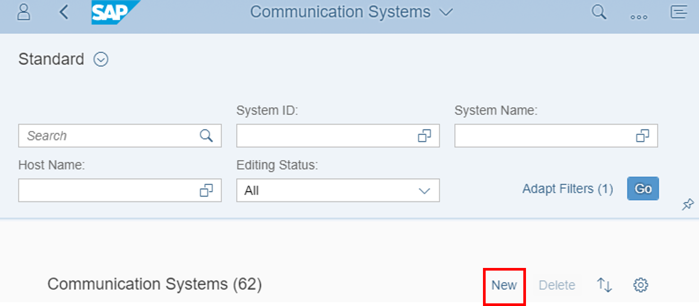
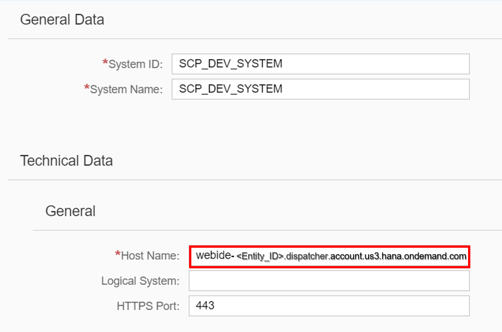
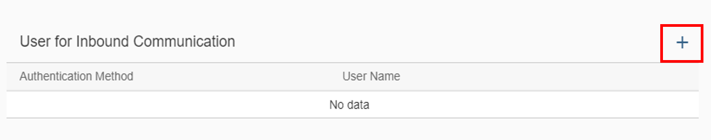
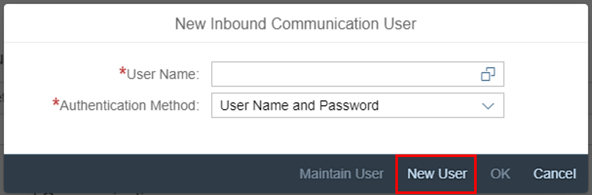
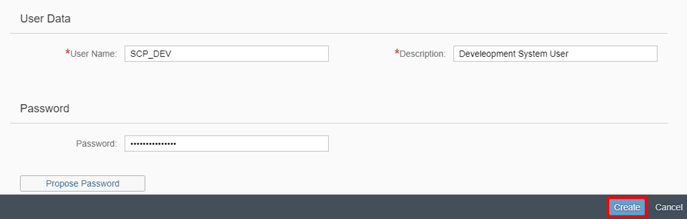
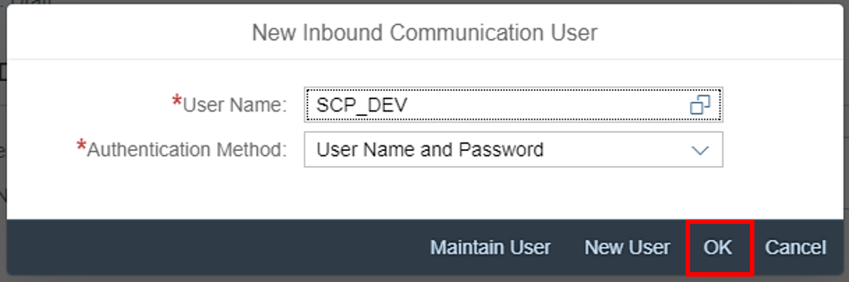
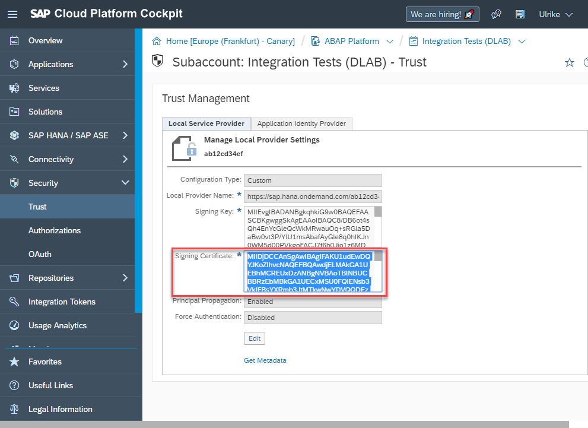
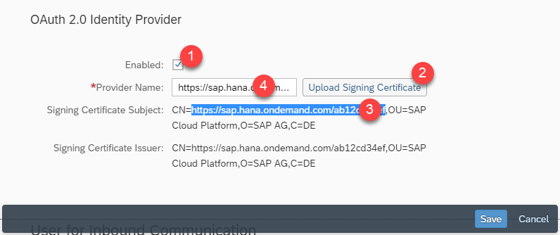

## Prerequisites  
- **Authorizations:** Your user needs a business role with business catalog **Communication Management** (ID: `SAP_CORE_BC_COM`) in **S/4HANA Cloud**

## Details
### You will learn
- How to create a communication system and user in S/4HANA Cloud for SAP Web IDE
- How to enable this communication system for OAuth

This tutorial focuses on creating an OAuth communication system. To create such an OAuth communication system, you have to create an inbound user, give your Web IDE's URL as host name, create and upload the SAP Cloud Platform Subaccount's certificate so that the S/4HANA system trusts that.

### Additional Information
- **SAP S/4HANA Cloud Release** (tutorial's last update): 1902

---

[ACCORDION-BEGIN [Step 1: ](Open communication system application)]
Navigate to **Communication Systems** tile to start the application.


[DONE]
[ACCORDION-END]

[ACCORDION-BEGIN [Step 2: ](Create communication system)]
Create a new communication system by clicking **New**.



[DONE]
[ACCORDION-END]

[ACCORDION-BEGIN [Step 3: ](Add system ID and system name)]
By adding a system ID, system name and clicking **Create**, you are able to register a new communication system.


[DONE]
[ACCORDION-END]

[ACCORDION-BEGIN [Step 4: ](Get SAP Web IDE URL)]
Switch to your SAP Cloud Platform cockpit, go to **Services** and select **SAP Web IDE**. Copy the link address of **Go to Service**, paste it to some text editor and remove `https://` from that SAP Web IDE's URL. This will be needed in the creation process of the communication system.


[DONE]
[ACCORDION-END]

[ACCORDION-BEGIN [Step 5: ](Set SAP Web IDE URL as host name)]
Switch back to the communication system maintenance in SAP S/4HANA Cloud system. Set SAP Web IDE's URL without `https://` that you got before as Host Name of the communication system.


[DONE]
[ACCORDION-END]

[ACCORDION-BEGIN [Step 6: ](Add inbound communication user to system)]
Click **`+`** to add a user for inbound communication. Inbound communication means that the here defined system is used from a communication partner to call from external into the S/4HANA system. Doing this, the user that will be added next has to be used to get authorized.



[DONE]
[ACCORDION-END]

[ACCORDION-BEGIN [Step 7: ](Create communication user)]
Click **New User** to create one.



[DONE]
[ACCORDION-END]

[ACCORDION-BEGIN [Step 8: ](Add user data and password)]
Enter a **user name** and **description** for your user. Give your user a password and click **Create**.



[DONE]
[ACCORDION-END]

[ACCORDION-BEGIN [Step 9: ](Confirm user to add)]
The new user will be taken as inbound communication user by clicking **OK**.



[DONE]
[ACCORDION-END]

[ACCORDION-BEGIN [Step 10: ](Get SAP Cloud Platform subaccount's signing certificate)]
Switch to your SAP Cloud Platform subaccount. Open trust settings, copy all data from the Signing Certificate field ( in windows: click inside and press `CTRL+a`) and paste it to some text editor.



[DONE]
[ACCORDION-END]

[ACCORDION-BEGIN [Step 11: ](Create certificate file)]
1. In the text editor file that you pasted SAP Cloud Platform subaccount's signing certificate into before, add a line with value "`-----BEGIN CERTIFICATE-----`" in front of the `<SIGNING_CERTIFICATE>` and a line with value "`-----END CERTIFICATE-----`" after.

    ```swift
        -----BEGIN CERTIFICATE-----
             <SIGNING_CERTIFICATE>
        -----END CERTIFICATE-----
    ```
2. Save your changes as `.cer` file.

[DONE]
[ACCORDION-END]

[ACCORDION-BEGIN [Step 12: ](Upload signing certificate to communication system)]
Go back to your SAP S/4HANA Cloud system and open your created communication system draft. **Edit** your draft and enable it for `OAuth 2.0` by checking the **Enabled** box. Then upload the certificate by clicking **Upload Signing Certificate**. Take the value of the `CN` attribute of the Signing certificate subject - that appears after upload - and enter it as the **Provider Name**. Click **Save**.



With this step, you've uploaded your certificate to your communication system. Now your S/4HANA system trusts your SAP Cloud Platform subaccount.

[DONE]
[ACCORDION-END]

[ACCORDION-BEGIN [Step 13: ](Test yourself)]

[VALIDATE_1]
[ACCORDION-END]
