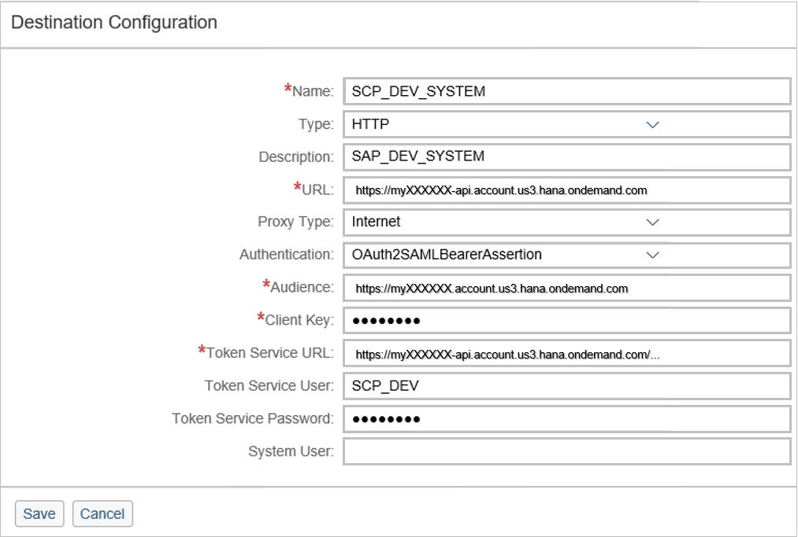

## Prerequisites  
Access to a subaccount on SAP Cloud Platform is expected as a prerequisite. **`ABAP Custom New UI - Custom Business Object, Custom Communication Scenario, Communication Arrangement`** as tutorial represents the Prerequisites for the creation of the Destination on SAP Cloud Platform.

## Next Steps
 (coming soon).
## Details
The configuration of the destination on SAP Cloud Platform will be explained in this tutorial. You learn where you can get all the information to build your destination to guarantee the connection to your SAP S/4HANA Cloud System. The various components of the Token Service URL are also part of this tutorial.
### You will learn  
This tutorial shows you how to configure the destination on SAP Cloud Platform.

### Time to Complete
**15 Min**.

---

[ACCORDION-BEGIN [Step 1: ](Create HTTP Destination)]
Enter the SAP Cloud Platform account as an administrator.
Switch to **Destinations** and click on **New Destination**.


[ACCORDION-END]

[ACCORDION-BEGIN [Step 2: ](Select Service Generation)]
Now enter following data to your destination:

**Name:** Name your destination
**Type:** HTTP
**Description:** Describe your destination
**URL:** URL of your S/4HANA Cloud System (with `-api`)
**Proxy Type:** Internet
**Authentication:** `OAuth2SAMLBearerAssertion`
**Audience:** URL of your S/4HANA Cloud System (without `-api`)
**Client Key:** Equals your communication user
**Token Service User:** Equals your communication user
**Token Service Password:** Password of your communication user



Token Service URL will be explained in the next step.

[ACCORDION-END]

[ACCORDION-BEGIN [Step 3: ](Define Token Service URL)]
**Token Service URL** - This consists of 3 parts:

   `<URL_of_your_S4HANA_Cloud_System> with –api `

    +

   `/sap/bc/sec/oauth2/token?scope=ADT_0001%20%2fUI5%2fAPP_INDEX_0001%20%2fIWFND%2fSG_MED_CATALOG_0002`

   +

  `%20+ <CustomBusinessObject>` + `_0001`


Example:

```swift
https://myXXXXXX-api.account.us3.hana.ondemand.com/sap/bc/sec/oauth2/token?scope=ADT_0001%20%2fUI5%2fAPP_INDEX_0001%20%2fIWFND%2fSG_MED_CATALOG_0002%20YY1_BONUSPLAN_CDS_0001

```


[ACCORDION-END]

[ACCORDION-BEGIN [Step 4: ](Enter Additional Properties)]
Add Additional Properties:
**`authnContextClassRef:`** `urn:oasis:names:tc:SAML:2.0:ac:classes:X509`
**`TrustAll:`** `true`
**`WEBIDEEnabled:`** `true`
**`WebIDEUsage:`** `odata_abap,ui5_execute_abap,dev_abap`


Now save your changes.

[ACCORDION-END]

## Next Steps
(coming soon)
