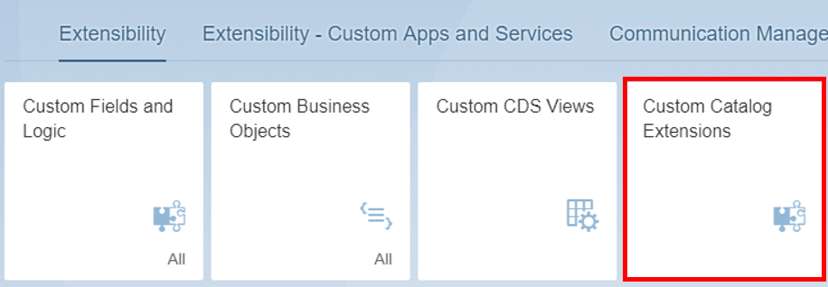
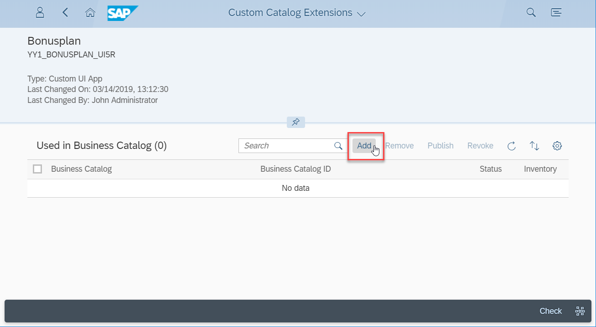
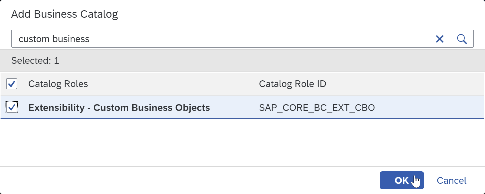
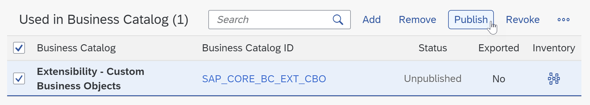
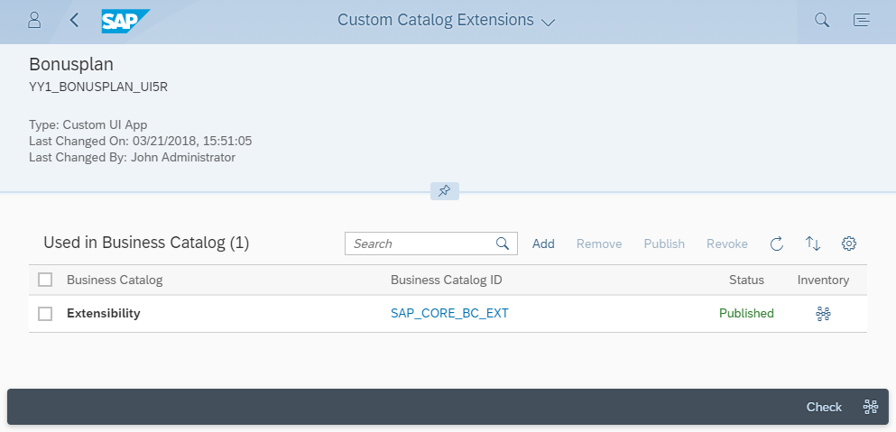
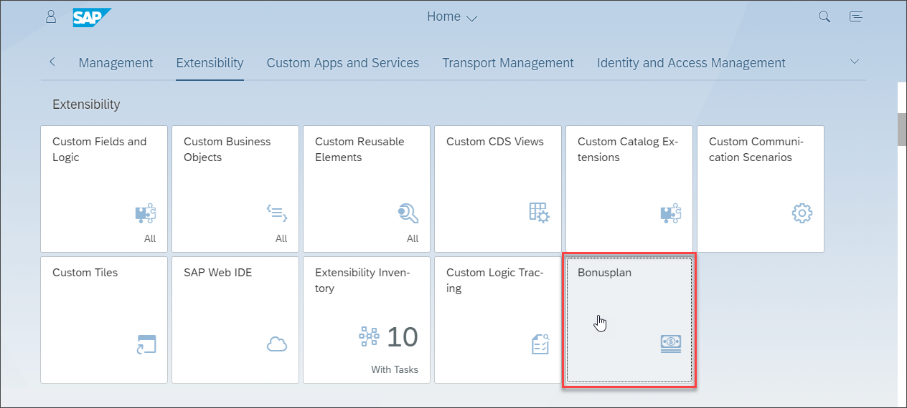
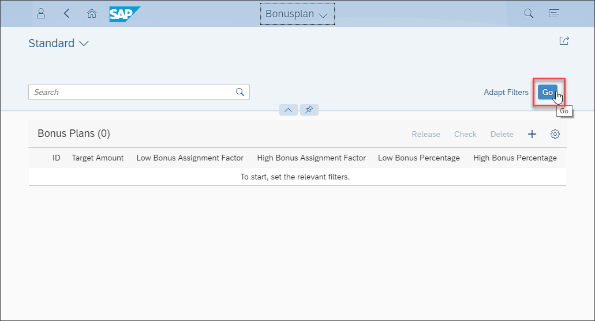
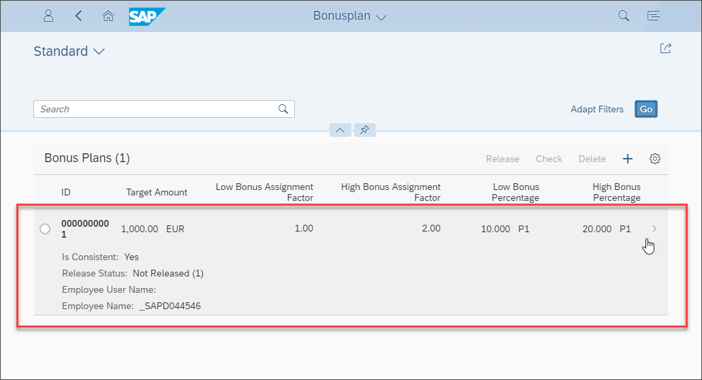

## Prerequisites
- **Authorizations:** Your user needs a business role with business catalog **Extensibility** (ID: `SAP_CORE_BC_EXT`) in **SAP S/4HANA Cloud**

## Details
### You will learn
- How to make the custom UI visible as an application tile in SAP Fiori launchpad

As application availability in Fiori Launchpad and authorization for it is managed via Business Catalogs, you will see how to extend such a business catalog with your new app.

### Additional Information
- **SAP S/4HANA Cloud Release** (tutorial's last update): 1902

---

[ACCORDION-BEGIN [Step 1: ](Open custom catalog extensions)]
Open **Custom Catalog Extensions** application on your SAP Fiori launchpad (SAP S/4HANA Cloud system).

[DONE]
[ACCORDION-END]

[ACCORDION-BEGIN [Step 2: ](Find and select application)]
Search your application and select it.
The ID of your application is the combination of the name that you gave when deploying it from SAP Cloud Platform to S/4HANA Cloud including the prefix `YY1_` plus the suffix `_UI5R`. It is of type `Custom UI App`.  

[DONE]
[ACCORDION-END]

[ACCORDION-BEGIN [Step 3: ](Extend business catalog)]
Press **Add** to start extending the business catalog that the new app shall be part of.

A pop up opens for catalog selection. Be aware, that users that shall be able to use the app must have a role with the same catalog assigned. As for this tutorial catalog `SAP_CORE_BC_EXT` is the essential prerequisite, we simply select that and press **OK**

The pop up has closed and the catalog extension got an entry in its list of used catalogs. Select that entry and press **Publish**

[DONE]
[ACCORDION-END]

[ACCORDION-BEGIN [Step 4: ](Open custom UI App)]
Go to the Fiori Launchpad by pressing the Home button.
Press **F5** to refresh your page and your new tile becomes visible.

Click it to open your new app developed with Web IDE.

The List Screen will open. As by default a list screen does not show the existing list entries you have to press the **Go** button to get these.

To get into the details screen of a Bonus Plan you can click its whole entry in the list.

[DONE]
[ACCORDION-END]

[ACCORDION-BEGIN [Step 9: ](Test yourself)]

[VALIDATE_1]
[ACCORDION-END]
