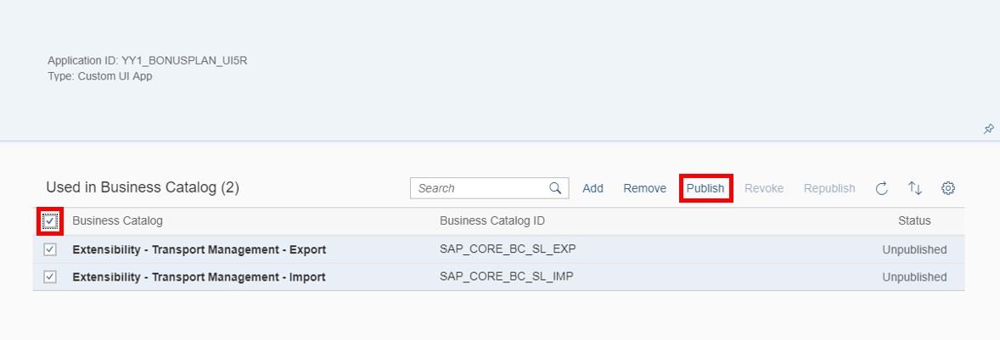
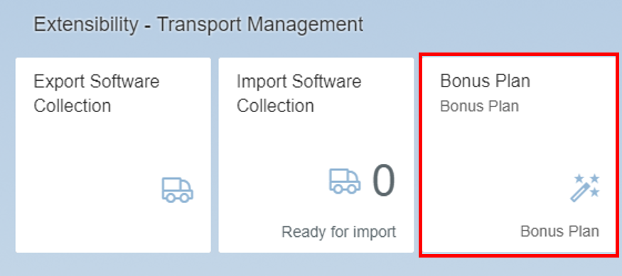

## Prerequisites  
- **Tutorials:** [`Create custom UI for S/4HANA on SAP Cloud Platform`](https://developers.sap.com/tutorials/abap-custom-ui-tile.html)

## Details
### You will learn
- How to make the custom UI visible as an application in SAP Fiori launchpad

The creation of a new tile will be explained with this tutorial. The adding of business catalogs to the catalog extension will be shown.

### Time to Complete
**15 Min**.

---

[ACCORDION-BEGIN [Step 1: ](Open custom catalog extensions)]
Open **Custom Catalog Extensions** application on your SAP Fiori launchpad (SAP S/4HANA Cloud system).

[ACCORDION-END]

[ACCORDION-BEGIN [Step 2: ](Select application)]
Search your application and select it.

[ACCORDION-END]

[ACCORDION-BEGIN [Step 3: ](Add business catalog)]
Add the following business catalogs to your catalog extension:

  - `SAP_CORE_BC_SL_EXP`
  - `SAP_CORE_BC_SL_IMP`

Check both business catalogs and publish them.

[ACCORDION-END]

[ACCORDION-BEGIN [Step 4: ](Check tile)]
Press **F5** to refresh your page and your tile is created.

[ACCORDION-END]
