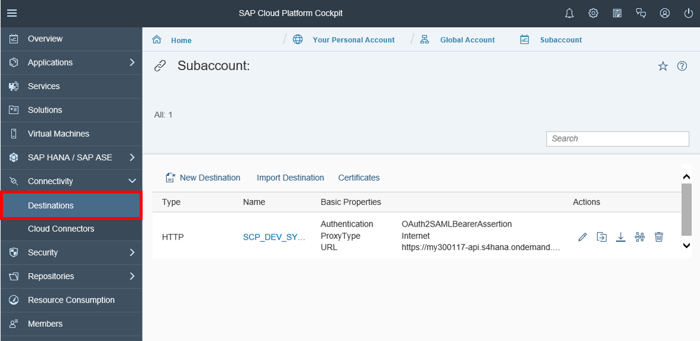
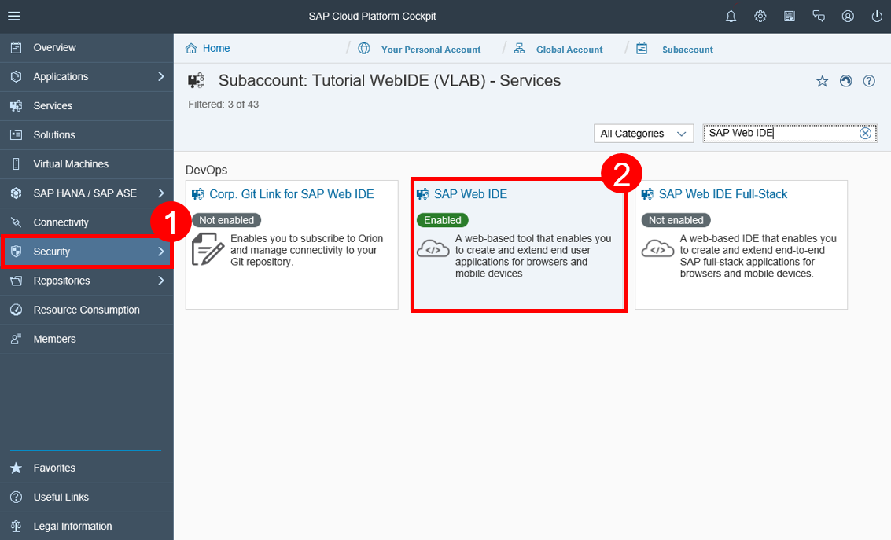
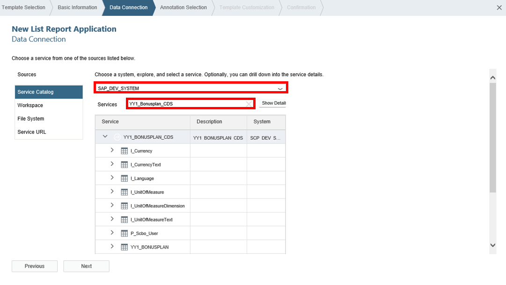

## Prerequisites  
The assignment of the business catalog **`SAP_CORE_BC_COM`**, **`SAP_CORE_BC_EXT`** to your user and **`Expose custom business object as external web service`** as tutorial represents the prerequisites for the usage of the service generation as well as custom communication scenario and communication arrangement creation.

## Details
### You will learn
- How to add a service scope to your destination
- How to create a UI project

This tutorial describes how to make a custom business object's service consumable on SAP Cloud Platform in case of OAuth authentication. This will be done by enhancing the Platform subaccount's destination to the services S/4HANA system. The service will be added to the scope of the destination. At the end you cannot only choose the service in SAP Web IDE, but also retrieve its data.

### Time to Complete
**15 Min**.

---

[ACCORDION-BEGIN [Step 1: ](Open SAP Cloud Platform destination)]
Open **Destinations** on SAP Cloud Platform.

[ACCORDION-END]

[ACCORDION-BEGIN [Step 2: ](Add service scope to destination)]
Edit your **destination** and add your **custom CDS view service** to your scope.

| ------------ | --------------------------------------------------------------------------------- |
| **`scope:`** |  `ADT_0001 /UI5/APP_INDEX_0001 /IWFND/SG_MED_CATALOG_0002 YY1_BONUSPLAN_CDS_0001`  |

Your **scope** consists now of 4 parts:
 - `ADT_0001`: scope of the gateway service for ADT  
 - `/UI5/APP_INDEX_0001`: scope of the UI2 app index
 - `/IWFND/SG_MED_CATALOG_0002`: scope of the catalog service version 2.0
 - `<CustomBusinessObjectServiceName> + _0001`: custom CDS view

    example: `YY1_BONUSPLAN_CDS_0001`

Be sure that all parts within the scope are separated with a space.

[ACCORDION-END]

[ACCORDION-BEGIN [Step 3: ](Search SAP Web IDE)]
Go to **Services**, search for **SAP Web IDE** and select it on your SAP Cloud Platform account.

Click **Go to Service** to open SAP Web IDE.

[ACCORDION-END]

[ACCORDION-BEGIN [Step 4: ](Select new project)]
Select **New Project from Template** to generate one.

If you don't see this welcome page then follow the alternative way:
File -> New -> Project from Template

[ACCORDION-END]

[ACCORDION-BEGIN [Step 5: ](Create UI project)]
Choose the **List Report Application** to create a new UI.

[ACCORDION-END]

[ACCORDION-BEGIN [Step 6: ](Enter basic information)]
Enter **`Bonusplan`** as project name and title.

 
Click **Next**.

[ACCORDION-END]

[ACCORDION-BEGIN [Step 7: ](Explore business object's service in SAP Web IDE)]
Search for **`YY1_BONUSPLAN_CDS`** and open the list. Now you can see following:

Without `YY1_BONUSPLAN_CDS_0001` as parameter in your scope you wouldn't be able to select `YY1_BONUSPLAN_CDS_0001` as service to create your UI project. All other services still cannot be selected.  

[ACCORDION-END]
