## Prerequisites  
Access to a subaccount on SAP Cloud Platform is expected as a prerequisite.

## Next Steps
 (coming soon).
## Details
You can add new members on SAP Cloud Platform and assign them different roles. With these roles users have different rights on SAP Cloud Platform. Downloading the metadata is important.
With this step you are able to generate a certificate that can be uploaded to the SAP S/4HANA Cloud System. The copying of the SAP Web IDE link also plays a significant role. This is required
in the process of creating the communication system to ensure the connection to the SAP Web IDE. This tutorial shows in addition how to generate a certificate from the metadata.

### You will learn  
You will be able to learn how to add a new member to your subaccount on SAP Cloud Platform. The download of your metadata will also take place in this tutorial. It also shows where to copy the SAP Web IDE link and you can see how the metadata is converted into a certificate.

### Time to Complete
**20 Min**.

---

[ACCORDION-BEGIN [Step 1: ](Enter SAP Cloud Platform)]
Enter the **SAP Cloud Platform** account as an administrator.

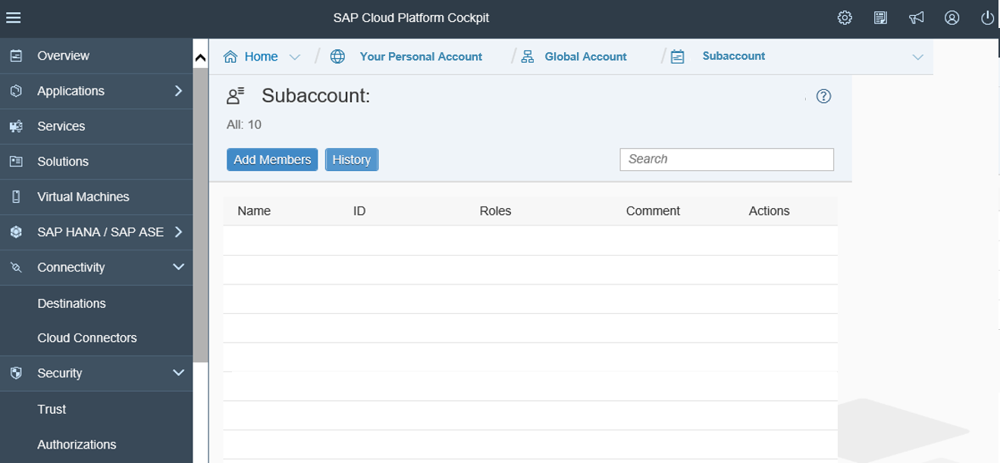

[ACCORDION-END]

[ACCORDION-BEGIN [Step 2: ](Add Members)]
Click on the **Add Members** button to create a new member.

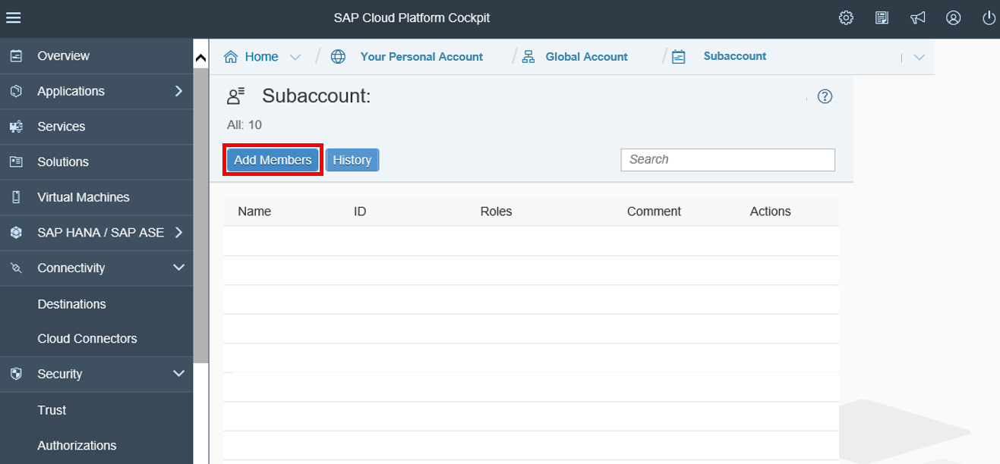

[ACCORDION-END]

[ACCORDION-BEGIN [Step 3: ]( Add User ID)]
Write the user ID and select administrator and developer as roles.
Afterwards click on **Add Members** to generate a user.


[ACCORDION-END]

[ACCORDION-BEGIN [Step 4: ](Check Data)]
Check your data for correctness.


[ACCORDION-END]

[ACCORDION-BEGIN [Step 5: ](Edit Local Service Provider)]
Switch to your trust settings and edit your Local Service Provider.


[ACCORDION-END]

[ACCORDION-BEGIN [Step 6: ](Add Information)]
Click on Generate Key Pair and add following information to your Local Provider:

Configuration Type: Custom
Local Provider Name: `account.us3.hana.ondemand.com<Entity_ID>`
Principal Propagation: Enabled
Force Authentication: Disabled
Save your changes.

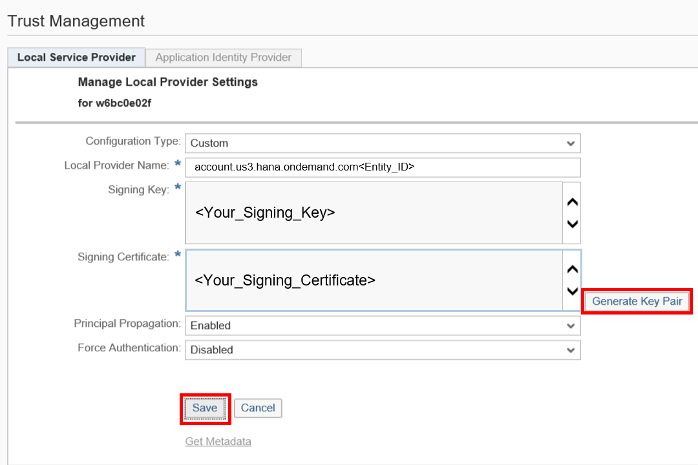

[ACCORDION-END]

[ACCORDION-BEGIN [Step 7: ](Save Metadata of Identity Authentication Tenant)]
Save the metadata of your Identity Authentication tenant on your local file system as an XML file. You can find the tenant at:
`https://<tenant ID>.subaccounts.ondemand.com/saml2/metadata`


[ACCORDION-END]

[ACCORDION-BEGIN [Step 8: ](Enter SAP Cloud Platform Identity Authentication Administration Console)]
Enter SAP Cloud Platform Identity Authentication Administration Console with:
`https://<tenant ID>.subaccounts.ondemand.com/admin`
You can also get the URL from the Identity Authentication tenant registration e-mail.


[ACCORDION-END]

[ACCORDION-BEGIN [Step 9: ](Add SAP Cloud Platform as Application)]
Choose **Applications & Resources** and go to Applications.
Click on the `+Add` button on the left hand panel to enter the name of your SAP Cloud Platform subaccount. Now save your changes.

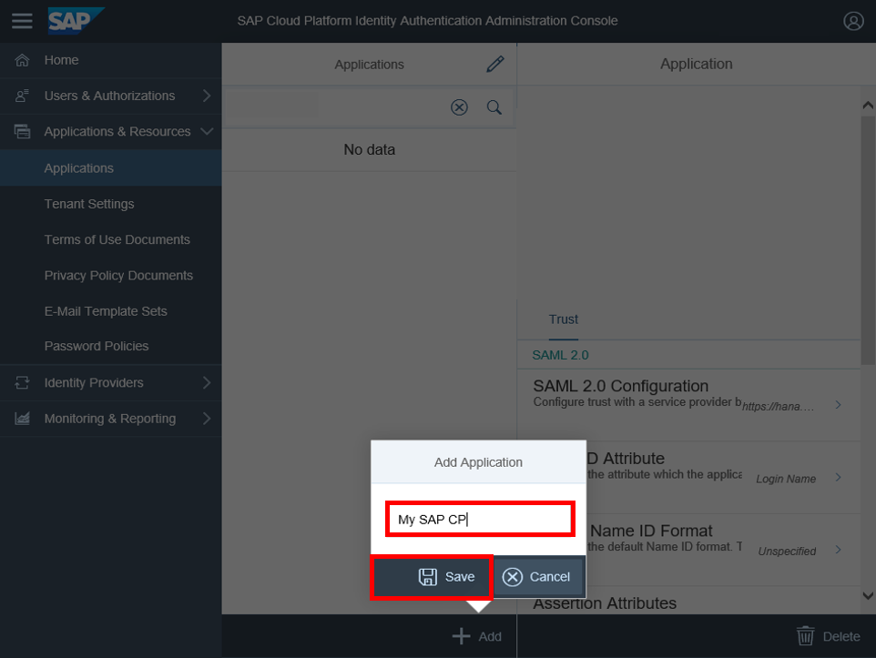

[ACCORDION-END]

[ACCORDION-BEGIN [Step 10: ](Configure SAML 2.0 Trust with SAP Cloud Platform)]
**Configure the `SAML 2.0` trust** with SAP Cloud Platform subaccount as a service provider.
Click on the newly created application on the left side and then on Trust.


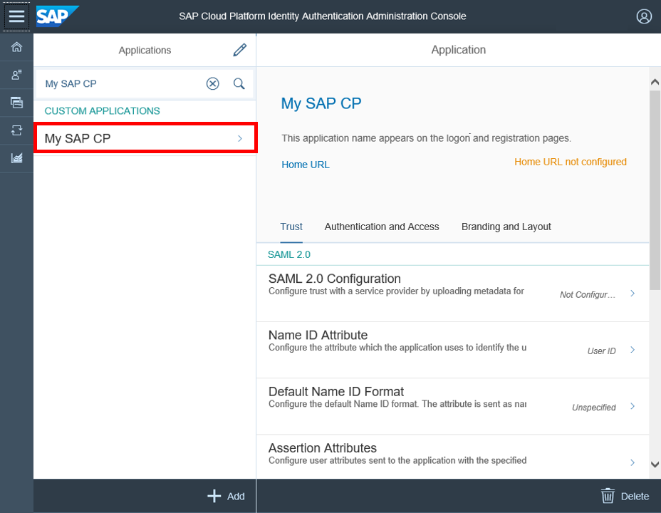

[ACCORDION-END]

[ACCORDION-BEGIN [Step 11: ](Upload Metadata of SAP Cloud Platform Subaccount)]
**Choose `SAML 2.0` Configuration**. Upload the metadata XML file of your SAP Cloud Platform subaccount. On service provider metadata upload, the fields are populated with the parsed data from the XML file. Save the configuration settings.
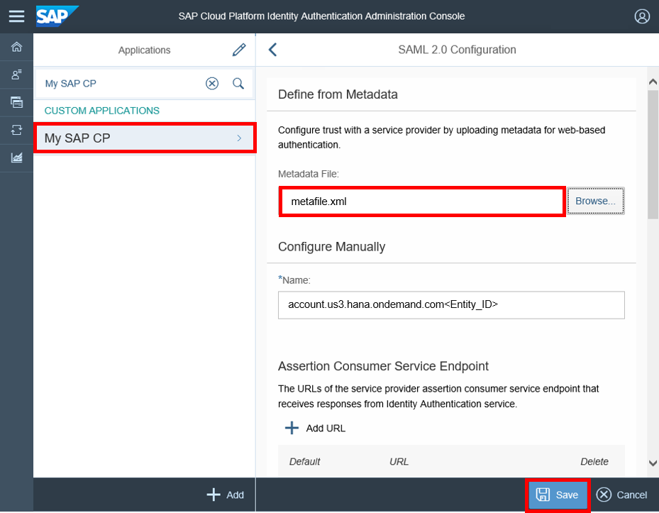

[ACCORDION-END]

[ACCORDION-BEGIN [Step 12: ](Select Name ID Attribute)]
Go to Name ID Attribute and choose Login Name and save your changes.
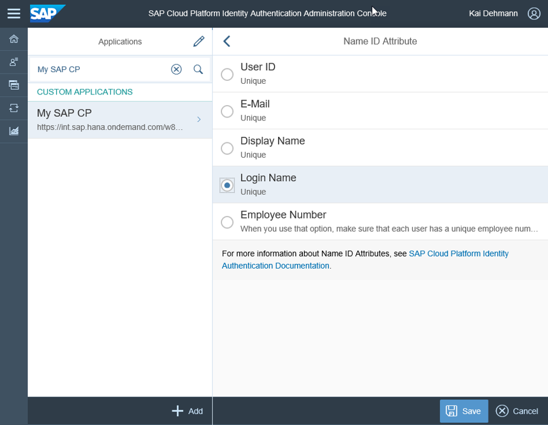

[ACCORDION-END]

[ACCORDION-BEGIN [Step 13: ](Switch to Identity Provider)]
Now switch to Identity Provider and select it.
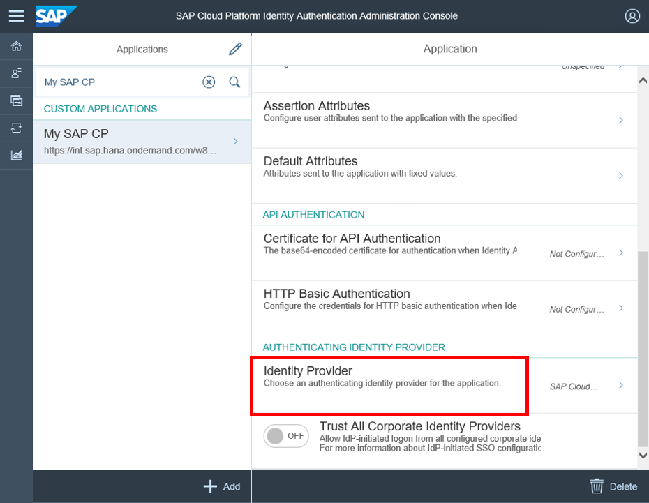

[ACCORDION-END]

[ACCORDION-BEGIN [Step 14: ](Select Identity Provider)]
Now select `sapdev` as Identity Provider and click afterwards on the save button.
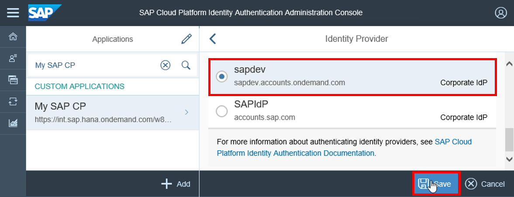

[ACCORDION-END]

[ACCORDION-BEGIN [Step 15: ](Add Trusted Identity Provider)]
Now switch back to your SAP Cloud Platform Cockpit, go to your Trust Settings.
Choose Application Identity Provider to add a Trusted Identity Provider.

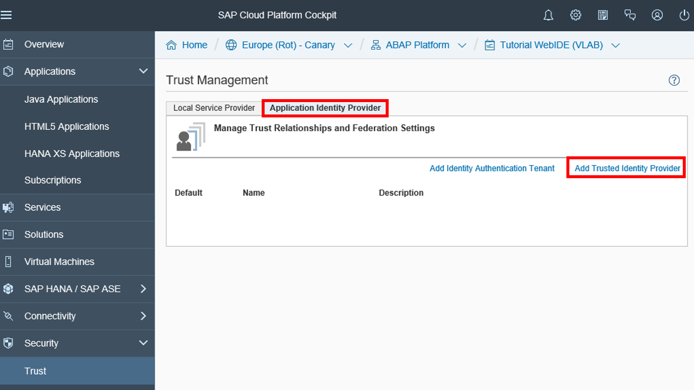

[ACCORDION-END]

[ACCORDION-BEGIN [Step 16: ](Add Information)]
Upload the Identity Authentication metadata XML file in the Metadata File field.
In the Attributes tab, choose Add Assertion-Based Attribute to add the following attribute:


|           **Assertion**            |       **Principle Attribute**      |
|:----------------------------------:|:----------------------------------:|
|             `first_name`           |            `firstname`             |
|             `last_name`            |             `lastname`             |   
|              `mail`                |              `email`               |   

Save your changes.

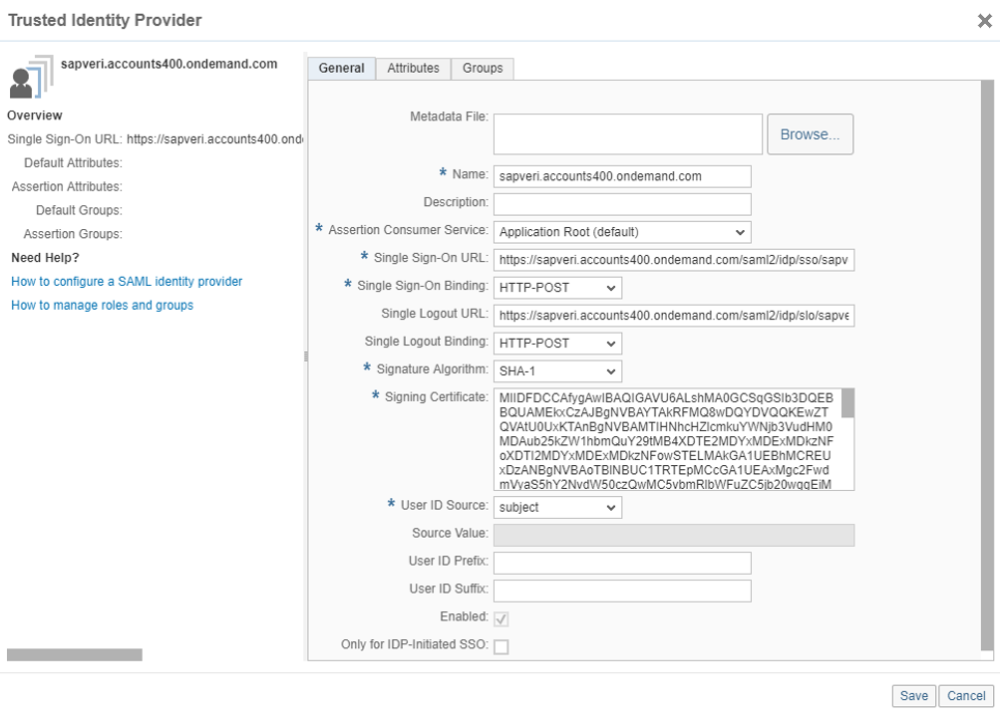
[ACCORDION-END]

[ACCORDION-BEGIN [Step 17: ](Change Application Permission)]
Go to **Services** on SAP Cloud Platform. Now click on **Configure Service** to change the Application Permission. Change the Assigned Role from your `WebIDEPersmission` to Everyone. Now save your changes.

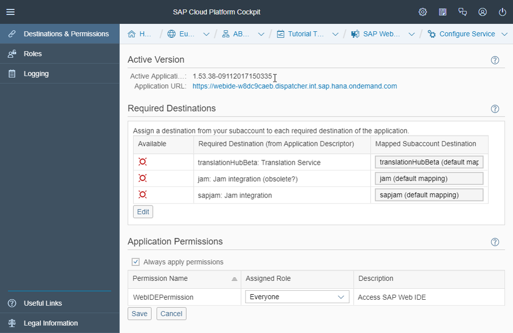

[ACCORDION-END]
[ACCORDION-BEGIN [Step 18: ](Get Metadata)]
Open trust settings and download the metadata by clicking on the **`Get Metadata`** link. In addition the local provide name will be important in the further steps.

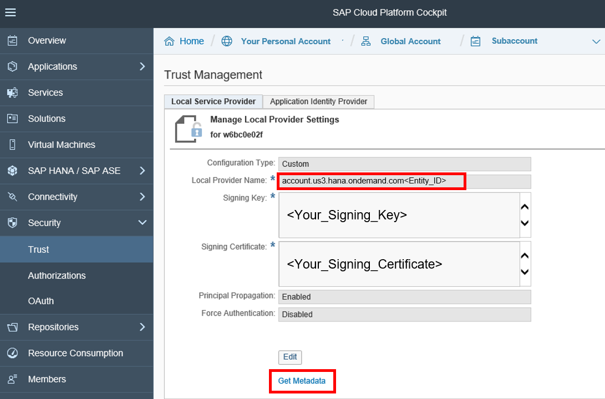

[ACCORDION-END]


[ACCORDION-BEGIN [Step 19: ](Create Certificate)]
Take your downloaded Metadata-File from SAP Cloud Platform and open it with an editor of your choice.
(1) Copy the code between the two tags in another file.


(2) Add also the begin and end tag to your copied code:

```swift
      -----BEGIN CERTIFICATE-----
           your_copied_code
      -----END CERTIFICATE-----

```
Now save your changes as `.cer` file

[ACCORDION-END]

[ACCORDION-BEGIN [Step 20: ](Copy Link Address)]
Now go to Services and select SAP Web IDE.
Copy the link address of **`Go to Service`**. This will be needed in the creation process of the communication system.


[ACCORDION-END]


## Next Steps
(coming soon)
