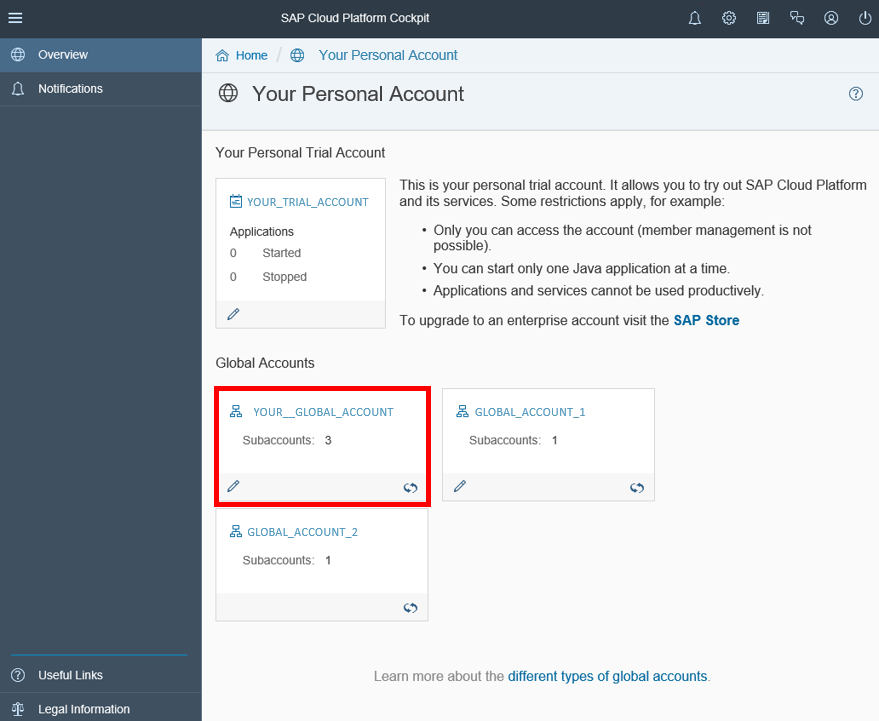
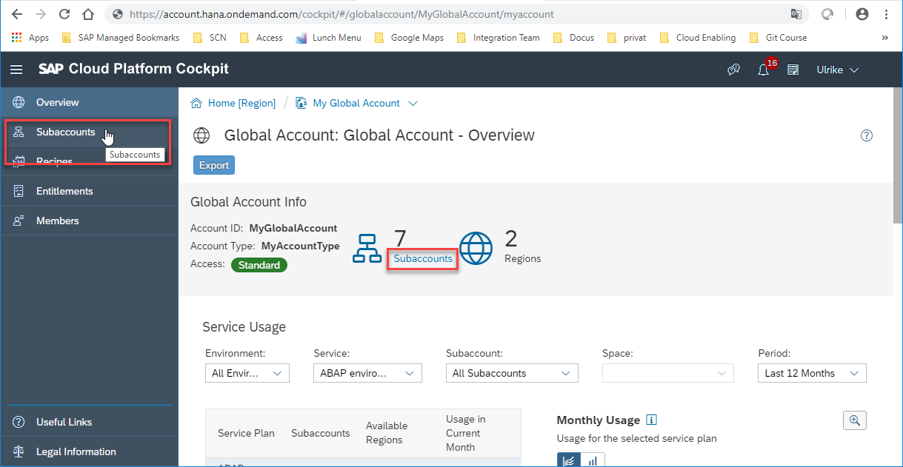
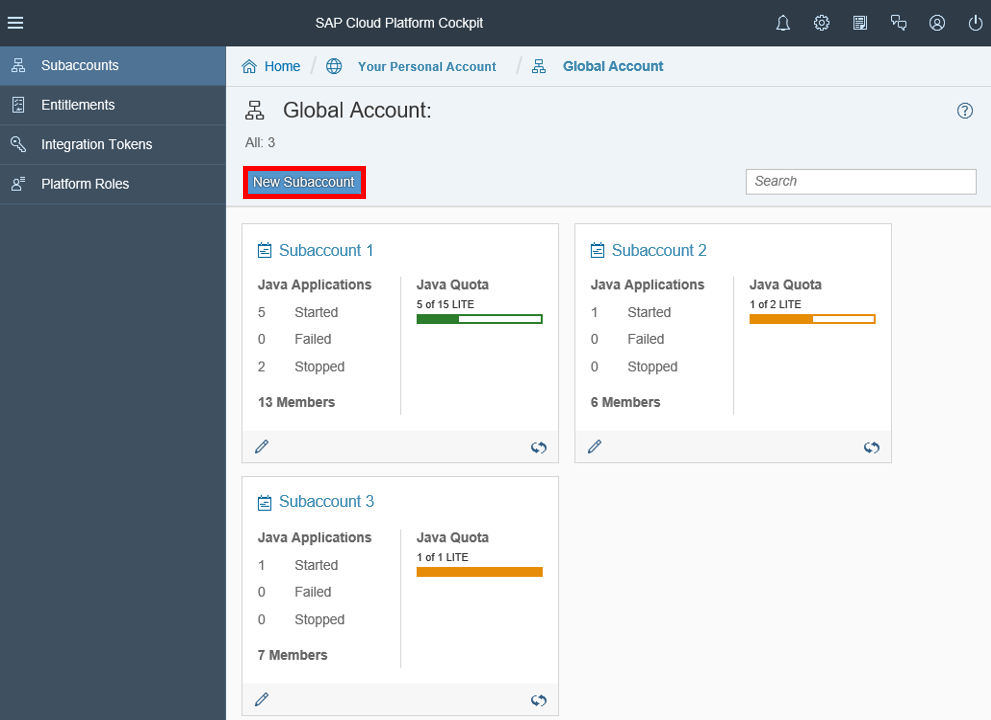
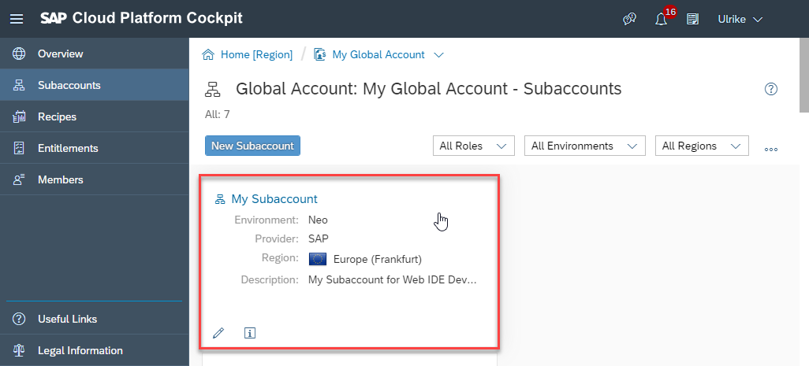
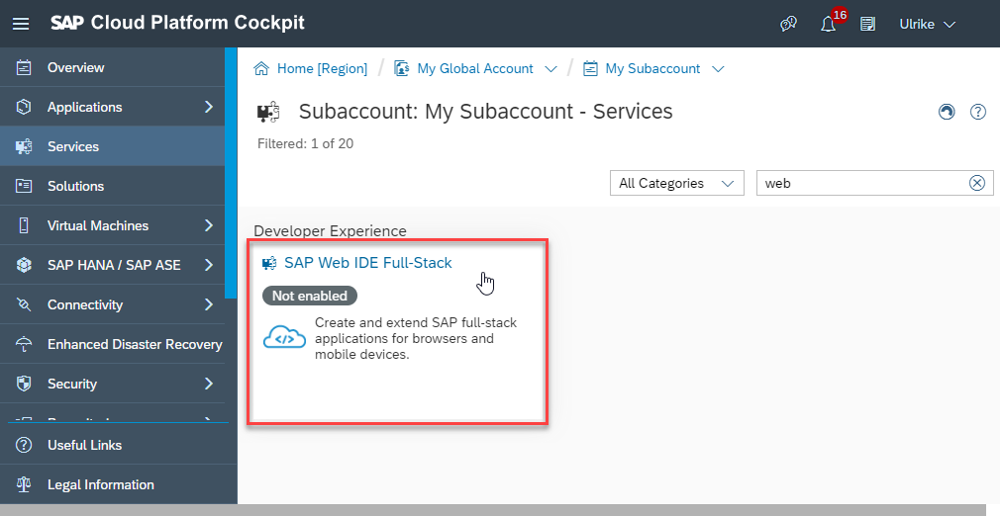
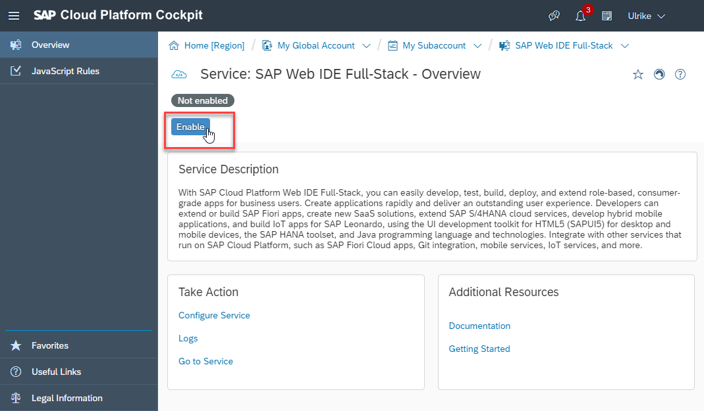
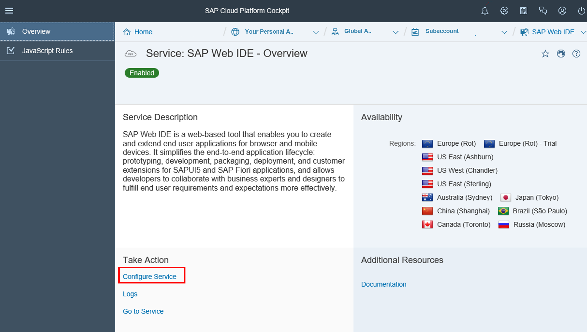
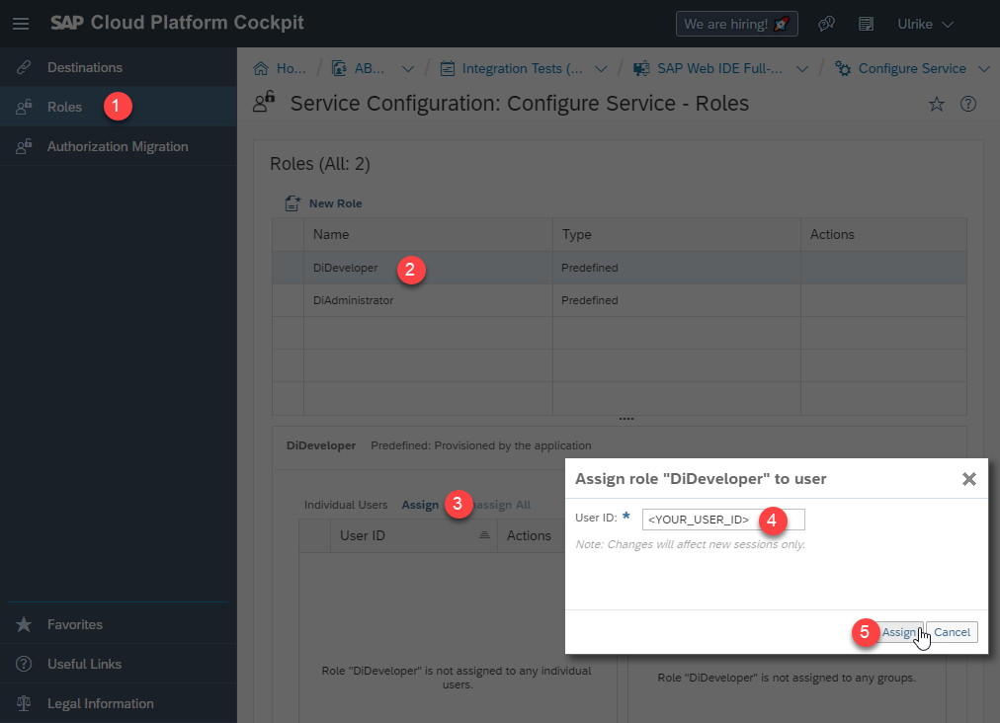

## Prerequisites   
  - **Authorization:** Your user needs access to your **SAP Cloud Platform global account** in the Neo environment.

## Details
### You will learn
- How to create a subaccount
- How to give users the permission to enter SAP Web IDE

### Additional Information
- **SAP S/4HANA Cloud Release** (tutorial's last update): 1902

---

[ACCORDION-BEGIN [Step 1: ](Enter SAP Cloud Platform global account)]
Enter SAP Cloud Platform and select your global account.

Choose one of the two options to navigate from global account's overview to its subaccounts.
One option is the **Subaccounts** point in the left hand side menu the other option is the link below the count of subaccounts within the Info part of the global account's overview area.

[DONE]
[ACCORDION-END]

[ACCORDION-BEGIN [Step 2: ](Create subaccount)]
Click **New Subaccount**.

A pop up opens.

Enter following data.

| Field label | Field value |
|:------------|:------------|
| **Display Name** | `<YOUR_NEW_SUBACCOUNTS_NAME>`|
| **Description**| (optional) |
| **Environment**| `Neo` |
| **Provider** | `SAP` |
| **Region** | `<YOUR_NEW_SUBACOUNTS_REGION>` |

 Click **Create**.

[DONE]
[ACCORDION-END]

[ACCORDION-BEGIN [Step 3: ](Enter subaccount)]
Now your new subaccount will be shown and you can enter it by clicking its tile.

[DONE]
[ACCORDION-END]

[ACCORDION-BEGIN [Step 4: ](Enable SAP Web IDE service in subaccount)]
Go to **Services**, search for **SAP Web IDE** and select it.

**Enable** the Web IDE service for this subaccount.

[DONE]
[ACCORDION-END]

[ACCORDION-BEGIN [Step 5: ](Enter Web IDE service's configuration)]
Click **Configure Service** inside Web IDE service's overview.

[DONE]
[ACCORDION-END]

[ACCORDION-BEGIN [Step 6: ](Grant user access to SAP Web IDE)]
To enable users to work with Web IDE you have to explicitly assign the `DiDeveloper` Role to each of them.

1. Go to **Roles**
2. Select **`DiDeveloper`** Role
3. Press **Assign** in the role's section for individual users. A pop up opens.
4. Enter the required User's ID
5. Press **Assign** in the pop up

With the next session the added user will have the permission to enter SAP Web IDE.

[DONE]
[ACCORDION-END]

[ACCORDION-BEGIN [Step 8: ](Test yourself)]

[VALIDATE_1]
[ACCORDION-END]
