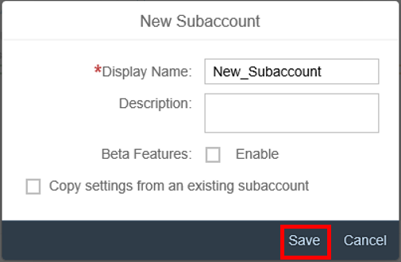
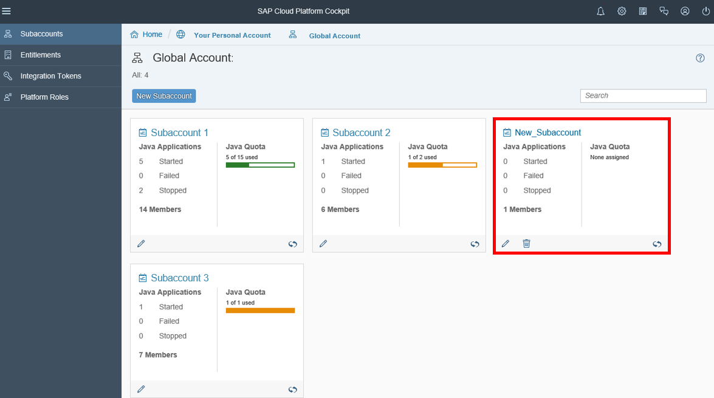
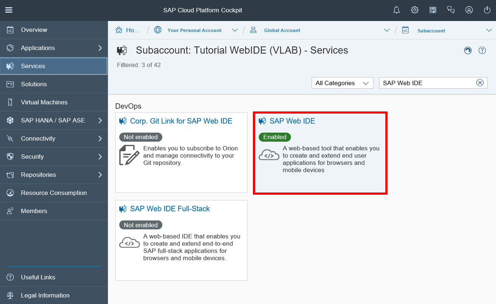

## Prerequisites  
Access to a subaccount on SAP Cloud Platform in Neo Environment is expected as a prerequisite.

## Next Steps
 (coming soon).
## Details
This tutorial describes how you can add a new subaccount to SAP Cloud Platform. Furthermore you learn how to give members the permission to enter SAP Web IDE.
### You will learn  
You will be able to learn how to add a new subaccount and give members the permission to enter SAP Web IDE.

### Time to Complete
**15 Min**.

---
[ACCORDION-BEGIN [Step 1: ](Enter SAP Cloud Platform subaccount)]
Enter the **SAP Cloud Platform** and select your global account.

[ACCORDION-END]

[ACCORDION-BEGIN [Step 2: ](Create new subaccount)]
Click on the corresponding button to create a new subaccount.

[ACCORDION-END]

[ACCORDION-BEGIN [Step 3: ](Add display name to subaccount)]
Now add a display name to your new subaccount.

[ACCORDION-END]

[ACCORDION-BEGIN [Step 4: ](Check created subaccount)]
`New_Subaccount` will be shown.

[ACCORDION-END]

[ACCORDION-BEGIN [Step 5: ](Search for SAP Web IDE)]
Go to **Services**, search for SAP Web IDE and select it.

[ACCORDION-END]

[ACCORDION-BEGIN [Step 6: ](Configure your Service)]
Now click on **Go to Services** on SAP Cloud Platform to configure your service.

[ACCORDION-END]

[ACCORDION-BEGIN [Step 7: ](Give SAP Web IDE access to everyone)]
You are able to change the **Application Permission**. Change the Assigned Role from your `WebIDEPermission` to **Everyone**. Now save your changes.

[ACCORDION-END]

## Next Steps
(coming soon)
