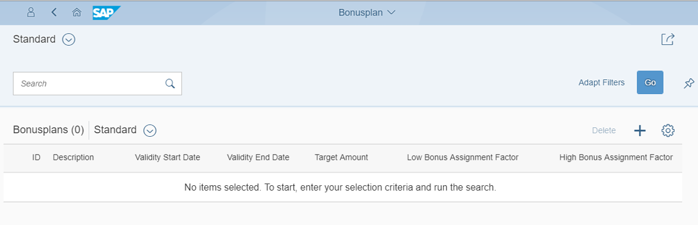
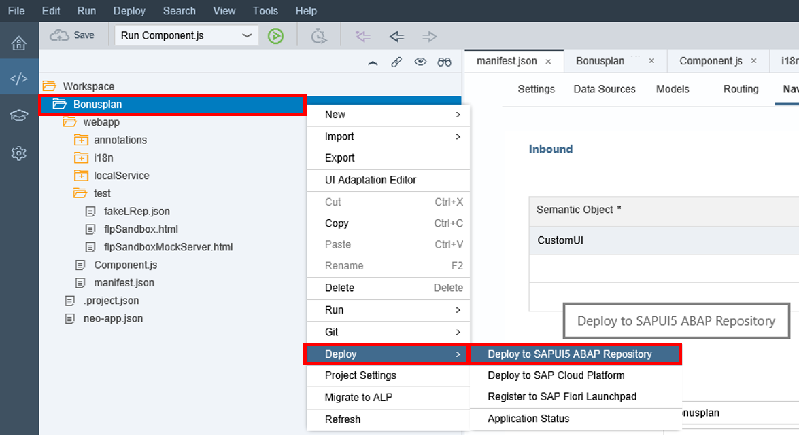
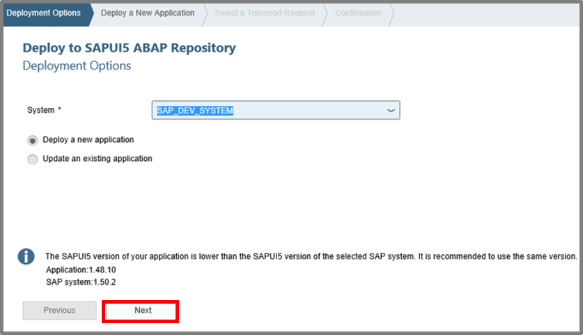
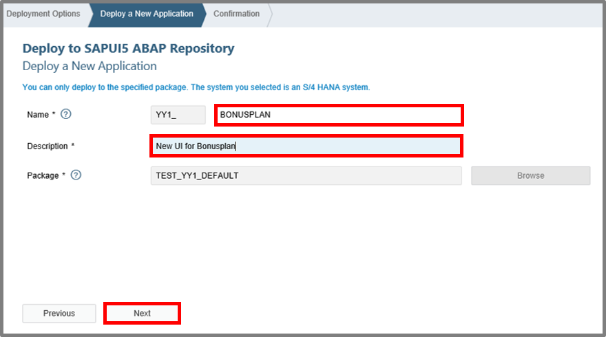
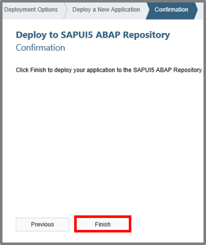

## Prerequisites  
Access to a SAP Web IDE account is expected as a prerequisite. **`ABAP Custom New UI - Create Destination on SAP Cloud Platform`** as tutorial represents a further Prerequisite for the UI creation of a tile.

## Next Steps
 (coming soon).
## Details
This tutorials shows you how to create a new project from template on SAP Web IDE. You learn how to run the List Report Application and test the UI. Also the modifying of an UI will be shown and furthermore the deployment of the created UI to SAPUI5 ABAP Repository.

### You will learn  
You will learn how to modify a UI on SAP Web IDE and deploy it to the SAPUI5 ABAP Repository.

### Time to Complete
**15 Min**.

---

[ACCORDION-BEGIN [Step 1: ](Open SAP Web IDE)]
Select **New project from Template** to generate one on SAP Web IDE.

[ACCORDION-END]

[ACCORDION-BEGIN [Step 2: ](Create List Report Application)]
Choose the **List Report Application** template to create a new UI.

[ACCORDION-END]

[ACCORDION-BEGIN [Step 3: ](Enter Basic Information)]
Now enter **`Bonusplan_UI`** as project name and UI for **`Bonusplan`** as title.

Afterwards click on the **Next** button.

[ACCORDION-END]

[ACCORDION-BEGIN [Step 4: ](Select Data Connection)]
Now select your data connection, which you have previously created on your
SAP Cloud Platform with your destination.
You also should choose `YY1_BONUSPLAN_CDS` as Service.

[ACCORDION-END]

[ACCORDION-BEGIN [Step 5: ](Choose Annotation Selection)]
Now choose all Annotations in this view and move on with **next**.

[ACCORDION-END]

[ACCORDION-BEGIN [Step 6: ](Customize Template)]
Select **`YY1_BONUSPLAN`** as OData Collection and **`to__HighBonusPercentage`** as OData Navigation.

And now just click on the **Finish** button.

[ACCORDION-END]

[ACCORDION-BEGIN [Step 7: ](Run Application)]
Select **`Component.js`** and click on the **Play** button to run your application.

[ACCORDION-END]

[ACCORDION-BEGIN [Step 8: ](Test UI)]
Now you should be able to see following:

[ACCORDION-END]

[ACCORDION-BEGIN [Step 9: ](Add Information)]
Open **`manifest.json`** file, go to Navigation and add following information
**Inbound Title:**
    **Semantic Object:** `CustomUI`
    **Action:** `Bonusplan_UI`
    **Title:** `Bonusplan`
    **Information:** `Bonusplan (info)`
    **Subtitle:** `Bonusplan`
    **Icon:** `sap-icon://activate` 	

Save your changes.

[ACCORDION-END]

[ACCORDION-BEGIN [Step 10: ](Deploy UI)]
Select your project **`Bonusplan`** and deploy this to `SAPUI5 ABAP Repository`.

[ACCORDION-END]

[ACCORDION-BEGIN [Step 11: ](Deploy New Application)]
Click on the **Next** button.

[ACCORDION-END]
[ACCORDION-BEGIN [Step 12: ](Enter Information)]
Enter following information:
**Name:** `BONUSPLAN`
**Description:** `New UI for Bonusplan`

Go on with next.

[ACCORDION-END]

[ACCORDION-BEGIN [Step 13: ](Select Finish)]
Select the **Finish** button.

[ACCORDION-END]
## Next Steps
(coming soon)
