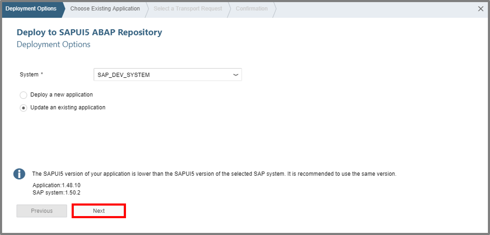

## Prerequisites  
Access to a SAP Web IDE account is expected as a prerequisite. **`Custom Business Object Service's consumption on SAP Cloud Platform via OAuth`** as tutorial represents a further Prerequisite for the UI creation of a tile.

## Next Steps
 (coming soon).
## Details
This tutorials shows you how to create a new project from template on SAP Web IDE. You learn how to run the List Report Application and test the UI. Also the modifying of an UI will be shown and furthermore the deployment of the created UI to SAPUI5 ABAP Repository.

### You will learn  
You will learn how to modify a UI on SAP Web IDE and deploy it to the SAPUI5 ABAP Repository.

### Time to Complete
**25 Min**.

---

[ACCORDION-BEGIN [Step 1: ](Open SAP Web IDE)]
Go to Services, search for **SAP Web IDE** and select it on your SAP Cloud Platform Account.

[ACCORDION-END]

[ACCORDION-BEGIN [Step 2: ](View Service Catalog)]
Now click on **Go to Service** to open SAP Web IDE.
Create a new project from template, select a List Report Application and your Service Catalog. Choose your destination and see the list of services afterwards.

[ACCORDION-END]

[ACCORDION-BEGIN [Step 3: ](Open SAP Web IDE)]
Select **New project from Template** to generate one on SAP Web IDE.

[ACCORDION-END]

[ACCORDION-BEGIN [Step 4: ](Create UI Project)]
Choose the **List Report Application** template to create a new UI.

The alternative way would be following:
File -> New -> Project from Template

[ACCORDION-END]

[ACCORDION-BEGIN [Step 5: ](Enter Basic Information)]
Now enter **`Bonusplan`** as project name and UI for **`Bonusplan`** as title.

Afterwards click on the **Next** button.

[ACCORDION-END]

[ACCORDION-BEGIN [Step 6: ](Set Data Connection)]
Now select your data connection, which you have previously created on your
SAP Cloud Platform with your destination.
You also should choose `YY1_BONUSPLAN_CDS` as Service.

[ACCORDION-END]

[ACCORDION-BEGIN [Step 7: ](Select Annotation)]
Now choose all Annotations in this view and move on with **next**.

[ACCORDION-END]

[ACCORDION-BEGIN [Step 8: ](Customize Template)]
Select **`YY1_BONUSPLAN`** as OData Collection.

And now just click on the **Finish** button.

[ACCORDION-END]

[ACCORDION-BEGIN [Step 9: ](Run Application)]
Select **`Component.js`** and click on the **Play** button to run your application.

[ACCORDION-END]

[ACCORDION-BEGIN [Step 10: ](Configure Application Tile Data)]
Open `webapp` folder and **`manifest.json`** file, ensure to be Descriptor mode of the Editor.

Then go to Navigation and add following information:

|**Inbound Tile:**                    |                                                     |
| ----------------------------------- | --------------------------------------------------- |
|        **Semantic Object:**         |                     `CustomUI`                      |
|            **Action:**              |                   `Bonusplan_UI`                    |
|             **Title:**              |                    `Bonusplan`                      |
|         **Information:**            |                 `Bonusplan (info)`                  |
|            **Subtitle:**            |                    `Bonusplan`                      |
|             **Icon:**               |                `sap-icon://activate` 	              |

Save your changes.

[ACCORDION-END]

[ACCORDION-BEGIN [Step 11: ](Open UI Adaptation Editor)]
Open the **UI Adaptation Editor** for your Project `Bonusplan` via context menu.

[ACCORDION-END]

[ACCORDION-BEGIN [Step 12: ](Adapt UI)]
Switch via **Adapt UI** button to adaptation mode. Click on the **marked table** and set the **visibility** to false.

Afterwards save your changes.

[ACCORDION-END]

[ACCORDION-BEGIN [Step 13: ](Deploy UI to S/4HANA System)]
Select your project `Bonusplan` and deploy this to S/4HANA System via Context Menu to SAPUI5 ABAP Repository.

Afterwards click on the **Next** button.

[ACCORDION-END]

[ACCORDION-BEGIN [Step 14: ](Set Options for Deployment as new Application)]
A Wizard opens. Set the destination to your S/4HANA System as system. Ensure, that the UI shall be deployed as a new application. Click Next button.

[ACCORDION-END]

[ACCORDION-BEGIN [Step 15: ](Set Application Name)]
Choose an application name for your deployment and move on with next.

[ACCORDION-END]

[ACCORDION-BEGIN [Step 16: ](Select Finish)]
Select the **Finish** button.

And now just click on the **Finish** button.

[ACCORDION-END]

[ACCORDION-BEGIN [Step 17: ](Confirm Deployment)]
Now confirm your deployment.

[ACCORDION-END]

[ACCORDION-BEGIN [Step 18: ](View)]
Now you should be able to see following:

[ACCORDION-END]

## Next Steps
(coming soon)
