## Prerequisites  
Access to a SAP Web IDE account is expected as a prerequisite. **`Make ABAP custom business object service's consumable on SAP Cloud Platform via OAuth`** as tutorial represents a further prerequisite.

## Details
### You will learn  
- How to modify a UI on SAP Web IDE
- How to deploy a UI to the SAPUI5 ABAP Repository

This tutorials shows you how to create a new project from template on SAP Web IDE. You learn how to run the list report application and test the UI. You also get to know how to modify an UI and how to deploy it to SAPUI5 ABAP Repository.

### Time to Complete
**25 Min**.

---

[ACCORDION-BEGIN [Step 1: ](Search SAP Web IDE)]
Go to **Services**, search for **SAP Web IDE** and select it on your SAP Cloud Platform account.

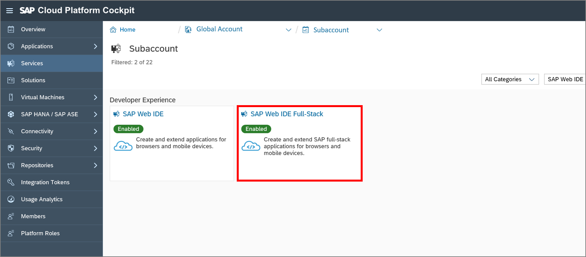

Click **Go to Service** to open SAP Web IDE.

[ACCORDION-END]

[ACCORDION-BEGIN [Step 2: ](Select new project)]
Select **New Project from Template** to generate one.

If you don't see this welcome page then follow the alternative way:
**File** | **New** | **Project from Template**

[ACCORDION-END]

[ACCORDION-BEGIN [Step 3: ](Create UI project)]
Choose the **List Report Application** template and click **Next** to create a new UI.

[ACCORDION-END]

[ACCORDION-BEGIN [Step 4: ](Enter basic information)]
Enter **`Bonusplan`** as the project name and title.

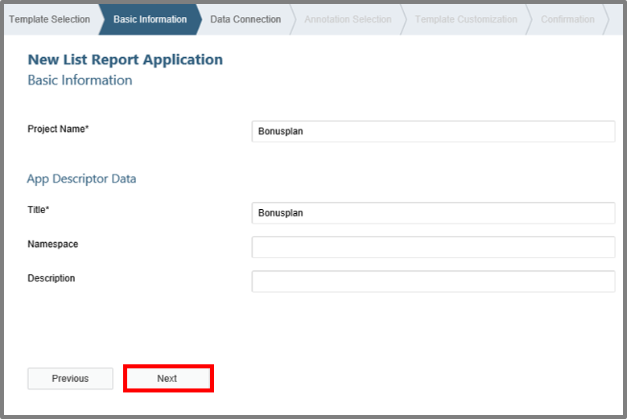

Click **Next**.

[ACCORDION-END]

[ACCORDION-BEGIN [Step 5: ](Set data connection)]
Select your data connection, which you have previously created on your SAP Cloud Platform with your destination. You should choose **`YY1_BONUSPLAN_CDS`** as service and click **Next**.

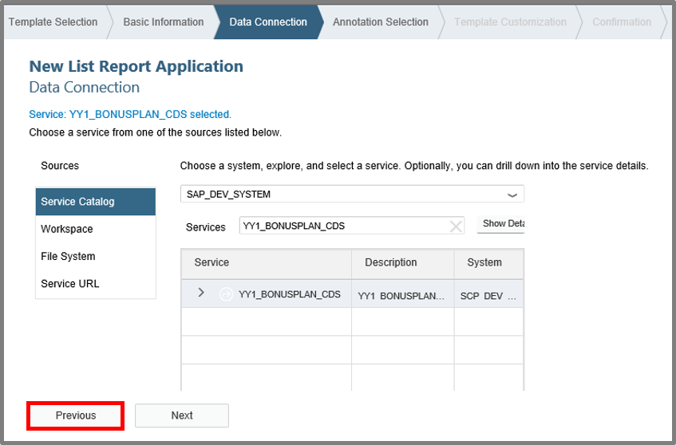

[ACCORDION-END]

[ACCORDION-BEGIN [Step 6: ](Select annotation)]
Now choose all annotations in this view and move on with **Next**.

[ACCORDION-END]

[ACCORDION-BEGIN [Step 7: ](Customize template)]
Select **`YY1_BONUSPLAN`** as OData collection and click **Finish**.

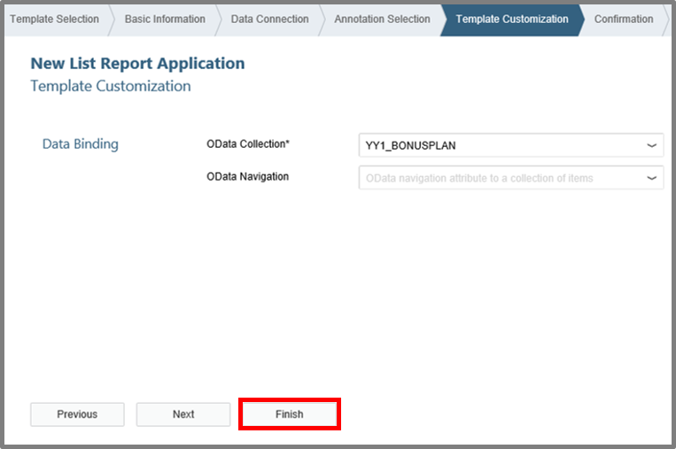
[ACCORDION-END]

[ACCORDION-BEGIN [Step 8: ](Run application)]
Select **`Component.js`** and click the play button to run your application.

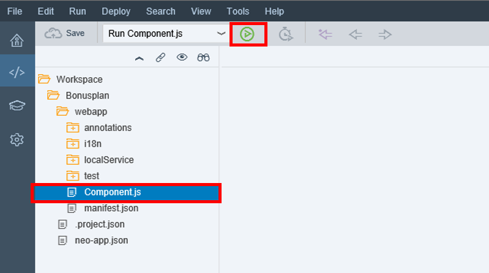

[ACCORDION-END]

[ACCORDION-BEGIN [Step 9: ](Configure application tile data)]
Open the `webapp` folder and `manifest.json` file, and make sure to be in descriptor mode of the editor.

Then go to **navigation** and add the following information:

|        **Semantic Object**          |                     `CustomUI`                      |
|            **Action**               |                   `Bonusplan_UI`                    |
|             **Title**               |                    `Bonusplan`                      |
|         **Information**             |                 `Bonusplan (info)`                  |
|            **Subtitle**             |                    `Bonusplan`                      |
|             **Icon**                |                `sap-icon://activate` 	              |

Click **Save**.

[ACCORDION-END]

[ACCORDION-BEGIN [Step 10: ](Open UI Adaptation editor)]
Open the UI Adaptation editor for your project **`Bonusplan`** via context menu.

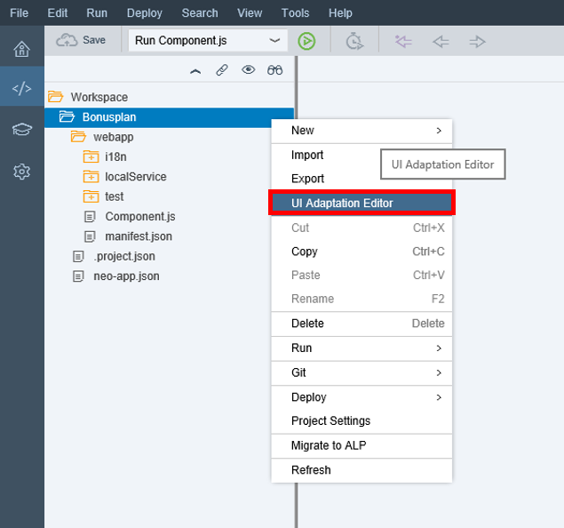

[ACCORDION-END]

[ACCORDION-BEGIN [Step 11: ](Adapt UI)]
Switch via **Adapt UI** button to adaptation mode. Click on the marked table and set the visibility to **`false`**.

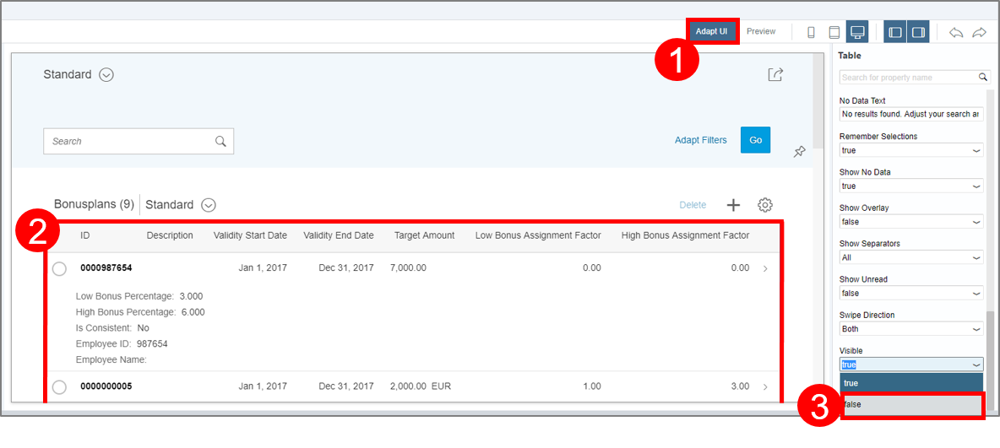
Save your changes.

[ACCORDION-END]

[ACCORDION-BEGIN [Step 12: ](Deploy UI to S/4HANA system)]
Select your project **`Bonusplan`** and deploy this to S/4HANA system via context menu to **SAPUI5 ABAP Repository**.

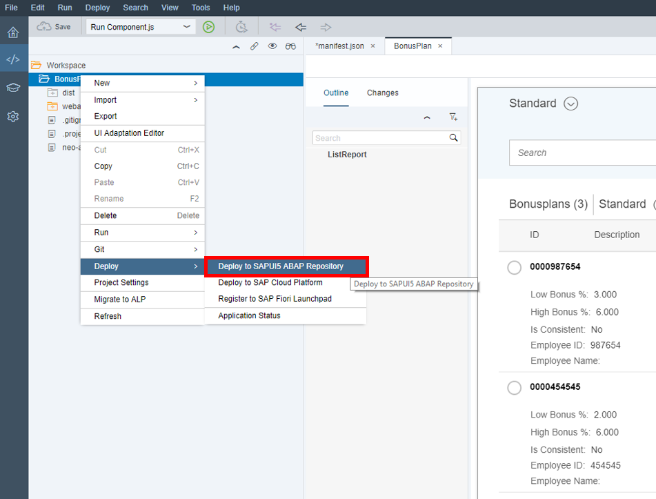
[ACCORDION-END]

[ACCORDION-BEGIN [Step 13: ](Set options for deployment as new application)]
A wizard opens. Set the destination to your S/4HANA system. Ensure that the UI is deployed as a new application. Click **Next**.

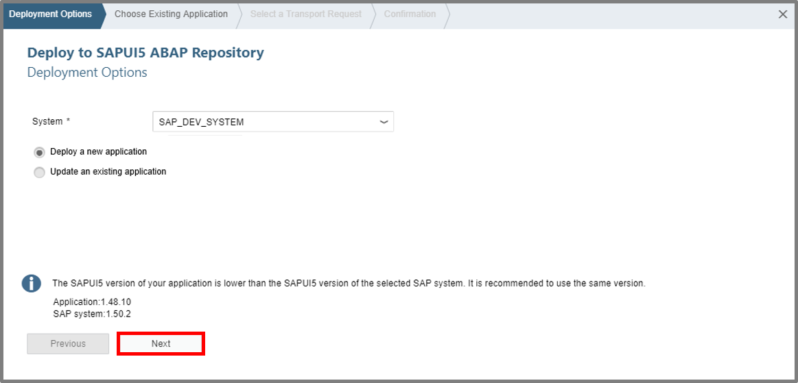

[ACCORDION-END]

[ACCORDION-BEGIN [Step 14: ](Set application name)]
Choose an application name for your deployment, click **Next** and **Finish**.

[ACCORDION-END]

[ACCORDION-BEGIN [Step 15: ](Confirm deployment)]
Confirm your deployment.

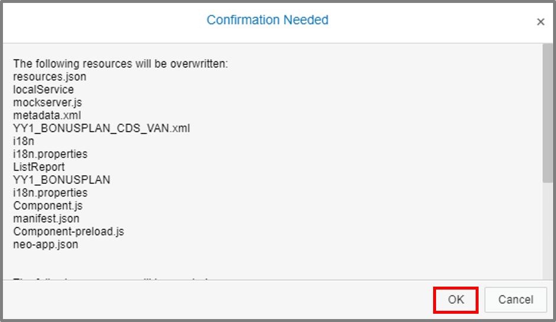

[ACCORDION-END]

[ACCORDION-BEGIN [Step 16: ](View)]
Now you should be able to see following:

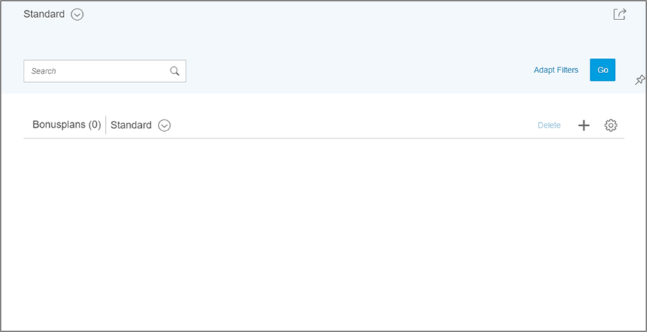

[ACCORDION-END]
