## Prerequisites  
- **Authorizations:** Your user needs a business role with Unrestricted Write Access and business catalog Extensibility - Fiori App Development (ID: `SAP_CORE_BC_EXT_UI`). Access to a SAP Web IDE account is expected as a prerequisite.
- **SAP S/4HANA Release:** 1902 (tutorial's last update)

## Details
### You will learn
- How to create a UI from template in SAP Web IDE
- How to adapt that UI to your needs
- How to test that UI
- How to deploy that UI as application to the S/4HANA Cloud system's SAPUI5 ABAP Repository

As building UIs in SAP Cloud Platform (Side-by-Side Extensibility) offers more possibilities than UI Adaptation within S/4HANA Cloud (In-App-Extensibility), this tutorial shows you roughly how to build an UI based on a S/4HANA Cloud Custom Business Object's OData service in Web IDE and how to get it to the S/4HANA Cloud system.

---

[ACCORDION-BEGIN [Step 1: ](Create UI project from template in SAP Web IDE)]
<!--Start of equal part with abap-custom-ui-communication-arrangement-->
In your SAP Cloud Platform Subaccount go to **Services**, search for **SAP Web IDE** and select it.

Click **Go to Service** to open SAP Web IDE.

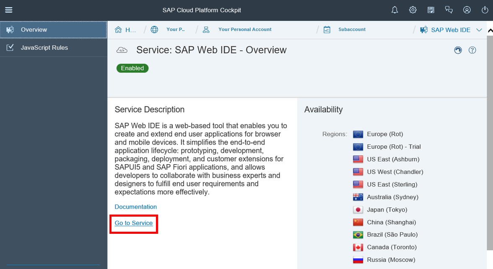

Select **New Project from Template** to start wizard for UI project creation.

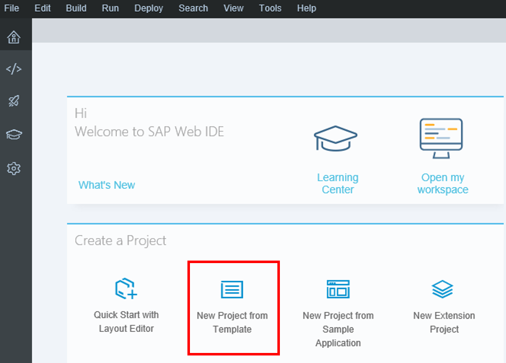

If you don't see this welcome page then follow the alternative way:

 **File** > **New** > **Project from Template**

Select the **List Report Application** template and click **Next** to create a new UI of this type.

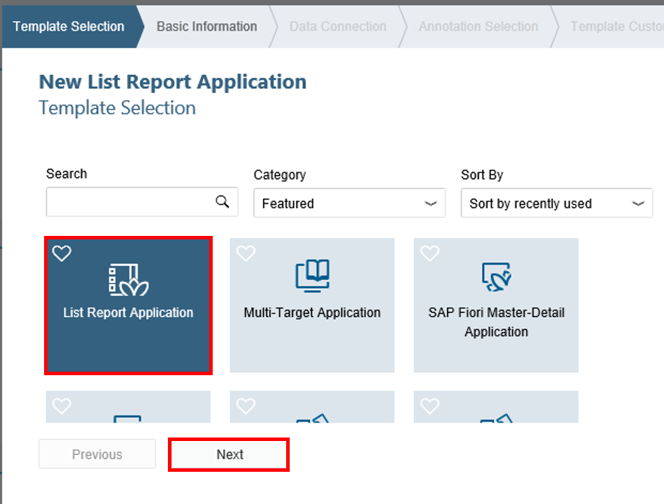

Enter basic information for the project, like **`Bonusplan`** as name and title.

Click **Next**.

To add a data connection click **Service Catalog** and set the destination **`SAP_DEV_SYSTEM`** which you have previously created on your SAP Cloud Platform. Choose **`YY1_BONUSPLAN_CDS`** as service and click **Next**.

<!-- End of equal part with abap-custom-ui-communication-arrangement-->

Choose all annotations in this view and move on with **Next**.

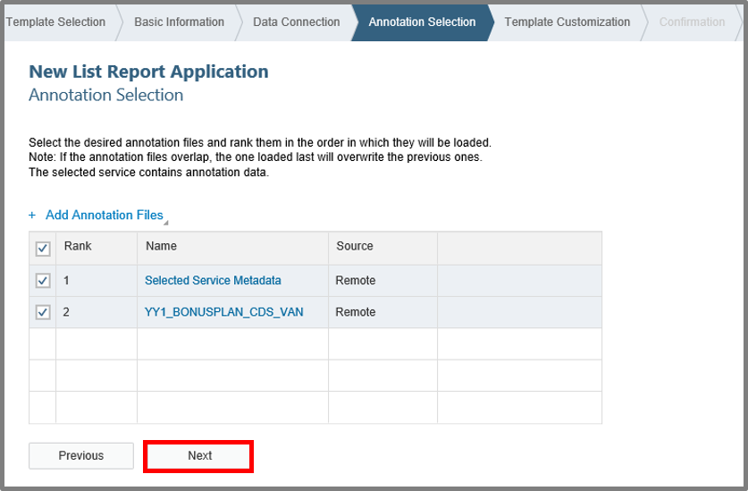

Customize the template by selecting **`YY1_BONUSPLAN`** as OData collection and click **Finish**.

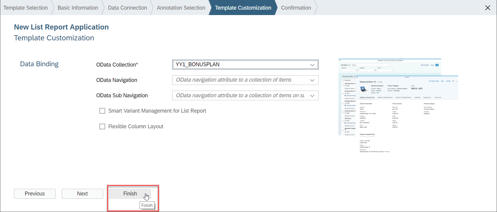

[DONE]
[ACCORDION-END]

[ACCORDION-BEGIN [Step 3: ](Configure S/4HANA Cloud application tile)]
To configure the tile that will appear in your S/4HANA Cloud Fiori Launchpad later, do the following:
Open the `webapp` folder and `manifest.json` file, and make sure to be in descriptor mode of the editor.

Then go to **navigation**

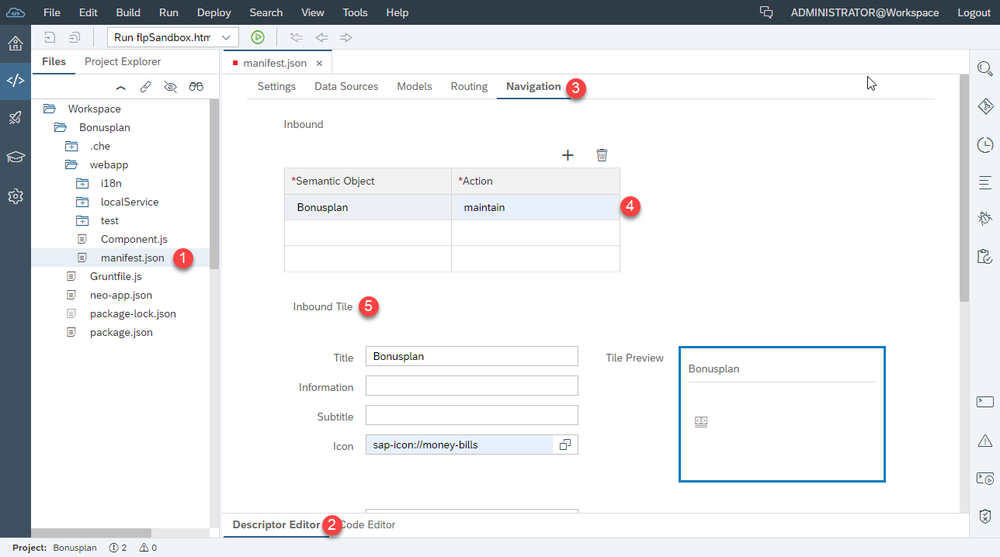

Add the following information:

| Inbound ||
| :------------------ | :-------------------- |
| **Semantic Object** | `Bonusplan`           |
| **Action**          | `mantain`             |

| Inbound Tile ||
| :------------------ | :----------------------- |
| **Title**           | `Bonusplan`              |
| **Icon**            | `sap-icon://money-bills` |

Click **Save**.

[DONE]
[ACCORDION-END]

[ACCORDION-BEGIN [Step 4: ](Edit UI in SAPUI5 Visual Editor)]
Open the SAPUI5 Visual Editor for your project **`Bonusplan`** via context menu.

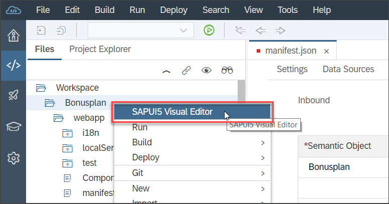

Switch via **Edit** button to edit mode.

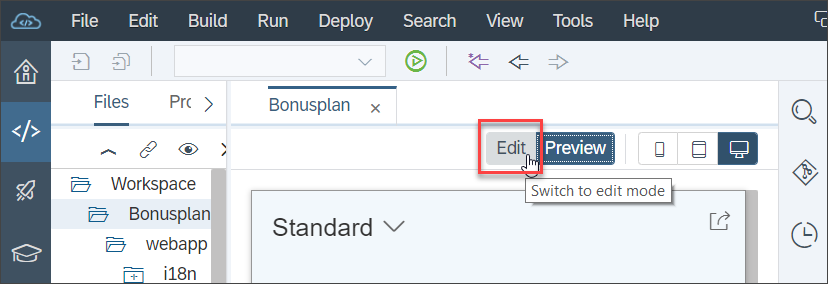

Click the column header area for the "Validity Start Date" column to mark it. On the right the marked control's properties will appear. You can see that you marked the whole column and not only the header cell's text, if the control property area has the heading "Column" instead of "Text". Scroll down in the column's properties to "Visibility" and set it to **`false`**.

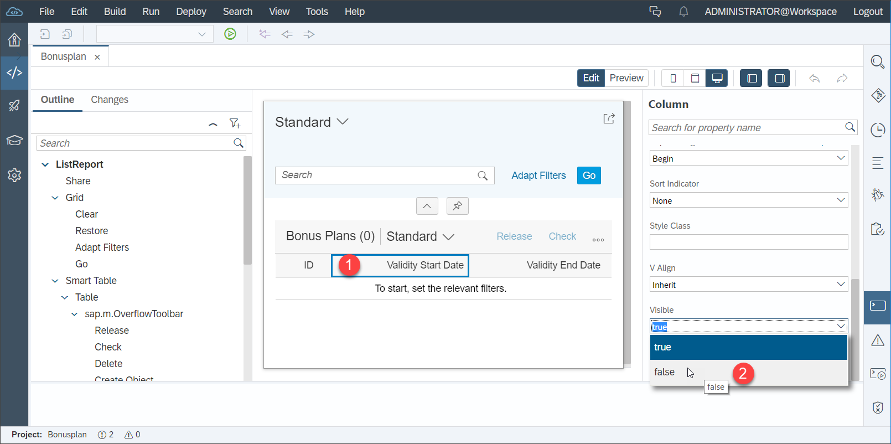

Make the "Validity End Date" column invisible as well.

Save your changes with CTRL+S.

[DONE]
[ACCORDION-END]

[ACCORDION-BEGIN [Step 5: ](Test UI)]
Although the Preview in SAPUI5 Editor already gives you an idea on how the UI will look and behave like a test in an own browser window is started this way.

Having just chosen a file of your project in the navigation tree or editor, click the play button to run your application in the test environment of SAP Web IDE. 

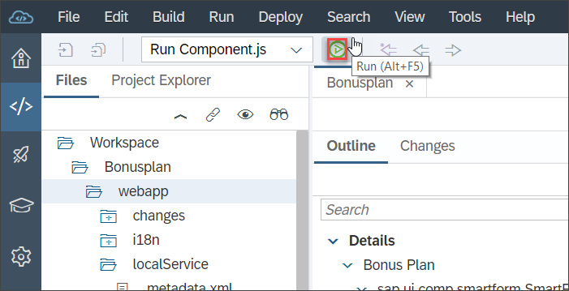

Now you get the UI previewed in an own browser window. It has functionality already. For example by pressing the **Go** button, you'll get the list of `Bonusplans` from your S/4HANA Cloud system.

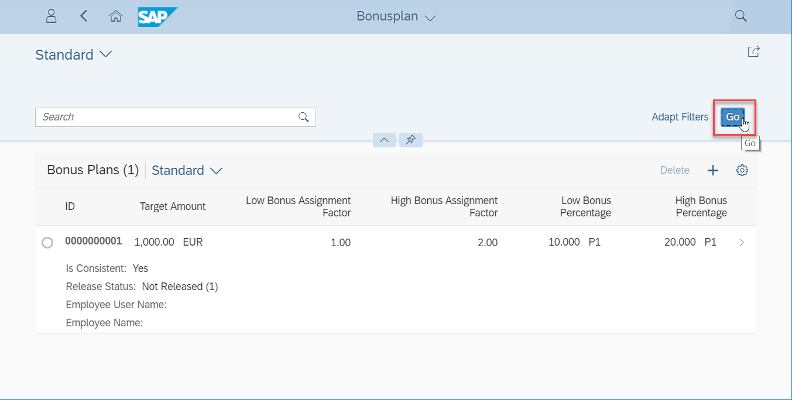

[DONE]
[ACCORDION-END]

[ACCORDION-BEGIN [Step 6: ](Deploy as application to S/4HANA Cloud)]
Right click your project **`Bonusplan`** and deploy it to your S/4HANA Cloud system via context menu **Deploy** > **Deploy to SAPUI5 ABAP Repository**.

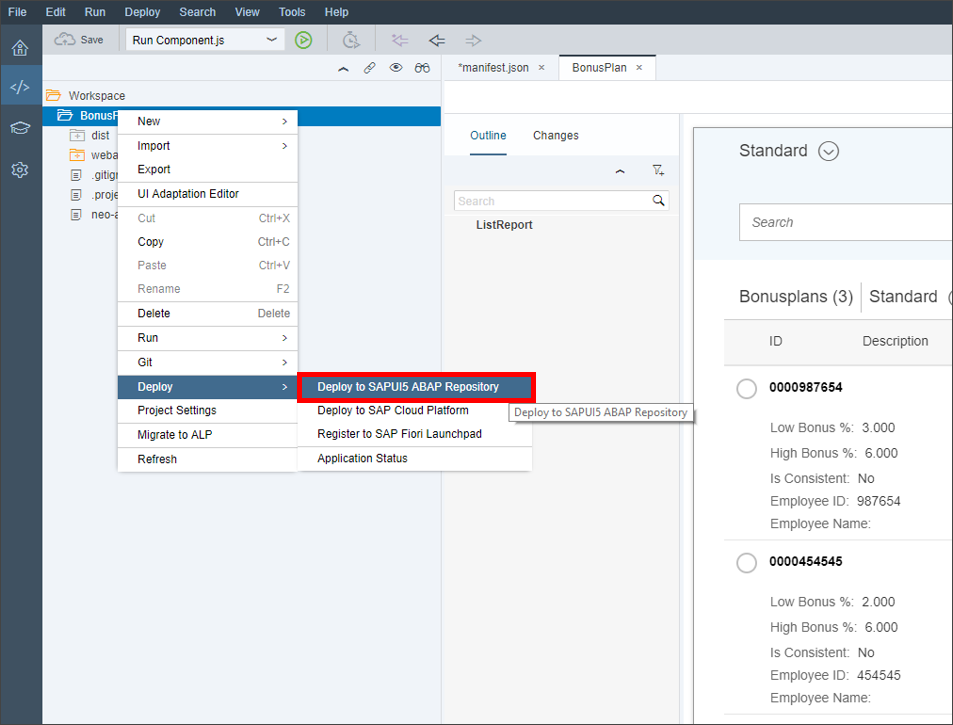

A wizard opens. Set the destination to your S/4HANA Cloud system ones. Ensure that the UI is deployed as a new application. Click **Next**.

Give an application name and description, click **Next** and **Finish**.

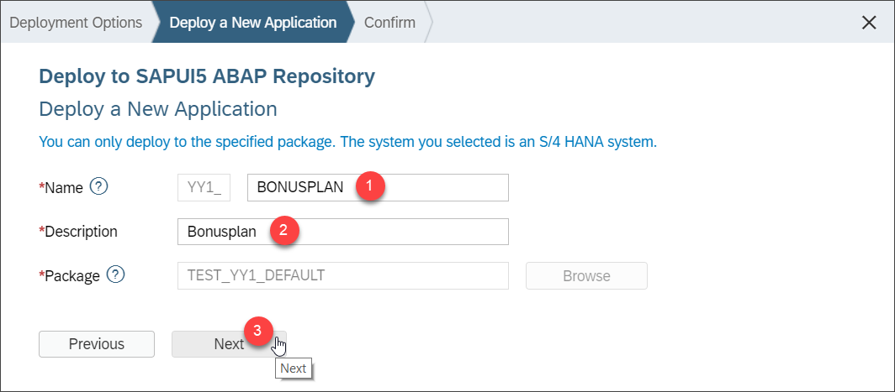

[DONE]
[ACCORDION-END]

[ACCORDION-BEGIN [Step 7: ](Test yourself)]

[VALIDATE_1]
[ACCORDION-END]
