## Prerequisites
**Authorizations**: Your user needs
- Administrator access to your **SAP Cloud Platform** subaccount
- Administrator access to your **SAP Cloud Platform Identity Authentication tenant**

## Details
### Glossary
**Identity**: individual people, but also computers, services, computational entities like processes and threads, or any group of such things
**Identity Provider**: system entity that creates, maintains, and manages identity information for identities
**Identity Authentication**: process of authenticating an identity
**SAP Cloud Platform Identity Authentication Service**: SAP's solution to enable identity authentication, abbreviated as **IAS**
**SAP Cloud Platform Identity Authentication tenant**: a customer's instance of the service
**SAP Cloud Platform Identity Authentication console**: Web application to configure your tenant


### You will learn
- How to set up SAP Cloud Platform Subaccount for secure communication (with Security Assertion Markup Language = SAML 2.0)
- How to set up SAP Cloud Platform Subaccount on SAP Cloud Platform Identity Authentication Service for secure communication
- How to get necessary information from your SAP Cloud Platform Subaccount and your SAP Cloud Platform Identity Authentication tenant to set up the mutual trust between them

>Be aware that in case of an integration with S/4HANA Cloud the used Identity Authentication for the Subaccount should be the very same as the one used for the S/4HANA Cloud system.
Your S/4HANA Cloud system you got already delivered by SAP with a configured trust between it and your SAP Cloud Platform Identity Authentication tenant. Now you will configure the trust between that and your SAP Cloud Platform subaccount on your own.
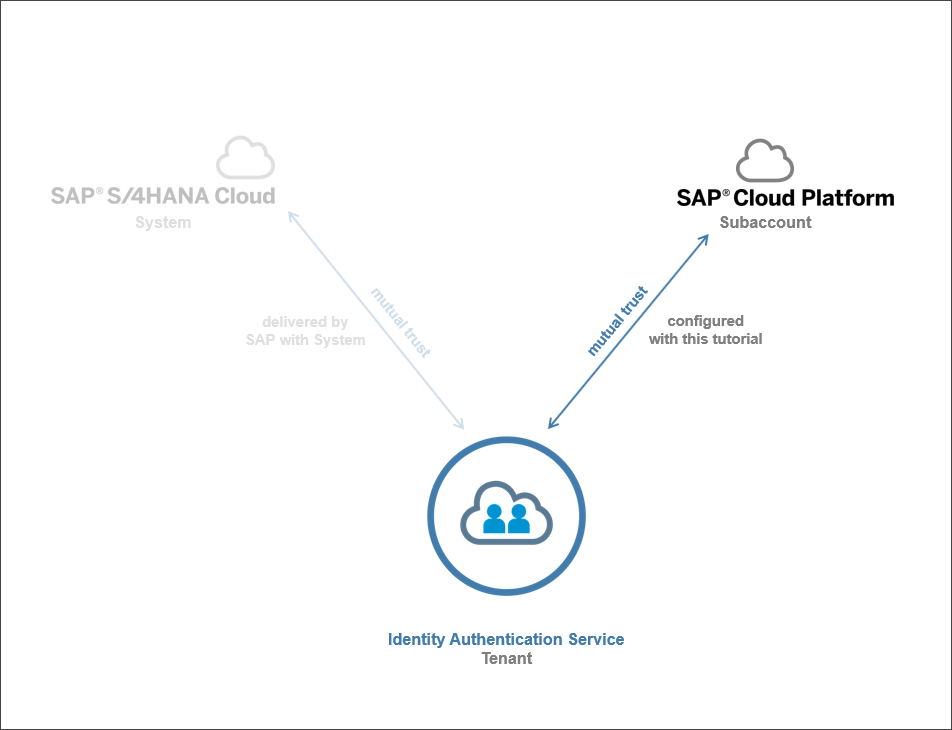

### Additional Information
- **Documentation:** [SAP Cloud Platform Identity Authentication Service](https://help.sap.com/viewer/6d6d63354d1242d185ab4830fc04feb1/Cloud/en-US/d17a116432d24470930ebea41977a888.html)
- **SAP S/4HANA Cloud Release** (tutorial's last update): 1911
---

[ACCORDION-BEGIN [Step 1: ](Enter trust management of subaccount)]
Enter the SAP Cloud Platform subaccount as an administrator and expand the **Security** area to open Trust Management by clicking the **Trust** section.

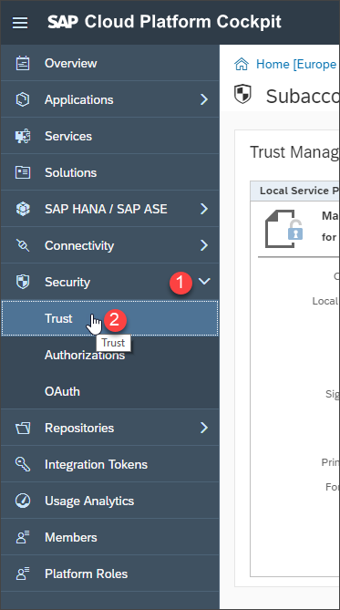

[DONE]
[ACCORDION-END]

[ACCORDION-BEGIN [Step 2: ](Set subaccount as service provider)]
To enable secure (Security Assertion Markup Language = SAML 2.0) communication the SAP Cloud Platform Subaccount has to be set up as Service Provider.

Being in the trust management, click **Edit** to change the default Local Service Provider.

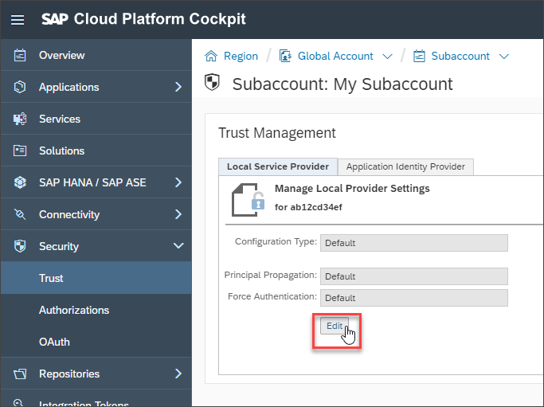

Change and add following information to your local provider:

| ------------------------------------------- | ------------------------------------------- |
|           **Configuration Type**            |                    `Custom`                   |
|           **Local Provider Name**           | `<platform region s URL>/<subaccount name>` (set automatically) |
|          **Principal Propagation**          |                 `Enabled`                 |
|          **Force Authentication**           |               `Disabled`            |

Click **Generate Key Pair**

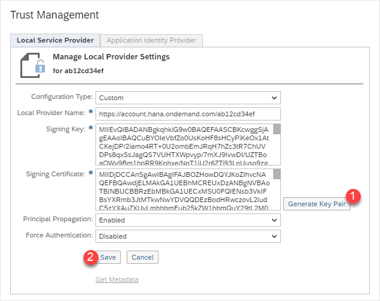

**Save** your changes.

[DONE]
[ACCORDION-END]

[ACCORDION-BEGIN [Step 3: ](Get metadata of subaccount)]
To set up the trust from Identity Authentication to the Subaccount soon you need the subaccount's metadata.
Download the metadata by clicking **Get Metadata**.

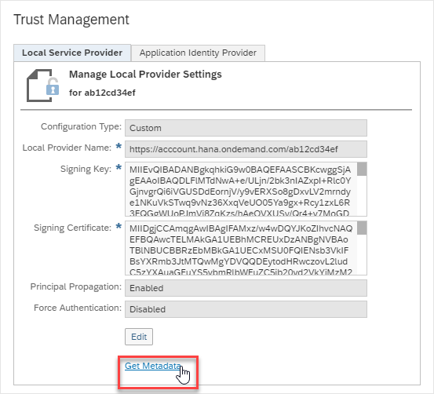

[DONE]
[ACCORDION-END]

[ACCORDION-BEGIN [Step 4: ](Enter Identity Authentication Administration Console)]
Open the SAP Cloud Platform Identity Authentication Administration Console with its URL which follows the pattern:

`https://<YOUR_TENANTS_ID>.accounts.ondemand.com/admin`

Tenant ID is an automatically generated ID by the system. The first administrator created for the tenant receives an activation e-mail with a URL in it. This URL contains the tenant ID.

SAP Cloud Platform Identity Authentication Administration Console entry screen looks (depending on authorizations) like that
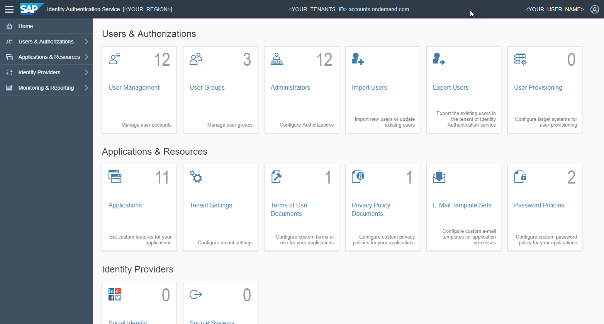

[DONE]
[ACCORDION-END]

[ACCORDION-BEGIN [Step 5: ](Add subaccount as application)]
The subaccount is represented in SAP Identity Authentication Service as Application.
Choose **Applications & Resources** and go to **Applications**. Click **+ Add** on the left hand panel to enter the name of your SAP Cloud Platform subaccount. Save your changes.

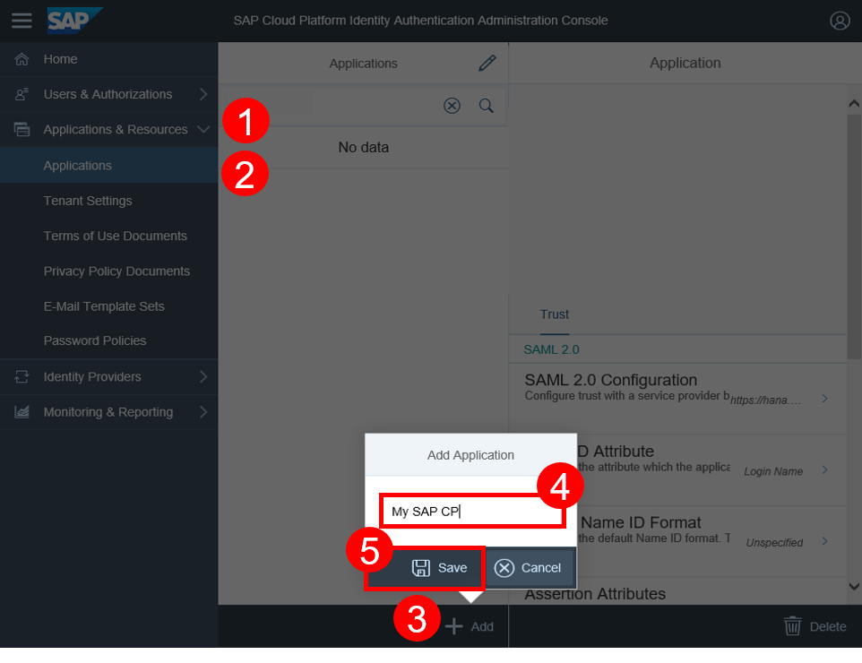

[DONE]
[ACCORDION-END]

[ACCORDION-BEGIN [Step 6: ](Configure application's trust with subaccount)]
Click on the newly created application on the left side and then on **Trust**. Choose **SAML 2.0 Configuration**.

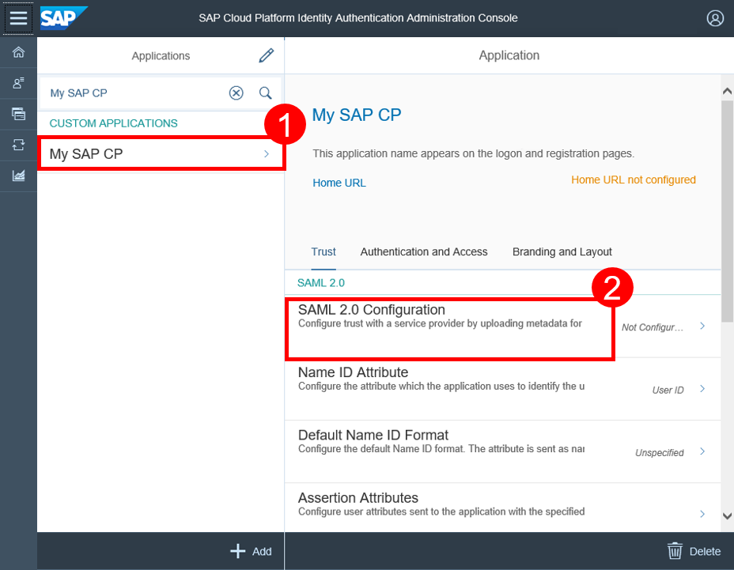

Upload the metadata XML file of your SAP Cloud Platform subaccount. By this service provider metadata upload, the needed properties are gotten from the XML file. Save the configuration settings.

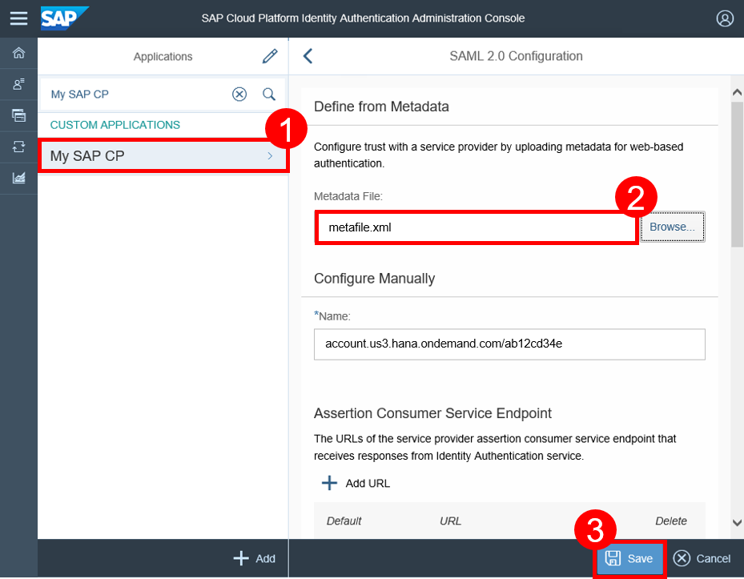

[DONE]
[ACCORDION-END]

[ACCORDION-BEGIN [Step 7: ](Set Subject Name Identifier)]

Now you have to configure which attribute is used to identify users during `SAML2.0` secure communication. By default this is **`User ID`**, but as S/4HANA Cloud by default works with **`Login Name`** it shall be switched to that.

**Procedure**

Still being in your application's Trust settings, select **Subject Name Identifier**.

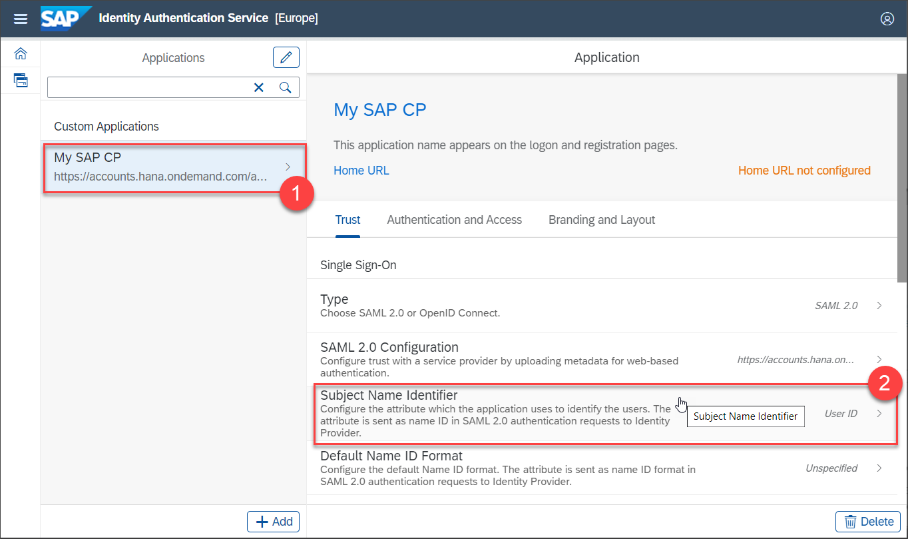

Under Basic Configuration choose **Login Name** from the dropdown list for the attribute and save your changes.

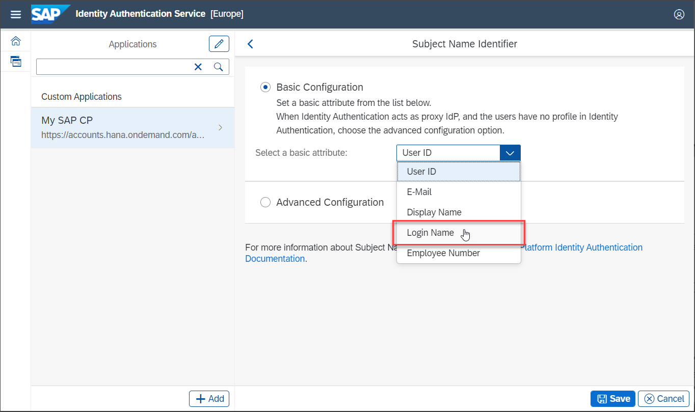

[DONE]
[ACCORDION-END]

[ACCORDION-BEGIN [Step 8: ](Configure application' s Default Identity Provider)]
As in most common use case the SAP Cloud Platform Identity Authentication Service does not act as Identity Provider itself but as proxy for a probably already existing corporate identity provider this has to be set now.

In your application's Trust settings switch to **Conditional Authentication** and select it.

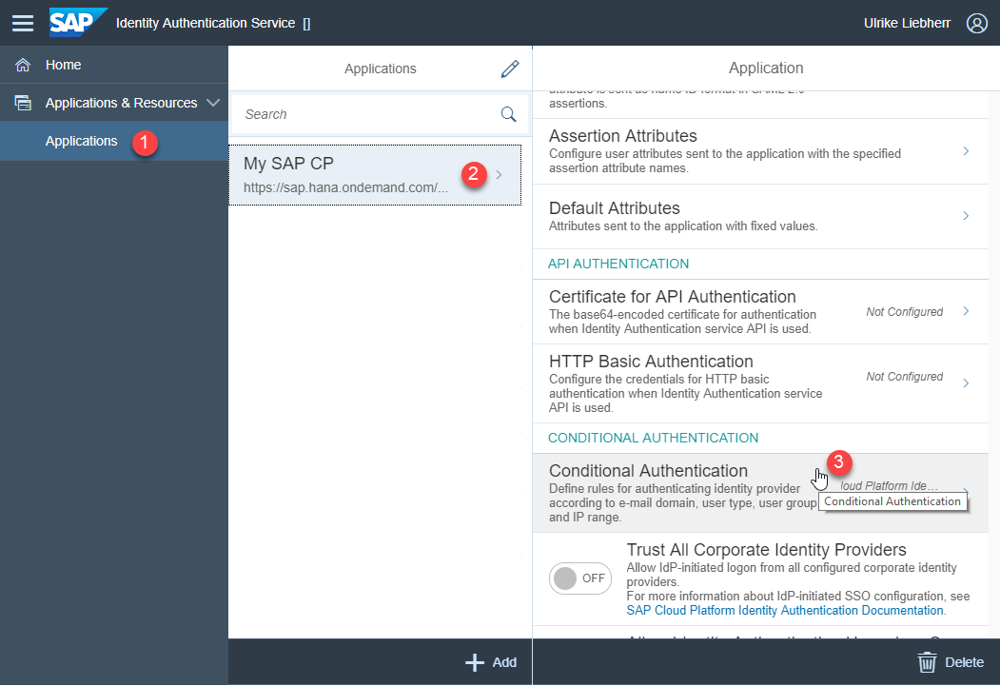

Select your corporate Identity Provider as **Default Identity Provider** and click **Save**.

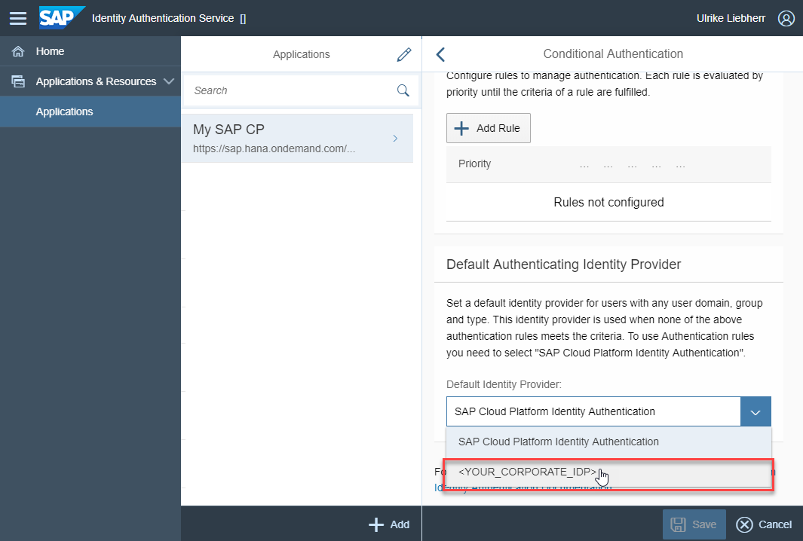

[DONE]
[ACCORDION-END]

[ACCORDION-BEGIN [Step 9: ](Get metadata of Identity Authentication tenant)]
To set the Identity Authentication tenant as trusted identity provider in the SAP Cloud Platform subaccount next, you need to get its metadata first.

Open the metadata XML by entering your tenant's web address for it which follows this pattern:

``` URI
https://<YOUR_TENANTS_ID>.accounts.ondemand.com/saml2/metadata
```

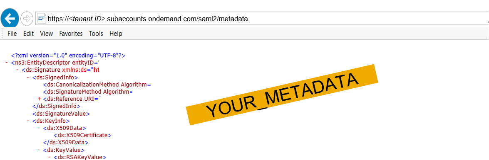

Save that XML to a file.

[DONE]
[ACCORDION-END]

[ACCORDION-BEGIN [Step 10: ](Add IAS as subaccount's trusted identity provider)]
Switch back to your SAP Cloud Platform cockpit and go to your trust settings.

Choose **Application Identity Provider** to add a trusted identity provider.


Upload metadata XML file of your identity authentication tenant in the **Metadata File** field. **Save** your changes.

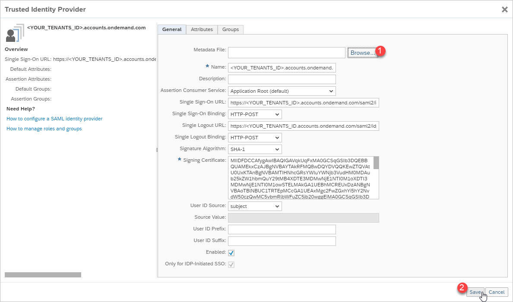

[DONE]
[ACCORDION-END]

[ACCORDION-BEGIN [Step 11: ](Test yourself)]

[VALIDATE_1]
[ACCORDION-END]
