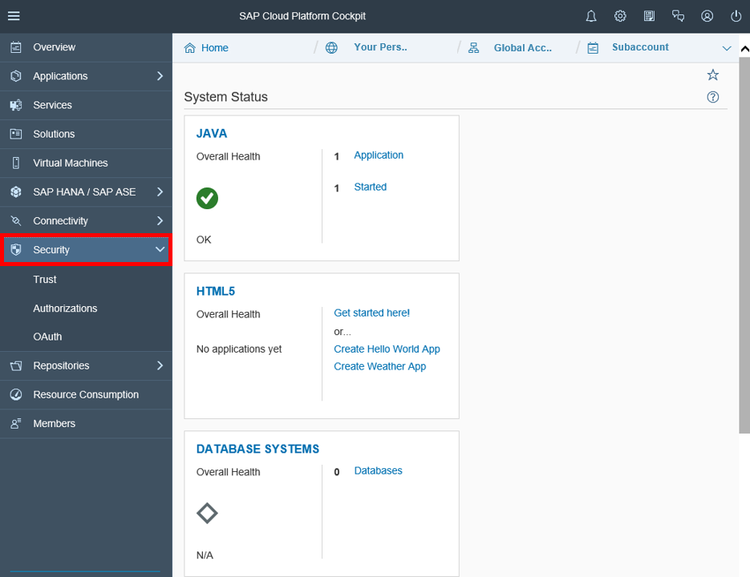
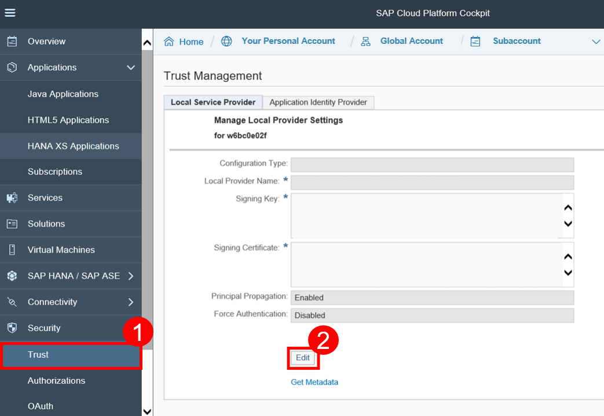
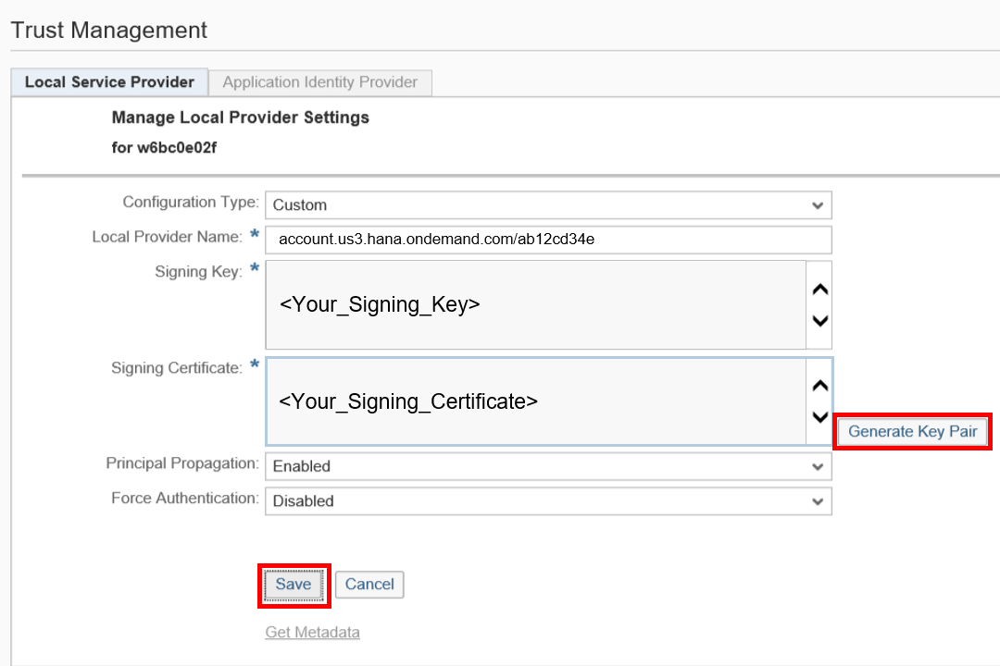
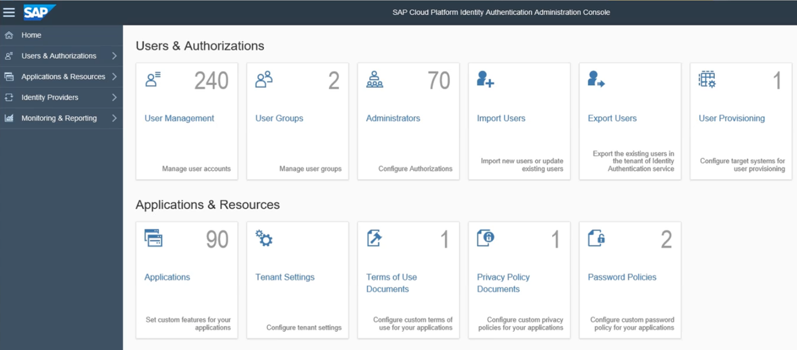
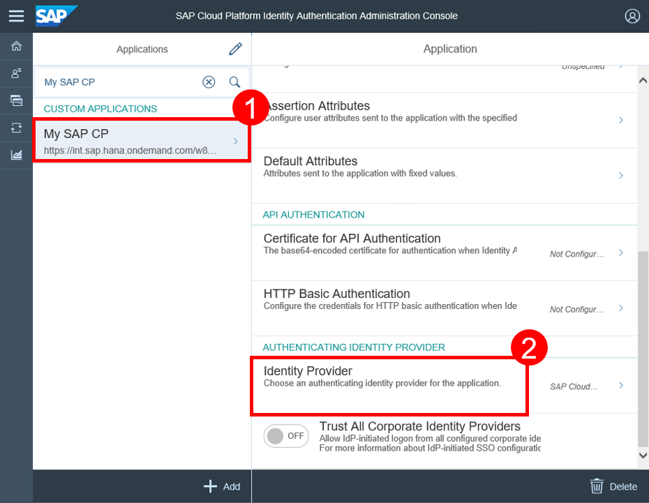
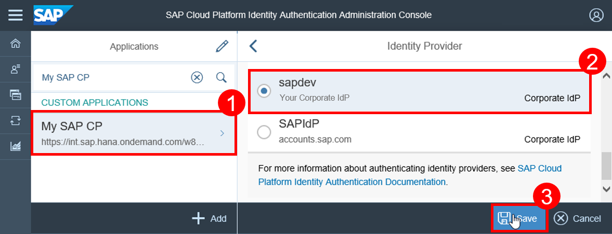
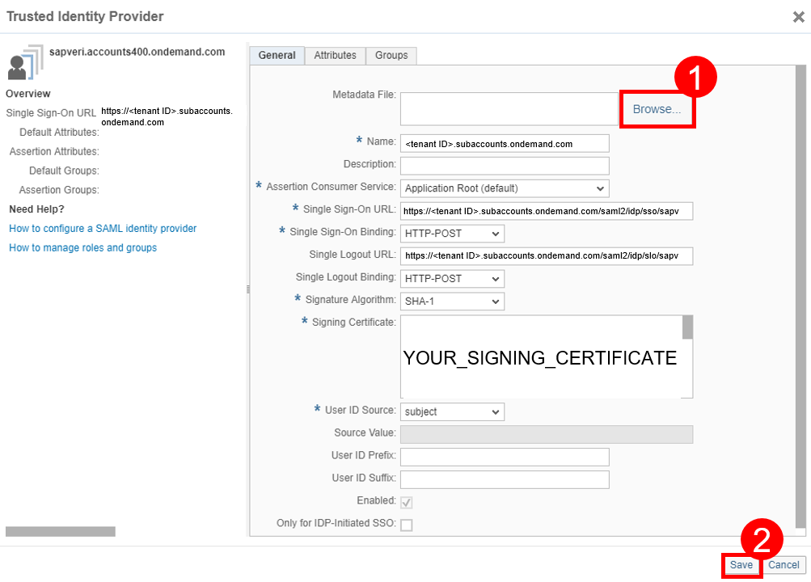

## Prerequisites  
- **Tutorials:** [`Maintain platform subaccounts and SAP Web IDE permissions`](https://developers.sap.com/tutorials/abap-custom-ui-subaccount-permission.html)

## Details
### You will learn
- How to set up trust between identity authentication and SAP Cloud Platform
- How to assign members different roles
- How to upload metadata

### Time to Complete
**25 Min**.

---

[ACCORDION-BEGIN [Step 1: ](Enter SAP Cloud Platform subaccount)]
Enter the SAP Cloud Platform subaccount as an administrator and expand the **Security** section.



[ACCORDION-END]

[ACCORDION-BEGIN [Step 2: ](Edit local service provider)]
Switch to your trust settings and create your local service provider by editing the not yet existing one.



[ACCORDION-END]

[ACCORDION-BEGIN [Step 3: ](Add provider data)]
Click **Generate Key Pair** and add following information to your local provider:

| ------------------------------------------- | ------------------------------------------- |
|           **Configuration Type**            |                    Custom                   |
|           **Local Provider Name**           | `<platform region s URL>/<subaccount name>` |
|          **Principal Propagation**          |                 `Bonusplan`                 |
|          **Force Authentication**           |               `Bonusplan (info)`            |



Save your changes.

[ACCORDION-END]

[ACCORDION-BEGIN [Step 4: ](Open identity authentication console)]
Open the SAP Cloud Platform Identity Authentication Administration Console with:
`https://<tenant ID>.subaccounts.ondemand.com/admin`
You can also get the URL from your identity authentication tenant registration e-mail.



[ACCORDION-END]

[ACCORDION-BEGIN [Step 5: ](Add subaccount as application)]
Choose **Applications & Resources** and go to **Applications**. Click **+ Add** on the left hand panel to enter the name of your SAP Cloud Platform subaccount. Save your changes.


[ACCORDION-END]

[ACCORDION-BEGIN [Step 6: ](Configure application's SAML 2.0 trust with subaccount)]
Click on the newly created application on the left side and then on **Trust**. Configure the **`SAML 2.0`** trust with SAP Cloud Platform subaccount as a service provider.


[ACCORDION-END]

[ACCORDION-BEGIN [Step 7: ](Get metadata of subaccount)]
Switch again to your SAP Cloud Platform subaccount and open trust settings to download the metadata by clicking **Get Metadata**. The local provider name will be important in further steps.


[ACCORDION-END]


[ACCORDION-BEGIN [Step 8: ](Upload subaccount's metadata as SAML 2.0 trust)]
Go back to your SAP Cloud Platform Identity Authentication Administration Console and choose **SAML 2.0 Configuration**. Upload the metadata XML file of your SAP Cloud Platform subaccount. On service provider metadata upload, the fields are populated with the parsed data from the XML file. Save the configuration settings.


[ACCORDION-END]

[ACCORDION-BEGIN [Step 9: ](Select name ID attribute)]
Select **Name ID Attribute**.


[ACCORDION-END]

[ACCORDION-BEGIN [Step 10: ](Set application' s name ID attribute)]
Choose **Login Name** and save your changes.


[ACCORDION-END]

[ACCORDION-BEGIN [Step 11: ](Set application' s identity provider)]
Switch to **Identity Provider** and select it.



[ACCORDION-END]

[ACCORDION-BEGIN [Step 12: ](Set identity provider)]
Select **`sapdev`** as identity provider and click **Save**.



[ACCORDION-END]

[ACCORDION-BEGIN [Step 13: ](Save metadata of identity authentication tenant)]
Save metadata of your identity authentication tenant on your local file system as an XML file. You can find the tenant at:
```
https://<tenant ID>.subaccounts.ondemand.com/saml2/metadata
```


[ACCORDION-END]

[ACCORDION-BEGIN [Step 14: ](Add subaccount's trusted identity provider)]
Switch back to your SAP Cloud Platform cockpit and go to your trust settings.

Choose **Application Identity Provider** to add a trusted identity provider.


[ACCORDION-END]

[ACCORDION-BEGIN [Step 15: ](Upload identity tenant's metadata)]
Upload identity authentication metadata XML file of your identity authentication tenant (Step 13) in the metadata file field. Save your changes.


[ACCORDION-END]
