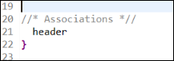
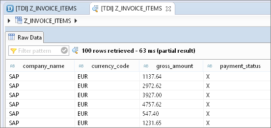

## Prerequisites
- You have a valid instance of an on-premise AS ABAP server, version 7.51 or higher (some ABAP Development Tools may not be available in earlier versions)
- You have run the transaction `SEPM_DG_OIA_NEW` or transaction `STC01 -> tasklist SAP_BASIS_EPM_OIA_CONFIG`. (If you do not, your CDS view will display empty.)
-	**Tutorial**: [Create an ABAP Package](abap-dev-create-package)

## Details
### You will learn  
- How to use the new Core Data Services (CDS) tools in ABAP in Eclipse.
- How to use the following ABAP and SQL elements in a CDS view:
    - SELECT statement
    - CASE statement
    - WHERE clause

CDS is an extension of the ABAP Dictionary that allows you to define semantically rich data models in the database and to use these data models in your ABAP programs. CDS is a central part of enabling code push-down in ABAP applications.

You can find more information about CDS in the [ABAP keyword documentation](https://help.sap.com/doc/abapdocu_751_index_htm/7.51/en-US/abencds.htm) and the [SAP Community](https://community.sap.com/topics/abap).

Throughout this tutorial, objects name include the suffix `XXX`. Always replace this with your group number or initials.

---

[ACCORDION-BEGIN [Step 1: ](Create a CDS view)]
  1. In the context menu of your package choose **New** and then choose **Other ABAP Repository Object**.

    

  2. Select **Data Definition**, then choose **Next**.

    

  3. Enter the following values, then choose **Next**:
    -	Name = **`Z_INVOICE_ITEMS_XXX`**
    - Description = **Invoice Items**

    

  4. Accept the default transport request (local) by simply choosing **Next** again.

    

  5. Select the entry **Define View**, then choose **Finish**

    

[DONE]
[ACCORDION-END]

[ACCORDION-BEGIN [Step 2: ](Enter the data source)]
The new view appears in an editor. Ignore the error for now. In this editor, enter the following values:

  1. Enter `Z_ITEMS_XXX` as the SQL view name.

  2. Enter the CDS view `sepm_sddl_so_invoice_item` as the data source for your view. You can get proposals for the data source by entering a few characters, then using code completion (keyboard shortcut **CTRL+SPACE**).

    

    


The SQL view name is the internal/technical name of the view which will be created in the database. `Z_Invoice_Items` is the name of the CDS view which provides enhanced view-building capabilities in ABAP. You should always use the CDS view name in your ABAP applications.

[DONE]
[ACCORDION-END]

[ACCORDION-BEGIN [Step 3: ](Edit the SELECT statement)]
You will now insert the fields `currency_code` and `gross_amount` into the SELECT list as follows:

  1. Trigger code completion in the SELECT list (by clicking on the SELECT list and using keyboard shortcut **CTRL+SPACE**), then double click on the entry **Insert all elements - template**. All the elements (fields and associations) of the underlying data source are inserted into the SELECT list.

  2. Remove all the elements in the SELECT list which were inserted by the code completion apart from `currency_code` and `gross_amount`. Remember to separate the elements in the SELECT statement with a comma.

    

    

[DONE]
[ACCORDION-END]

[ACCORDION-BEGIN [Step 4: ](Use an existing CDS association)]
You will now model the relationships between data sources by using some existing CDS associations. You can use associations in path expressions to access elements (fields and associations) in related data sources without specifying JOIN conditions. You can now display the element info by positioning the cursor on the data source name **`sepm_sddl_so_invoice_item`** and choosing **F2**.

To see the related data sources that can be accessed using associations, scroll down.
To see details about the target data source of the association header, choose the hyperlink **`sepm_sddl_so_invoice_header`**.


[DONE]
[ACCORDION-END]

[ACCORDION-BEGIN [Step 5: ](Add fields from existing associations)]
You will now add fields of related data sources to the SELECT list of `Z_Invoice_Items`, using the associations in path expressions. Each element in the path expression must be separated by a period.

1. Add the association **`header`** to your selection list, preferably with a comment, by adding the following the code. do not forget to add a comma after the previous item, `gross_amount`:

    

2. You will get an error, "Field header must be included in the selection list together with field `SEPM_SDDL_SO_INVOICE_ITEM.SALES_ORDER_INVOICE_KEY`". Resolve this by adding the field **`sepm_sddl_so_invoice_item.sales_order_invoice_key`** to the Select statement.

3. Add the `company_name` of the business partner to the SELECT list using the associations **header** and **buyer** in a path expression

4.	Add the `payment_status` from the invoice header to the SELECT list using the association **header**

    

[DONE]
[ACCORDION-END]

[ACCORDION-BEGIN [Step 6: ](Add a CASE statement)]
If the invoice has been paid, you want to set the **`payment_status`** to X (true). Do this by implementing a CASE expression, assigning the alias `payment_status` to the CASE expression.

Remove the existing declaration, **`header.payment_status,`** and replace it with the following code. Do not forget to separate **`payment_status`** and **`header`** with a comma.


```ABAP
case header.payment_status
    when 'P' then 'X'
    else ' '
end as payment_status,
```


> You can check your code below.

[DONE]
[ACCORDION-END]

[ACCORDION-BEGIN [Step 7: ](Add a WHERE clause)]
You will now filter the results so that only invoice items with `currency_code = 'USD'` are retrieved.

1. Add a WHERE clause:

    ```ABAP

    WHERE currency_code = 'USD'

    ```

    !

2. Save and activate the data definition by choosing **Save** (`Ctrl+S`) and **Activate** (`Ctrl+F3`).

    

[DONE]
[ACCORDION-END]

[ACCORDION-BEGIN [Step 8: ](Check your code and view your changes)]
Your CDS view code should look something like this:

```ABAP

@AbapCatalog.sqlViewName: 'ZITEMS_XXX'
@AbapCatalog.compiler.compareFilter: true
@AccessControl.authorizationCheck: #NOT_REQUIRED
@EndUserText.label: 'CDS View for "Use-cds-view" tutorial'
define view Z_Invoice_Items_2
  as select from sepm_sddl_so_invoice_item

{
  header.buyer.company_name,
  sepm_sddl_so_invoice_item.sales_order_invoice_key,
  sepm_sddl_so_invoice_item.currency_code,
  sepm_sddl_so_invoice_item.gross_amount,

  case header.payment_status
    when 'P' then 'X'
    else ' '
    end

  as payment_status,

//* Associations *//
  header
}

where currency_code = 'USD'

```
Open the CDS View in the Data Preview by choosing **F8**. Your CDS View should look like this:

  

[DONE]
[ACCORDION-END]

[ACCORDION-BEGIN [Step 9: ](Test yourself)]

[VALIDATE_1]
[ACCORDION-END]
