## Prerequisites  
 - ABAP Development: [Create a global ABAP Class and Data Dictionary structure for data retrieval](https://www.sap.com/developer/tutorials/abap-dev-adt-create-class-structure.html).


## Next Steps
 - Use a CDS View in ALV with IDA (coming soon).

## Details
### You will learn  
In the following exercise you will learn how to use the new Core Data Services (CDS) tools in ABAP in Eclipse. CDS is an extension of the ABAP Dictionary that allows you to define semantically rich data models in the database and to use these data models in your ABAP programs. CDS is a central part of enabling Code Push-down in ABAP applications.
You will learn to define a new CDS view in a DDL source.
You can find more information about CDS in the SAP Help Portal (coming soon) and the SAP Community Network (coming soon).

### Time to Complete
**15-20 Min**.

---

[ACCORDION-BEGIN [Step 1: ](Choose an ABAP Object)]
In the context menu of your package choose **New** and then choose **Other ABAP Repository Object**.

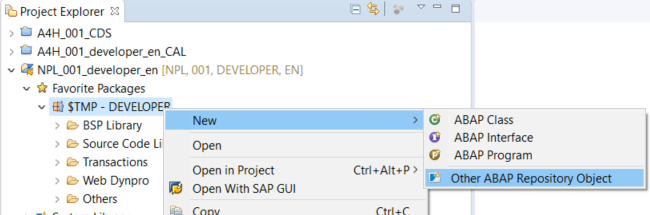

[DONE]
[ACCORDION-END]

[ACCORDION-BEGIN [Step 2: ](Select a Data Definition)]

Select **Data Definition**, then choose **Next**.

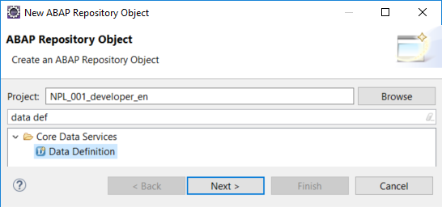

[DONE]
[ACCORDION-END]


[ACCORDION-BEGIN [Step 3: ](Enter values)]

Enter the following, then choose **Next**:

a.	Name = **`Z_INVOICE_ITEMS`**

b.	Description = **Invoice Items**

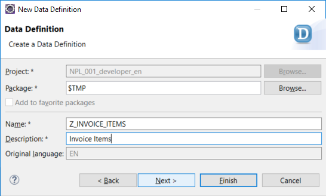


[DONE]
[ACCORDION-END]

[ACCORDION-BEGIN [Step 4: ](Accept the transport request)]

Accept the default transport request (local) by simply choosing **Next** again.

 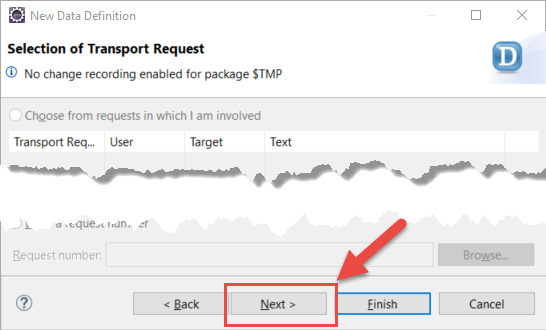

[DONE]
[ACCORDION-END]

[ACCORDION-BEGIN [Step 5: ](Define a View)]

Select the entry **Define View**, then choose **Finish**

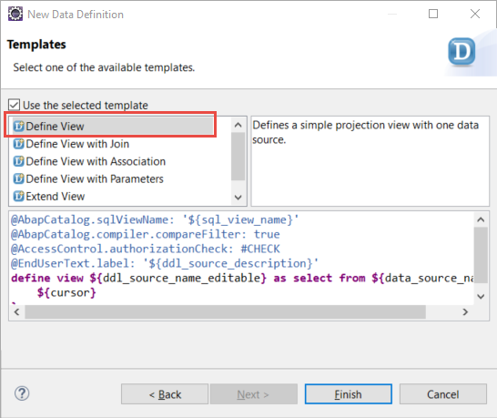

[DONE]
[ACCORDION-END]

[ACCORDION-BEGIN [Step 6: ](Enter the data source)]

The new view appears in an editor. In this editor, enter the following values:

a. Enter `ZINVOICEITEMS` as the SQL view name.

b. Enter the CDS view `sepm_sddl_so_invoice_item` as the data source for your view.

c. Use code completion (keyboard shortcut **CTRL+SPACE**) to get proposals for the data source.

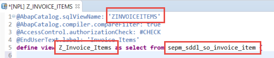

> Note: The SQL view name is the internal/technical name of the view which will be created in the database. `Z_Invoice_Items` is the name of the CDS view which provides enhanced view-building capabilities in ABAP. You should always use the CDS view name in your ABAP applications.

[DONE]
[ACCORDION-END]

[ACCORDION-BEGIN [Step 7: ](Edit the SELECT statement)]

You will now insert the fields `currency_code` and `gross_amount` into the SELECT list as follows:

a. Trigger code completion in the SELECT list (by clicking on the SELECT list and using keyboard shortcut **CTRL+SPACE**), then double click on the entry **Insert all elements - template**. All the elements (fields and associations) of the underlying data source are inserted into the SELECT list.

b.	Remove all the elements in the SELECT list which were inserted by the code completion apart from `currency_code` and `gross_amount`. Remember to separate the elements in the SELECT statement with a comma.

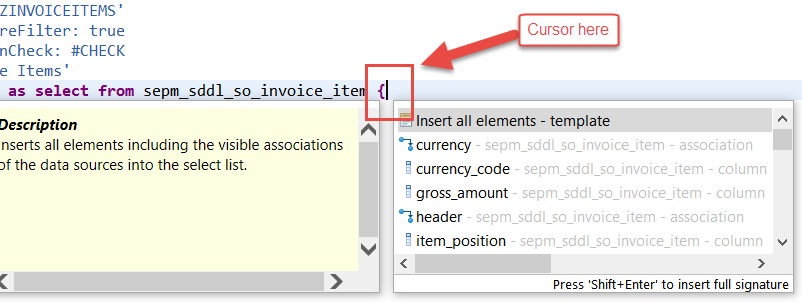

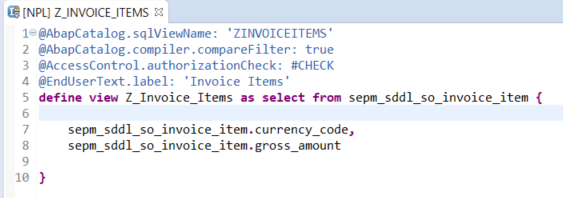

[DONE]
[ACCORDION-END]

[ACCORDION-BEGIN [Step 8: ](Use CDS associations)]

You will now model the relationships between data sources by using some CDS associations. You can use associations in path expressions to access elements (fields and associations) in related data sources without specifying JOIN conditions. You can now display the element info by positioning the cursor on the data source name **`sepm_sddl_so_invoice_item`** and choosing **F2**.

a.	To see the related data sources that can be accessed using associations, scroll down.

b.	To see details about the target data source of the association header, choose the hyperlink **`sepm_sddl_so_invoice_header`**

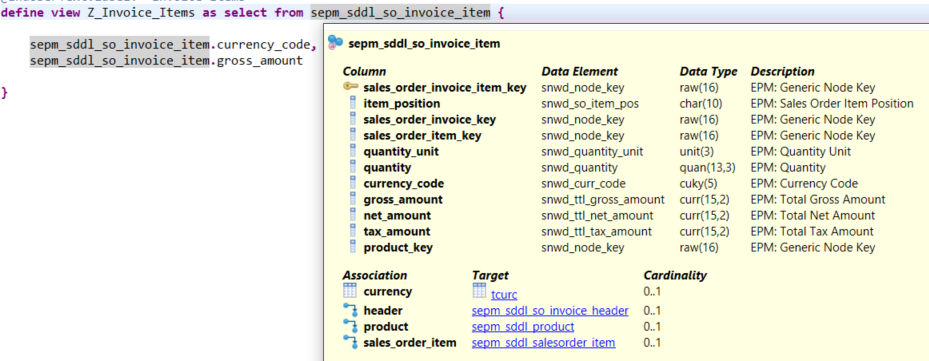

[DONE]
[ACCORDION-END]

[ACCORDION-BEGIN [Step 9: ](Add Fields)]

You will now add fields of related data sources to the SELECT list of `Z_Invoice_Items`, using the associations in path expressions. Each element in the path expression must be separated by a period.

a.	Add the `company_name` of the business partner to the SELECT list using the associations header and buyer in a path expression

b.	Add the `payment_status` from the invoice header to the SELECT list using the association header

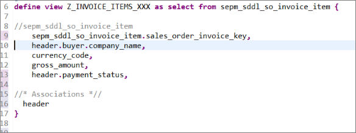

[DONE]
[ACCORDION-END]

[ACCORDION-BEGIN [Step 10: ](Add a CASE statement)]

If the invoice has been paid, you want to set the `payment_status` to X (true). Do this by implementing a CASE statement

```ABAP
case header.payment_status
    when 'P' then 'X'
    else ' '
end as payment_status
```

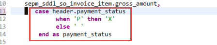

[DONE]
[ACCORDION-END]

[ACCORDION-BEGIN [Step 11: ](Add a CAST statement)]

Cast the type of the transformed `payment_status` to the data element you created - `zso_invoice_payment_status` - by using a CAST statement:

```ABAP
cast(
    case header.payment_status
        when 'P' then 'X'
        else ' '
    end
as zso_invoice_payment_status )

as payment_status
```

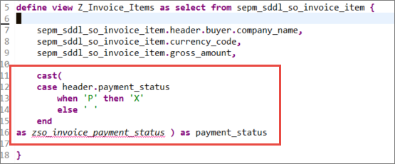

> Note: You can open the online help for the CAST statement by positioning the cursor on the cast keyword and choosing F1

[DONE]
[ACCORDION-END]

[ACCORDION-BEGIN [Step 12: ](Add a WHERE clause)]

You will now filter the results so that only invoice items with `currency_code = 'EUR'` are retrieved.

a. Add a WHERE clause:

```ABAP
WHERE currency_code = 'EUR'
```

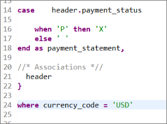

b. Save and activate the data definition by choosing **Save** (`Ctrl+S`) and **Activate** (`Ctrl+F3`).


[DONE]
[ACCORDION-END]

## Next Steps
- Use a CDS View in ALV with IDA (coming soon).
