## Prerequisites  
 - [Create and run an ABAP application](https://www.sap.com/developer/tutorials/abap-create-basic-app.html).


## Next Steps
 - [Create a CDS view](https://www.sap.com/developer/tutorials/abap-dev-adt-create-cds-view.html).

## Details
### You will learn  
You will learn how to create data retrieval logic, by replacing the WRITE statement in your report with the SELECT statement you created previously in the SQL Console. In order to separate concerns properly and to show you a wider tool set,  the data retrieval logic will be encapsulated in a global ABAP class.

### Time to Complete
**1 hour**.

---

[ACCORDION-BEGIN [Step 1: ](Open your ABAP program)]
First, open your ABAP program, `ZSO_INVOICE_ITEMS_EURO` which you created in the previous tutorial, [Create and run an ABAP application](https://www.sap.com/developer/tutorials/abap-create-basic-app.html).


[DONE]
[ACCORDION-END]

[ACCORDION-BEGIN [Step 2: ](Delete the WRITE statement)]

In the program `ZSO_INVOICE_ITEMS_EURO`, remove the WRITE statement: Delete the whole line, by placing the cursor somewhere in the WRITE statement and choosing **Ctrl+D**:


[DONE]
[ACCORDION-END]

[ACCORDION-BEGIN [Step 3: ](Create the global class)]

Now create the global class for the data retrieval:

a.	In the run method, create a local variable of the type `type ref to zcl_invoice_retrieval`:

b.	`data: invoices type ref to zcl_invoice_retrieval`.

c.	Since this class does not yet exist, you will get a syntax error. To create the class, place the cursor on the class name and open the Quick Assist by choosing **Ctrl+1**. In the Quick Assist menu, double-click on **Create global class `zcl_invoice_retrieval`**:

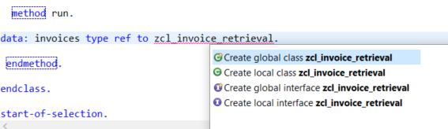

d.	A wizard will appear to create a new ABAP class. Add:
  - name **`ZCL_INVOICE_RETRIEVAL`**
  - description **invoice Retrieval**

e. Choose **Finish**:

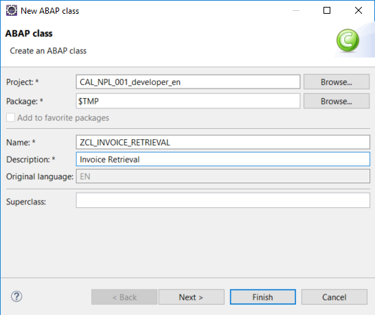

> A new editor will be opened showing the class you have created, `ZCL_INVOICE_RETRIEVAL`.

[DONE]
[ACCORDION-END]

[ACCORDION-BEGIN [Step 4: ](Check the syntax)]

 Go back to your program and trigger the syntax check using the keyboard shortcut `Ctrl+F2`.

 > The syntax error should no longer occur..

[DONE]
[ACCORDION-END]

[ACCORDION-BEGIN [Step 5: ](Instantiate the class)]

Still in your program, create an instance of class `zcl_invoice_retrieval` using the **`new`** operator:

`invoices = new zcl_invoice_retrieval`

[DONE]
[ACCORDION-END]

[ACCORDION-BEGIN [Step 6: ](Retrieve the records from the database)]

To read the records from the database, you need to call the method `get_items_from_db`.
This method does not yet exist so we will create it with a Quick Assist as follows:

a.	Position the cursor on the name of the missing method and choose `Ctrl+1`. In the Quick Assist menu, double-click on

`Create method get_items_from_db` :

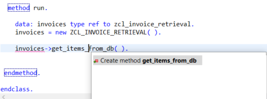

b.  In the wizard that appears, create a public method without parameters, simply by choosing **Finish**:

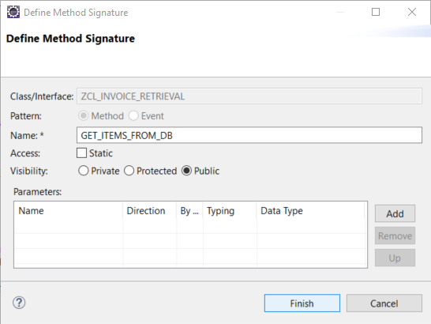

> The Quick Fix creates:
- a method definition
- an empty method implementation in the class `ZCL_INVOICE_RETRIEVAL` :

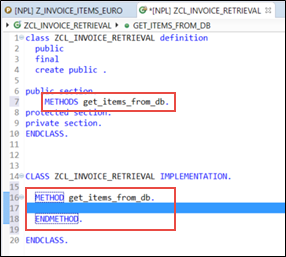

[DONE]
[ACCORDION-END]

[ACCORDION-BEGIN [Step 7:  ](Add an ABAP Doc comment)]

To improve readability, add an ABAP Doc comment immediately before the method definition, for example:

**"! Method reads invoice items from database**

> ABAP Doc comments can be used to document APIs and are displayed in the Element Info. ABAP Doc comments begin with `"!` .
NOTE: You must insert the ABAP Doc comment *immediately* before the declaration; otherwise you will get a warning from ADT.

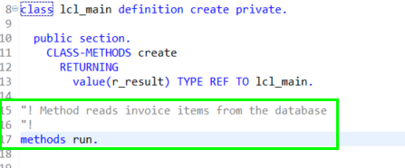

[DONE]
[ACCORDION-END]

[ACCORDION-BEGIN [Step 8: ](Add the method implementation)]

Now you will complete the method implementation of `get_items_from_db`, using the SQL Console:

a.	Open the SQL Console.

b.	On the bottom left hand side of the SQL console is the query section. It contains the last executed SELECT statements as Open SQL statements ready to be transferred into your ABAP code:

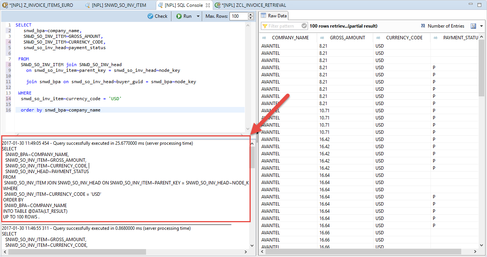

The code from the SQL console should look like this. Note that the SQL Console query section automatically adds the INTO clause

`INTO TABLE @DATA(LT_RESULT)` :

```ABAP
SELECT
   SNWD_BPA~COMPANY_NAME,
   SNWD_SO_INV_ITEM~GROSS_AMOUNT,
   SNWD_SO_INV_ITEM~CURRENCY_CODE,
   SNWD_SO_INV_HEAD~PAYMENT_STATUS
 FROM
  SNWD_SO_INV_ITEM JOIN SNWD_SO_INV_HEAD ON SNWD_SO_INV_ITEM~PARENT_KEY = SNWD_SO_INV_HEAD~NODE_KEY JOIN SNWD_BPA ON SNWD_SO_INV_HEAD~BUYER_GUID = SNWD_BPA~NODE_KEY
 WHERE
  SNWD_SO_INV_ITEM~CURRENCY_CODE = 'USD'
 ORDER BY  SNWD_BPA~COMPANY_NAME
 INTO TABLE @DATA(LT_RESULT).
 UP TO 100 ROWS.
```

c.	Resize the query section and copy the Open SQL statement using the shortcut **Ctrl+C**.

d.	Now paste the statement into the method implementation of `get_items_from_db`.

[DONE]
[ACCORDION-END]

[ACCORDION-BEGIN [Step 9: ](Format the code)]

Now you can format (that is, "pretty-print") the source code: Open the **Source** menu and choose **Format**. (Alternatively you can use the shortcut **Shift+F1**).
> If you want to specify your formatting settings, you can do this in the project's properties. Right-click on the Project in the Project Explorer and choose Properties.


a.	Delete the addition `UP TO 100 ROWS`.

b.	To make the `SELECT` statement more readable, add some line breaks in the `JOIN` conditions:


[DONE]
[ACCORDION-END]

[ACCORDION-BEGIN [Step 10: ](Define a Data Dictionary structure)]

Now you will define your own Data Dictionary ("DDIC") structure as a result type of the method: First, you  will declare a local variable explicitly by using a Quick Assist. Afterwards (in step 11) you will create the Dictionary structure:

a.	Declare the local variable using a Quick Assist, by positioning the cursor on the declared inline variable `lt_result` and choosing **Ctrl+1**.

b. Select Declare local variable `lt_result` explicitly by double clicking in the Quick Assist menu:

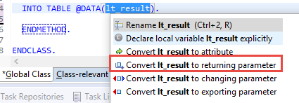

> This creates a local variable referring to a local type.

[DONE]
[ACCORDION-END]

[ACCORDION-BEGIN [Step 11: ](Create a global Data Dictionary structure)]

In the next steps you will replace the local type with a global Data Dictionary structure.

First, create the global Data Dictionary structure:

a.	In the Project Explorer, select the folder `$TMP-<USERNAME>`, then choose **New > Other Repository Object**:


b.	In the wizard that appears, filter the list of ABAP repository object types by entering **`struct`**.

c.	Then enter the following and choose Finish.
•	Name = **`ZSO_INVOICE_ITEM`**
•	Description = for example, **Invoice item structure**


> A new text editor is opened showing the content of the newly created Data Dictionary structure.

[DONE]
[ACCORDION-END]

[ACCORDION-BEGIN [Step 12: ](Define fields for the structure)]

a. Remove the generated example component `component_to_be_changed` from the structure:

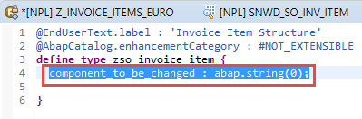

b. In the item structure, define the fields `company_name`, `amount`, `currency_code`, and `payment_status`.
> The editor shows a syntax error because the amount has not yet been bound to the currency code.

c. To bind the amount to the currency code:
•	Add a new line in front of the field amount, add `@` and open code completion, by entering  **Ctrl+1**.
> A list of all possible annotations is shown.

•	Select the annotation `@Semantics.amount.currencyCode:`

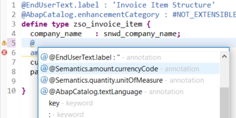

•	Trigger the code completion again by entering `: '` and then entering **Ctrl+1**, then choose the annotation **`zso_invoice_item.currency_code`**:

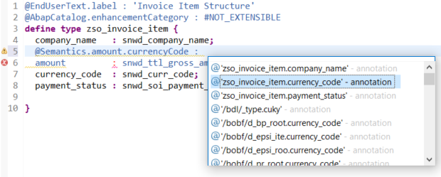

•	Finally choose **Save (Ctrl+S)** and **Activate (Ctrl+F3)**.

> We added the link between the amount field and the currency code. The editor should not show any syntax errors any more. Your code should look like this:

```ABAP
@EndUserText.label : 'Invoice Item Structure'
@AbapCatalog.enhancementCategory : #NOT_EXTENSIBLE
define type zso_invoice_item {
  company_name   : snwd_company_name;
  @Semantics.amount.currencyCode : 'zso_invoice_item.currency_code'
  amount         : snwd_ttl_gross_amount;
  currency_code  : snwd_curr_code;
  payment_status : snwd_soi_payment_status_code;

}

```
[DONE]
[ACCORDION-END]

[ACCORDION-BEGIN [Step 13: ](Replace helper_type with Dictionary structure)]

Now, switch back to the editor of your invoice retrieval class `ZCL_INVOICE_RETRIEVAL`.
> In the next steps, you will replace the local type `helper_type` with the Data Dictionary structure that you created.

a.	In the method `get_items_from_db`, change the type of the variable `lt_result` to a standard table of `zso_invoice_item`:


b.	Remove the local type `helper_type`:


Your method still does not return any data. Therefore, you will use another Quick Assist to declare your local variable as a returning parameter. You want to convert the local variable to a returning parameter of your method so that you can access the result from your program:

c.	To do so place the cursor on the variable `lt_result` and enter **Ctrl+1** for code completion.

d.	Choose **Convert `lt_result` to returning parameter**:


> Note that the returning parameter was added to the method and an additional table type based on the structure was generated.

[DONE]
[ACCORDION-END]

[ACCORDION-BEGIN [Step 14: ](Document method paremeters)]

You can also use ABAP Doc to document method parameters with a Quick Assist. Place the cursor inside the ABAP Doc comment. Then enter **Ctrl+1** to open the Quick Assist menu and double-click on **Add missing parameters to documentation**.
> The ABAP Doc comment is extended by a `@parameter ... | `.
You can now use this to document the method parameters: To do so, just enter the documentation after the pipe symbol (` | `).


[DONE]
[ACCORDION-END]

[ACCORDION-BEGIN [Step 15: ](Synchronize with Class Builder)]

We have documented our method using ABAP Doc. However, we also want to see the same short texts in the description fields of the form-based Class Builder in SAP GUI.
To do this, we need to tag the required text in the ABAP Doc as "synchronized" to ensure that it is synchronized with the Class Builder.

a.	Mark the short text for your method in ABAP Doc as "synchronized" by surrounding it with the tag

`<p class="shorttext synchronized">...</p>`.

b.	Do the same for the short text of your parameter `lt_result`.

[DONE]
[ACCORDION-END]

[ACCORDION-BEGIN [Step 16: ](Activate the class)]

Activate the class by choosing  **Activate** (Ctrl+F3) in the toolbar. The code for your class should look like this:

```ABAP
CLASS zcl_invoice_retrieval DEFINITION
  PUBLIC
  FINAL
  CREATE PUBLIC .

  PUBLIC SECTION.
    TYPES: ty_table_of_zso_invoice_item TYPE STANDARD TABLE OF zso_invoice_item WITH DEFAULT KEY.

"! <p class="shorttext synchronized">Read items from DB</p>
"! Method reads invoice items from the database
"! @parameter lt_result | <p class="shorttext synchronized">Table of invoice items</p>
"!
    METHODS get_items_from_db
              RETURNING
                VALUE(lt_result) type ty_table_of_zso_invoice_item.
  PROTECTED SECTION.
  PRIVATE SECTION.
ENDCLASS.

CLASS zcl_invoice_retrieval IMPLEMENTATION.

  METHOD get_items_from_db.

  SELECT
    snwd_bpa~company_name,
    snwd_so_inv_item~gross_amount,
    snwd_so_inv_item~currency_code,
    snwd_so_inv_head~payment_status

  FROM
   snwd_so_inv_item
   JOIN snwd_so_inv_head ON snwd_so_inv_item~parent_key = snwd_so_inv_head~node_key
   JOIN snwd_bpa ON snwd_so_inv_head~buyer_guid = snwd_bpa~node_key

   INTO TABLE @lt_result

  WHERE
   snwd_so_inv_item~currency_code = 'USD'

  ORDER BY
   snwd_bpa~company_name.

  ENDMETHOD.
ENDCLASS.
```

[DONE]
[ACCORDION-END]

[ACCORDION-BEGIN [Step 17: ](Check synchronized texts)]

Finally in this section, you will check that the synchronized short texts are also shown in the Class Builder. First we have to open the class in SAP GUI.
To easily find the class in the Project Explorer, choose **Link with Editor**:

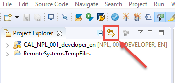

a. In the Project Explorer, select the class `ZCL_INVOICE_RETRIEVAL` and choose **Open with SAP GUI** from the context menu:

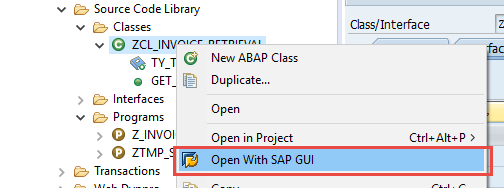

The method description shows the text we entered in the ABAP Doc comment in the synchronized tag.

b. Choose **Parameters**.
You will see that the description of the parameter has also been synchronized.

c. Close the class in SAP GUI and return to your ABAP program by choosing **Close**:

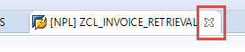

[DONE]
[ACCORDION-END]

[ACCORDION-BEGIN [Step 18: ](Check the ABAP Doc for the method)]

a. Back in the ABAP Program `ZSO_INVOICE_ITEMS_EURO`, position the cursor on the method call `GET_ITEMS_FROM_DB` and display the Element Info of the method by choosing **Element Info (F2)**.

In addition to the method signature it also shows the ABAP Doc you wrote before.

b. Close the Element Info by choosing **ESC**.

[DONE]
[ACCORDION-END]
[ACCORDION-BEGIN [Step 19: ](Receive the returning parameter result in an inline variable)]

Now you use a new inline declared variable, `data(invoice_items)` , to receive the result of the returning parameter `invoices->get_items_from_db( )` :


`data(invoice_items) = invoices->get_items_from_db( ).`  

[DONE]
[ACCORDION-END]

[ACCORDION-BEGIN [Step 20: ](Display the invoice items in an ALV grid)]

Now you can display the invoice items in an SAP List Viewer ("ALV grid"), using the class `CL_ALV_TABLE` in your program.

a.	(Still in the program `ZSO_INVOICE_ITEMS_EURO`), enter `cl_salv_table=>` and get the code completion proposals by entering **Ctrl+SPACE** :

b.	Select the static method `factory` and …

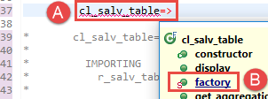

c.	Insert the full signature of the method call by pressing **Shift+Enter** :

> If you prefer to insert the full signature by default, you can change the behavior of the code completion in the Preferences. Select Window in the menu and click on Preferences. In the Preferences Dialog enter code completion in the filter field or open the following path ABAP Development > Editors > Source Code Editors > Code Completion. In the Code Completion settings, you can activate a checkbox to Always insert full signature on completion.

[DONE]
[ACCORDION-END]

[ACCORDION-BEGIN [Step 21: ](Edit the factory method)]

In the method call that has been generated:

a.	Remove the commented exporting parameters `list_display`, `r_container`, and `container_name` using the shortcut **Ctrl+D**

b.	Uncomment the importing parameter `r_salv_table` using the shortcut **Ctrl+7** and assign it to an inline variable `alv_table`

c.	Assign the variable `invoice_items` to the changing parameter `t_table`.

d.	Then call the `display` method of `ALV_TABLE` :

`alv_table->display(  )`.

[DONE]
[ACCORDION-END]

[ACCORDION-BEGIN [Step 22: ](Activate the factory method)]

Activate your program by choosing **Activate (Ctrl+F3)** in the toolbar.

The code for your program `z_invoice_items_euro` should look like this:

```ABAP

REPORT z_invoice_items_euro.

class lcl_main definition create private.

  public section.
    CLASS-METHODS create
      RETURNING
        value(r_result) TYPE REF TO lcl_main.

    methods run.

  protected section.
  private section.

endclass.

class lcl_main implementation.

  method create.
    create object r_result.
  endmethod.

  method run.

    data: invoices type ref to zcl_invoice_retrieval.
    invoices = new ZCL_INVOICE_RETRIEVAL( ).

    data(invoice_items) = invoices->get_items_from_db( ).


       cl_salv_table=>factory(

         IMPORTING
           r_salv_table   =     data(alv_table)

          CHANGING
            t_table        = invoice_items ).

       alv_table->display(  ).

 endmethod.

endclass.

start-of-selection.

lcl_main=>create( )->run( ).

```

[DONE]
[ACCORDION-END]

[ACCORDION-BEGIN [Step 23: ](Display your results in SAP List Viewer)]

Run your report by choosing Execute (F8).
The invoice items are displayed in the SAP List Viewer (or "ALV grid"):

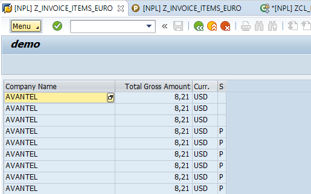

[DONE]
[ACCORDION-END]

[ACCORDION-BEGIN [Step 24: ](Create a boolean data element)]

Notice that the payment status contains the internal codes such as `P`. You will now change this to a boolean field that just returns `X` (true) if the invoice is paid or `SPACE` (false) if it has not been paid. You will implement this logic in a new data element.

a.	Go back to your Data Dictionary structure and change the type of field `payment_status` to `zso_invoice_payment_status` :


Since the data element `zso_invoice_payment_status` does not exist, you get a syntax error. You will now resolve this using **Quick Assist**:

b.	Select `zso_invoice_payment_status`, open Quick Assist by choosing **Ctrl+1** , and create a new data element by choosing **Create data element `zso_invoice_payment_status`**, then choosing **Enter** :


c.	Enter a description for the new data element in the field **Description**, then choose **Finish** :


d.	Under "Field Labels" on the right, enter the following:
•	Short = Paid
•	Medium = Invoice paid
•	Long = Invoice paid
•	Title = Invoice paid


e.	Choose **Save (Ctrl+S)**, then **Activate (Ctrl+F3)**.

[DONE]
[ACCORDION-END]

[ACCORDION-BEGIN [Step 25: ](Activate the structure)]

Back in the structure `ZSO_INVOICE_ITEM`, choose **Check ABAP Development Object (Ctrl+F2)**. Then choose **Activate (Ctrl+F3)**.
> The Data Dictionary structure `ZSO_INVOICE_ITEM` is now activated.

[DONE]
[ACCORDION-END]

[ACCORDION-BEGIN [Step 26: ](Loop over payment_status values)]

Back in the retrieval class `ZCL_INVOICE_RETRIEVAL`, add a loop in the implementation part of the method `get_items_from_db` which transforms the values of `payment_status` into a flag that is `X` (true) when the invoice has been paid. Then activate the class by choosing **Activate (Ctrl+F3)**.
> There is a preference which allows you to reuse SAP GUI for Windows when running applications. To enable this feature, select Window in the menu and choose on Preferences. In the Preferences dialog open ABAP Development > SAP GUI Integration and tick the check box Reuse SAP GUI window when running applications.

[DONE]
[ACCORDION-END]

[ACCORDION-BEGIN [Step 27: ](Finally, run your report)]

Go back to your report `ZSO_INVOICE_ITEMS_EURO`, and execute it by choosing **Execute (F8)**.
> In the SAP List Viewer, your ALV should look like this:


You have completed the exercise!

You are now able to:
·	Create an ABAP Project which represents a logon to your development system  
·	Use the Data Preview to look at the content in database tables and views
·	Use the SQL Console to create and fine tune more complex select statements
·	Create ABAP Programs Classes, Dictionary structures and data elements
·	Use Quick Assists via the shortcut for quick fixes Ctrl+1
·	Document your source code using ABAP Doc  

[DONE]
[ACCORDION-END]
## Next Steps
- [Create a CDS view](https://www.sap.com/developer/tutorials/abap-dev-adt-create-cds-view.html)
