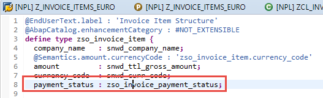
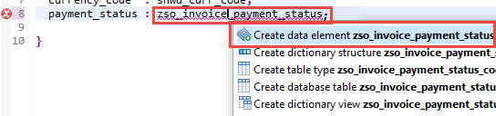
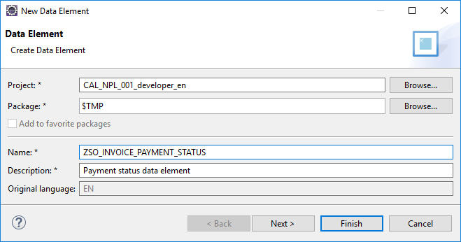
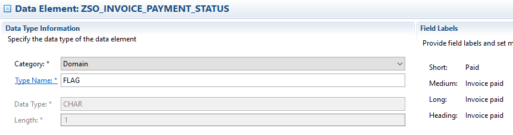
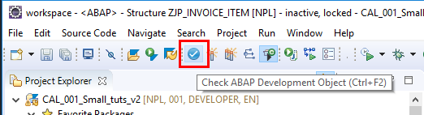
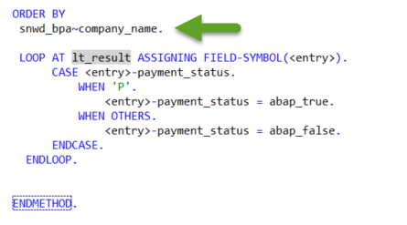

## Prerequisites  
 - You have a valid instance of an on-premise AS ABAP server, version 7.51 or higher (some ABAP Development Tools may not be available in earlier versions)

## Details
### You will learn  
- How to create a data element.
- How to use this data element to provide Boolean logic to one of the columns in the table


---

[ACCORDION-BEGIN [Step 1: ](Change field type to new data element)]
Go back to your ABAP Dictionary structure `zso_invoice_item` and change the type of field `payment_status` to **`zso_invoice_payment_status`**:



Since the data element `zso_invoice_payment_status` does not exist, you get a syntax error, which you will fix using a quick fix below.

[DONE]
[ACCORDION-END]

[ACCORDION-BEGIN [Step 2: ](Choose a Quick Fix)]

1. Select the data element and display all the available Quick Fixes by choosing **`Ctrl+1`**.

2. Then choose **Create data element `zso_invoice_payment_status`** and choose **Enter**.

    

[DONE]
[ACCORDION-END]

[ACCORDION-BEGIN [Step 3: ](Create a new data element)]

Enter a description for the new data element in the field **Description**, then choose **Finish** :



[DONE]
[ACCORDION-END]

[ACCORDION-BEGIN [Step 4: ](Enter type and field labels)]
In the Data Element editor that appears, enter the following:

1. In the **Type Name** box, enter **Flag**.

2. Under **Field Labels** on the right, enter the following:
	- Short = **Paid**
	- Medium = **Invoice paid**
	- Long = **Invoice paid**
	- Title = **Invoice paid**



[DONE]
[ACCORDION-END]

[ACCORDION-BEGIN [Step 5: ](Save and activate the data element)]

Then choose **Save (`Ctrl+S`)**, then **Activate (`Ctrl+F3`)** your data element.

[DONE]
[ACCORDION-END]

[ACCORDION-BEGIN [Step 6: ](Check the structure for syntax errors)]

Go back to the structure `ZSO_INVOICE_ITEM` and choose **Check ABAP Development Object (`Ctrl+F2`)** :



[DONE]
[ACCORDION-END]

[ACCORDION-BEGIN [Step 7: ](Activate the structure)]

Choose Activate **(`Ctrl+F3`)**.

The ABAP Dictionary structure `zso_invoice_item` is now activated.

[DONE]
[ACCORDION-END]

[ACCORDION-BEGIN [Step 8: ](Use your data element in the ABAP class)]
Go back to the class, `**ZCL_INVOICE_RETRIEVAL**`, which you created in the previous tutorial, ([Create an ABAP class](https://developers.sap.com/tutorials/abap-dev-create-new-class.html)).

You will now transform the values of `payment_status` from **P** to a flag that is set to **X** (true) when the invoice has been paid.

You will do this by looping through each row of the table using a `field-symbol`, which acts as a place-holder for each row of the internal table `lt_result`. The `field-symbol` is declared inline.

Enter the following code after the `ORDER BY` clause of the `SELECT` statement:

```ABAP

LOOP AT lt_result ASSIGNING FIELD-SYMBOL(<entry>).
    CASE <entry>-payment_status.
        WHEN 'P'.
            <entry>-payment_status = abap_true.
        WHEN OTHERS.
            <entry>-payment_status = abap_false.
    ENDCASE.
ENDLOOP.

```



[DONE]
[ACCORDION-END]

[ACCORDION-BEGIN [Step 9: ](Save and Activate the class)]
Finally, choose **Save (`Ctrl+S`)**, then **Activate (`Ctrl+F3`)** your class.

Your code should now look like this:

```ABAP
CLASS zcl_invoice_retrieval DEFINITION
  PUBLIC
  FINAL
  CREATE PUBLIC .

  PUBLIC SECTION.
    TYPES: ty_table_of_zso_invoice_item TYPE STANDARD TABLE OF zso_invoice_item WITH DEFAULT KEY.

    METHODS get_items_from_db
              RETURNING
                VALUE(lt_result) type ty_table_of_zso_invoice_item.
  PROTECTED SECTION.
  PRIVATE SECTION.
ENDCLASS.

CLASS zcl_invoice_retrieval IMPLEMENTATION.

  METHOD get_items_from_db.

  SELECT
    snwd_bpa~company_name,
    snwd_so_inv_item~gross_amount,
    snwd_so_inv_item~currency_code,
    snwd_so_inv_head~payment_status

  FROM
   snwd_so_inv_item
   JOIN snwd_so_inv_head ON snwd_so_inv_item~parent_key = snwd_so_inv_head~node_key
   JOIN snwd_bpa ON snwd_so_inv_head~buyer_guid = snwd_bpa~node_key

   INTO TABLE @lt_result

  WHERE
   snwd_so_inv_item~currency_code = 'USD'

  ORDER BY
   snwd_bpa~company_name.

   LOOP AT lt_result ASSIGNING FIELD-SYMBOL(<entry>).
        CASE <entry>-payment_status.
            WHEN 'P'.
                <entry>-payment_status = abap_true.
            WHEN OTHERS.
                <entry>-payment_status = abap_false.
        ENDCASE.
    ENDLOOP.
  ENDMETHOD.
ENDCLASS.
```

[DONE]
[ACCORDION-END]

[ACCORDION-BEGIN [Step 10: ](Test your changes)]
You can now test the result of your changes in the SAP List Viewer.

There is a preference which allows you to reuse SAP GUI windows when running applications. To enable this feature, choose **Window > Preferences**. In the Preferences dialog, open **ABAP Development > SAP GUI Integration** and tick the appropriate check box.

Go back to your report and execute it by choosing **F8**. Your SAP List Viewer should look roughly like this:


[DONE]
[ACCORDION-END]

[ACCORDION-BEGIN [Step 11: ](Test yourself)]

The `field-symbol` `booking` has been defined as follows. Rewrite the `LOOP AT` statement using an inline declaration. Enter your code in the box below and choose **Submit Answer**:

```ABAP
FIELD-SYMBOLS <booking> TYPE sbook.
LOOP AT Booking_List ASSIGNING <booking>.
```

[VALIDATE_1]
[ACCORDION-END]
