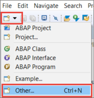
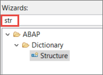
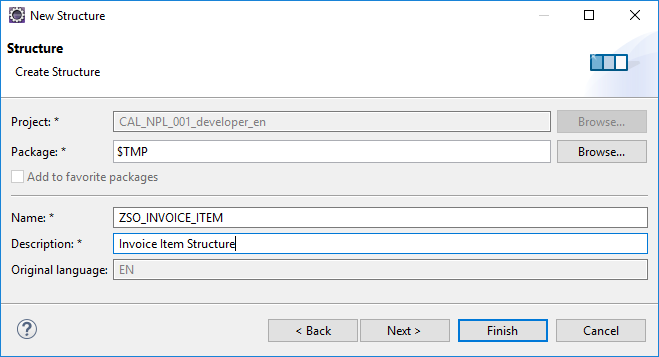
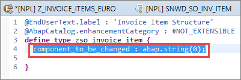
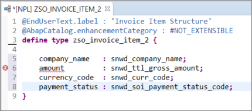
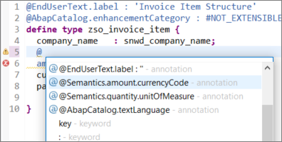
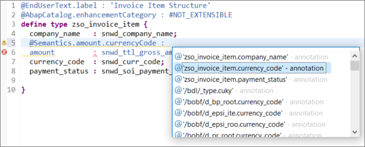

## Prerequisites  
 - You have a valid instance of an on-premise AS ABAP server, version 7.51 or higher (some ABAP Development Tools may not be available in earlier versions)

## Details
### You will learn  
- How to create an Data Dictionary structure

---

[ACCORDION-BEGIN [Step 1: ](Create a global Data Dictionary structure)]

Now, you will create a global Data Dictionary ("DDIC") structure: In the toolbar, select **New**, then choose **Other ABAP Repository Object**.



[DONE]
[ACCORDION-END]

[ACCORDION-BEGIN [Step 2: ](Filter the list of object types)]

In the wizard that appears, filter the list of ABAP repository object types by entering `**struct**`.



[DONE]
[ACCORDION-END]

[ACCORDION-BEGIN [Step 3: ](Enter name and description)]

Then enter the following and choose **Finish**.
- Name = **`ZSO_INVOICE_ITEM`**
- Description = for example, **Invoice item structure**



A new text editor is opened showing the content of the newly created Data Dictionary structure.

[DONE]
[ACCORDION-END]

[ACCORDION-BEGIN [Step 4: ](Remove the generated component)]

Remove the generated example component `component_to_be_changed` from the structure:



[DONE]
[ACCORDION-END]

[ACCORDION-BEGIN [Step 5: ](Define fields for the structure)]

In the item structure, define the fields `company_name`, `amount`, `currency_code`, and `payment_status`, and assign them to the relevant data elements as follows:
```ABAP
  company_name   : snwd_company_name;
  amount         : snwd_ttl_gross_amount;
  currency_code  : snwd_curr_code;
  payment_status : snwd_soi_payment_status_code;

```



The editor shows a syntax error because the amount has not yet been bound to the currency code.

[DONE]
[ACCORDION-END]

[ACCORDION-BEGIN [Step 6: ](Bind amount to currency code annotation)]

To bind the amount to the currency code:

1. Add a new line in front of the field **`amount`**, add **`@`** and open code completion, by entering  **Ctrl+Space**. A list of all possible annotations is shown.

2. Select the annotation **`@Semantics.amount.currencyCode`**.

    

3. Trigger the code completion again: enter **`: '`** after `@Semantics.amount.currencyCode`, then choose **Ctrl+Space**, then choose the annotation **`zso_invoice_item.currency_code`**:

    

4. Finally choose **Save (Ctrl+S)**

You should no longer get a syntax error.

[DONE]
[ACCORDION-END]

[ACCORDION-BEGIN [Step 7: ](Check and activate the structure)]

Back in the structure `ZSO_INVOICE_ITEM`, choose **Check ABAP Development Object (Ctrl+F2)**. Then choose **Activate (Ctrl+F3)**.

The Data Dictionary structure `ZSO_INVOICE_ITEM` is now activated.

Your code should look like this:

```ABAP
@EndUserText.label : 'Invoice Item Structure'
@AbapCatalog.enhancementCategory : #NOT_EXTENSIBLE
define type zso_invoice_item {
  company_name   : snwd_company_name;
  @Semantics.amount.currencyCode : 'zso_invoice_item.currency_code'
  amount         : snwd_ttl_gross_amount;
  currency_code  : snwd_curr_code;
  payment_status : snwd_soi_payment_status_code;

}

```

[DONE]
[ACCORDION-END]

[ACCORDION-BEGIN [Step 7: ](Test yourself)]

[VALIDATE_1]
[ACCORDION-END]

### More information
[From Open SQL Joins to CDS Associations](https://blogs.sap.com/2016/08/12/from-open-sql-joins-to-cds-associations/)

---
