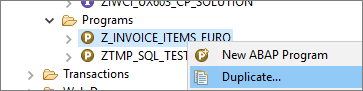
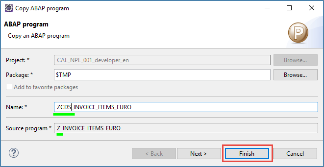
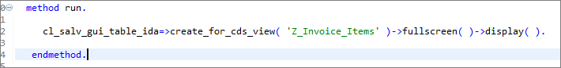

## Prerequisites  
 - **Proficiency:** Beginner
 - **Tutorials:**
[Create an ABAP Class and Dictionary Structure](coming soon)
[Create a CDS view](coming soon)

## Next Steps
 - Select a tutorial from the [Tutorial Navigator](http://www.sap.com/developer/tutorial-navigator.html) or the [Tutorial Catalog](http://www.sap.com/developer/tutorials.html)

## Details
### You will learn  
In this tutorial you will learn how to to consume the CDS view in the SAP List Viewer ("ALV") with Integrated Data Access (ALV with IDA). ALV with IDA lets you display views and tables that contain very large quantities of data.

### Time to Complete
**15 Min**

---

[ACCORDION-BEGIN [Step 1: ](Duplicate the ABAP program)]

Duplicate the program `Z_INVOICE_ITEMS_EURO` that you created in the previous tutorial, *Create an ABAP Class and Dictionary Structure (coming soon)*:
a.	Select the program `Z_INVOICE_ITEMS_EURO` and choose Duplicate from the context menu:

b.	Give the duplicated program a name by entering `ZCDS_INVOICE_ITEMS_EURO` in the **Name:** box:

c.	Choose **Finish**.

[DONE]
[ACCORDION-END]

[ACCORDION-BEGIN [Step 2: ](Replace with IDA)]

You will now replace the implementation of the RUN method with a new implementation:

a.	Delete the implementation of the `run` method:

b.  Now create an ALV with IDA for your CDS view `Z_Invoice_Items` and display the ALV in full screen:

`cl_salv_gui_table_ida=>create_for_cds_view( 'Z_Invoice_Items' )->fullscreen( )->display( ).`

c.	Choose **Save (Ctrl+S)**  and **Activate (Ctrl+F3)**.
d.	Execute your program by choosing **Execute (F8)**.

> The invoice items are displayed in ALV with IDA.

[DONE]
[ACCORDION-END]

[ACCORDION-BEGIN [Step 3: ](Display the mouse-over information)]

Display the mouse-over information for the Paid column by positioning the cursor on the column heading.
**NOTE**: Notice that, in our case, the information is incorrect.
We will change this information in the CDS view using an annotation.

[DONE]
[ACCORDION-END]

[ACCORDION-BEGIN [Step 4: ](Set the mouse-over information with an annotation)]

**NOTE: Write the annotation before the CASE statement.**

a. Set the mouse-over information for the `payment_status` to:

 `@EndUserText.quickInfo: 'Paid' `

 b. Choose **Save (Ctrl+S)**  and **Activate (Ctrl+F3)**.

[DONE]
[ACCORDION-END]

[ACCORDION-BEGIN [Step 5: ](Execute the duplicated program)]

Execute `ZCDS_INVOICE_ITEMS_EURO` again by choosing **Execute (F8)**.

> The mouse-over information for the Paid column has been changed.

[DONE]
[ACCORDION-END]

## Next Steps

- Select a tutorial from the [Tutorial Navigator](http://www.sap.com/developer/tutorial-navigator.html) or the [Tutorial Catalog](http://www.sap.com/developer/tutorials.html)
